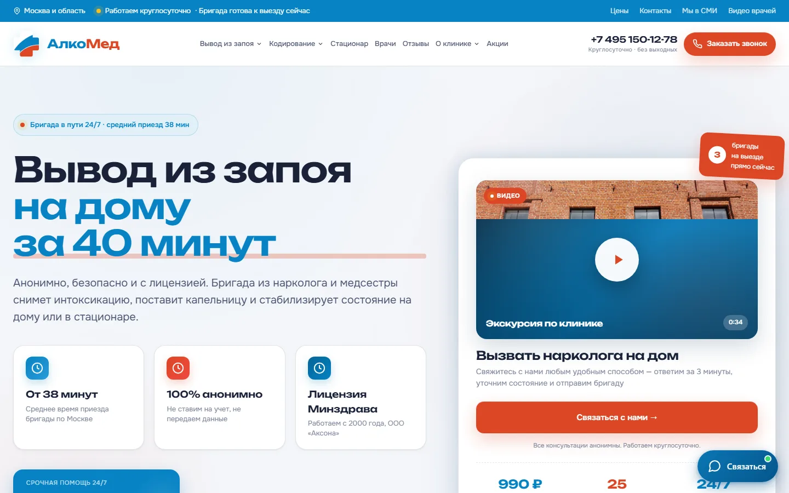
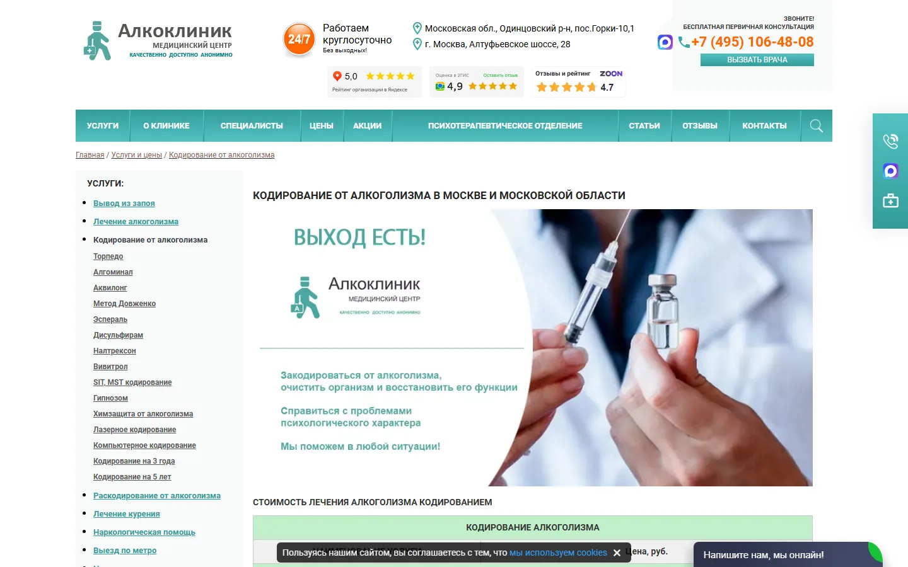
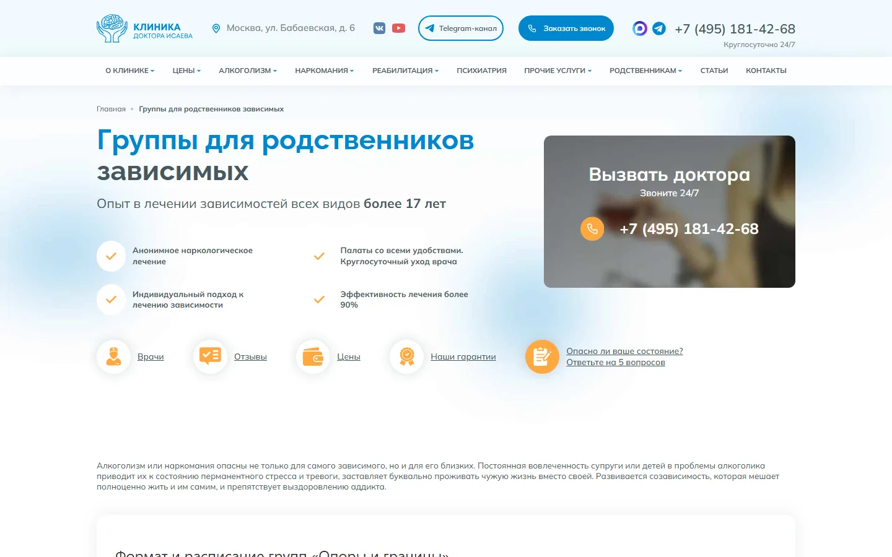
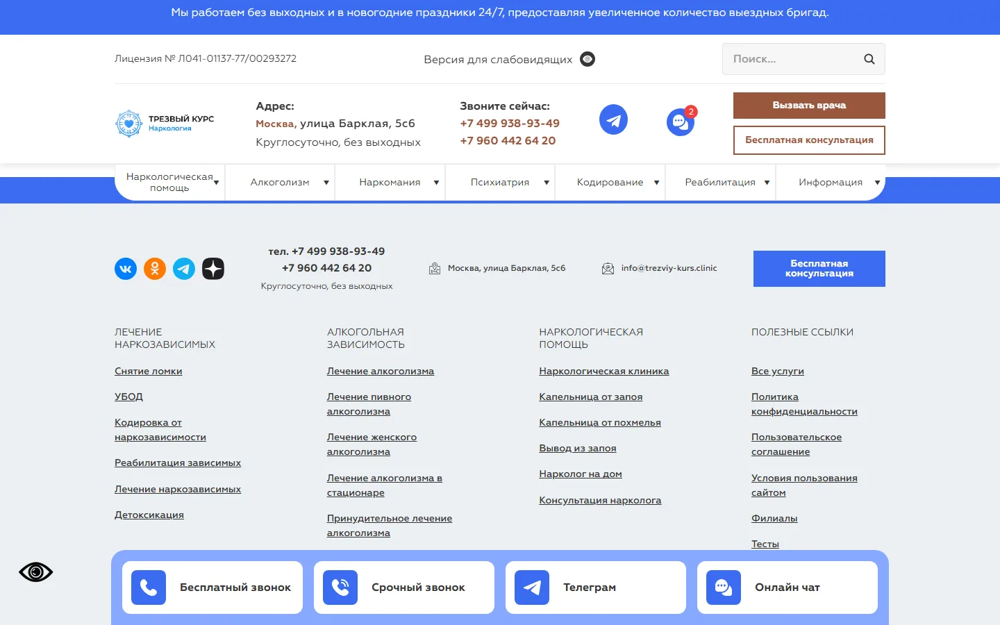
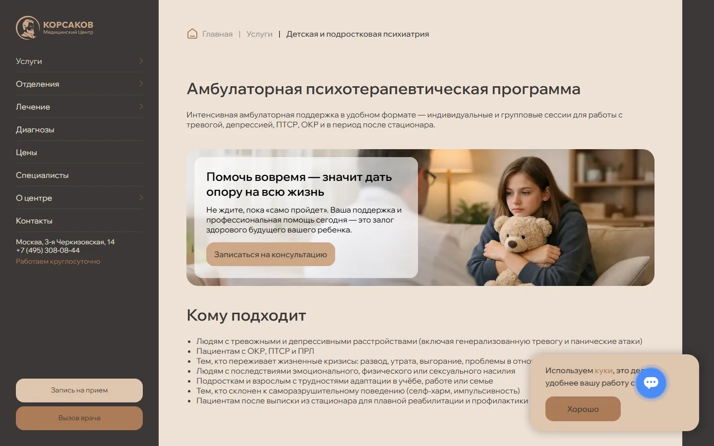
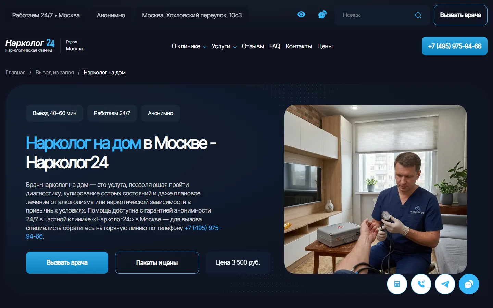

# Конкурентный анализ и финальная архитектура profilactica.clinic

**Срез данных:** 17 сентября 2026 года  
**База:** 160 доменов конкурентов, ~143 тыс. URL конкурентов, 1004 URL profilactica.clinic, конкурентный анализ из 5 частей, отдельные разборы GPT 5.6 / GPT 6 ASTRA / Sonnet 5, паспорт проекта, исследования аудитории, языка, поисковых задач и доверия.

## Оглавление

1. [Главный вывод](#главный-вывод)
2. [Что показал рынок](#1-что-показал-рынок)
3. [Карта конкурентов](#2-карта-конкурентов)
4. [Где конкуренты уязвимы](#3-где-конкуренты-уязвимы)
5. [Что сейчас не так с profilactica.clinic](#4-что-сейчас-не-так-с-profilacticaclinic)
6. [Финальная стратегия](#5-финальная-стратегия)
7. [Финальная SILO-архитектура](#6-финальная-silo-архитектура)
8. [Новые коммерческие страницы](#7-какие-новые-коммерческие-страницы-дают-самый-понятный-резерв)
9. [Финальная ГЕО-модель](#8-финальная-гео-модель)
10. [Что должно отличать каждую ГЕО-страницу](#9-что-должно-отличать-каждую-гео-страницу)
11. [Полная перелинковка](#10-полная-перелинковка)
12. [Обязательные блоки money-page](#11-обязательные-блоки-money-page)
13. [Что нужно сделать с доверием](#12-что-нужно-сделать-с-доверием)
14. [Приоритет внедрения](#13-приоритет-внедрения)
15. [Что считать успехом новой структуры](#14-что-считать-успехом-новой-структуры)
16. [Приложения: полные каталоги](#приложения-полные-каталоги)

## Ключевые показатели

| Показатель | Значение |
| --- | --- |
| Конкурентных доменов в выборке | 160 |
| URL-строк конкурентов | 143270 |
| Медиана страниц на домен | 279.5 |
| Среднее страниц на домен | 895.4 |
| URL текущего сайта profilactica.clinic | 1004 |
| URL внутри /uslugi/ | 882 |
| Текущих ГЕО URL | 763 |
| Прочих URL внутри /uslugi/ | 119 |
| Остальных страниц сайта | 122 |
| Страниц в финальной архитектуре | 178 |
| из них P0 | 76 |
| из них P1 | 90 |
| из них P2 | 12 |
| Метро/узлов в рабочей матрице | 215 |
| Округов Москвы | 12 |
| Основных городов МО | 50 |
| URL в основной планируемой ГЕО-матрице | 1260 |

---

## Главный вывод

`profilactica.clinic` не нужно становиться ещё одним огромным сайтом с тысячами одинаковых страниц. По объёму проект уже больше медианного конкурента: у сайта 1004 URL против медианы рынка около 280. Проблема не в количестве страниц, а в том, **из чего это количество собрано**.

Внутри `/uslugi/` находится 882 URL. Около 763 из них — ГЕО-страницы, в основном две матрицы: «нарколог на дом × локация» и «вывод из запоя × локация». То есть большая часть коммерческого сайта уже размножена географически, а ассортимент услуг, структура разделов, страницы выбора и доверия развиты слабее.

Финальная стратегия строится на пяти вещах:

1. **Service-first SILO:** сначала услуга и её подвиды, затем ГЕО только там, где оно действительно нужно.
2. **Четыре основные ГЕО-матрицы:** нарколог на дом, вывод из запоя на дому, капельница от запоя и алкоголя на дому, кодирование от алкоголизма.
3. **Глубокое коммерческое покрытие без ГЕО:** женский и пивной алкоголизм, зависимости от мефедрона, кокаина, амфетамина, гашиша, Лирики и другие отдельные направления.
4. **Нормальная психиатрическая SILO:** расстройство → группа расстройств → психиатрия, а не сотни плоских URL в `/uslugi/`.
5. **Доверие и принятие решения:** понятная цена, кто приезжает, когда нужен стационар, кто отвечает за услугу, что происходит после первичной помощи и как проверить клинику.

> **Целевая модель:** не самый большой сайт в нише, а самый понятный и проверяемый сайт в момент, когда человек выбирает конкретную помощь.

### Размер сайта относительно рынка

Объём сайта уже выше рынка; проблема не в недостатке URL.

| Сайт / бенчмарк | Страниц |
| --- | --- |
| profilactica.clinic | 1004 |
| Медиана рынка | 279.5 |
| Среднее рынка | 895.4 |

### Из чего сейчас состоит profilactica.clinic

763 ГЕО URL, 119 прочих URL внутри /uslugi/, 122 остальные страницы сайта.

| Слой | URL |
| --- | --- |
| ГЕО URL | 763 |
| Прочие /uslugi/ | 119 |
| Остальные страницы | 122 |

---

# 1. Что показал рынок

В выборке 160 конкурентных доменов — около 143 270 URL-строк. Среднее значение сильно раздувают крупные федеральные сетки, поэтому полезнее медиана: около 280 страниц на домен. `profilactica.clinic` с 1004 страницами уже находится заметно выше среднего рынка по объёму.

Это важно, потому что старая логика «надо просто создать больше посадочных» для проекта уже не работает. Если продолжить размножать две текущие ГЕО-матрицы, сайт станет больше, но его структура останется перекошенной.

### Что у рынка уже стало стандартом

Практически у всех сильных игроков есть одни и те же базовые элементы: круглосуточная связь, «анонимность», лицензия, цена «от», специалисты, отзывы, формы вызова, стационар, кодирование, вывод из запоя. Это уже не преимущество.

Выигрывают конкуренты, которые лучше остальных собирают **систему**:

- глубокая структура услуг;
- ясное разделение дома и стационара;
- отдельные страницы методов и форматов;
- понятная логика стоимости;
- привязка услуги к конкретному специалисту;
- реальная локальная логистика;
- переход от разовой помощи к дальнейшему лечению и реабилитации.

### Сколько конкурентов используют ГЕО по направлениям

Количество доменов в выборке, у которых видно ГЕО-покрытие по направлению.

| Направление | Доменов с ГЕО |
| --- | --- |
| Нарколог и срочная помощь | 50 |
| Вывод из запоя | 36 |
| Кодирование | 22 |
| Капельницы | 22 |
| Лечение алкоголизма | 23 |
| Реабилитация | 19 |
| Лечение наркомании | 14 |
| Психиатрия | 12 |

---

# 2. Карта конкурентов

В нише нет одного сайта, который стоит копировать целиком. У разных лидеров сильны разные системы.

## Группа A — основные стратегические ориентиры

### Verimed — структура услуг

**Роль:** Verimed — структура услуг.  
**Домен:** verimed.ru


Сильнейшая сторона — архитектура. Услуги разложены на хабы, подуслуги, методы, форматы и локальные страницы. Это главный ориентир для SILO и для перехода от плоской `/uslugi/` к нормальному дереву.

**Сильные стороны:** архитектура: хабы, подуслуги, методы, форматы и локальные страницы. Главный ориентир для SILO.  
**Ограничения:** федеральное масштабирование и количество URL сами по себе не цель.  
**Брать:** иерархию, хабы, раздельные подуслуги, выборочное ГЕО.  
**Не брать:** федеральное масштабирование и количество URL само по себе.

### AlcoMed — доверие, цена и реальная клиника

**Роль:** AlcoMed — доверие, цена и реальная клиника.  
**Домен:** alcomed.ru



AlcoMed опасен не размером сайта, а тем, что соединяет услугу с ценой, врачами, физическими адресами, стационаром, документами и внешними отзывами. Пользователю легче проверить, кому он собирается платить и что произойдёт после звонка.

**Сильные стороны:** соединяет услугу с ценой, врачами, адресами, стационаром, документами и внешними отзывами.  
**Ограничения:** опасен не размером сайта, а проверяемостью фактов. Нужен единый реестр фактов и более точная ГЕО-логика.  
**Брать:** состав услуги, правила цены, физические доказательства, специалистов, логику выезда.  
**Обойти:** единым реестром фактов и более точной ГЕО-логикой.

### AlcoClinic — коммерческая глубина

**Роль:** AlcoClinic — коммерческая глубина.  
**Домен:** alcoclinic.ru



Сильная сторона — дробление нижней части воронки: методы кодирования, вещества, УБОД, форматы лечения, тарифы. Это хороший ориентир для страниц, где пользователь реально выбирает отдельный метод или отдельную услугу.

**Сильные стороны:** дробление нижней части воронки: методы кодирования, вещества, УБОД, форматы лечения, тарифы.  
**Ограничения:** нельзя дробить ради количества и копировать одинаковые коммерческие блоки.  
**Брать:** отдельные URL под самостоятельные коммерческие задачи.  
**Не брать:** дробление ради количества и одинаковые коммерческие блоки на десятках почти одинаковых страниц.

### Ne-zavisimost / клиника Исаева — длинный путь пациента

**Роль:** Ne-zavisimost / клиника Исаева — длинный путь пациента.  
**Домен:** ne-zavisimost.ru



Сильнее многих конкурентов закрывает не только острый запрос, но и то, что происходит после него: мотивация, реабилитация, семья, повторный срыв, дальнейшее сопровождение.

**Сильные стороны:** закрывает не только острый запрос, но и мотивацию, реабилитацию, семью, повторный срыв, сопровождение.  
**Ограничения:** информационный объём ради объёма копировать не нужно.  
**Брать:** переход `острая помощь → лечение → реабилитация → семья → поддержка`.  
**Не копировать:** информационный объём ради объёма.

## Группа B — сильные специализированные ориентиры

### Трезвый курс — масштабирование ГЕО

**Роль:** Трезвый курс — масштабирование ГЕО.  
**Домен:** trezviy-kurs.clinic



Полезен как стресс-тест: показывает, насколько далеко можно размножить `услуга × локация`. Но копировать модель целиком нельзя — именно здесь легко уйти в тысячи шаблонных страниц без дополнительной пользы.

**Сильные стороны:** показывает, насколько далеко можно размножить «услуга × локация».  
**Ограничения:** модель целиком копировать нельзя: легко уйти в тысячи шаблонных страниц без пользы.  
**Брать:** только как стресс-тест масштаба, не как шаблон контента.

### Клиника Корсаков — психиатрия

**Роль:** Клиника Корсаков — психиатрия.  
**Домен:** klinika-korsakov.ru



Главный ориентир для психиатрии. Психиатрические направления нельзя оставлять приложением к наркологии — им нужна собственная структура, специалисты и логика выбора формата помощи.

**Сильные стороны:** самостоятельная вертикаль: отделение → расстройство → специалист → стационар.  
**Ограничения:** психиатрию нельзя оставлять приложением к наркологии.  
**Брать:** собственную структуру, специалистов и логику выбора формата помощи.

### Narkolog24 — коммерческий шаблон

**Роль:** Narkolog24 — коммерческий шаблон.  
**Домен:** narkolog24.clinic



Хороший пример страницы, которая не просто рассказывает об услуге, а помогает принять решение: формат, цена, состав помощи, специалист, документы, стационар.

**Сильные стороны:** страница помогает принять решение: формат, цена, состав помощи, специалист, документы, стационар.  
**Ограничения:** это ориентир интерфейса выбора, а не всей архитектуры сайта.  
**Брать:** порядок блоков money-page и связку тарифа с процессом.

### Сильные стороны ключевых конкурентов

Оценки по осям: Пересечение, SEO-угроза, Ширина, Глубина, Коммерция, Local, Trust, Структура. Шкала 0–10.

| Домен | Пересечение | SEO-угроза | Ширина | Глубина | Коммерция | Local | Trust | Структура |
| --- | --- | --- | --- | --- | --- | --- | --- | --- |
| verimed.ru | 10 | 9 | 10 | 9 | 9 | 9 | 8 | 10 |
| alcomed.ru | 9 | 9 | 7 | 8 | 10 | 10 | 10 | 8 |
| alcoclinic.ru | 9 | 9 | 9 | 8 | 10 | 7 | 6 | 9 |
| ne-zavisimost.ru | 8 | 8 | 9 | 10 | 7 | 5 | 8 | 10 |
| trezviy-kurs.clinic | 8 | 8 | 10 | 8 | 8 | 10 | 6 | 10 |
| klinika-korsakov.ru | 7 | 8 | 8 | 8 | 8 | 7 | 9 | 8 |
| narkolog24.clinic | 8 | 8 | 8 | 8 | 9 | 8 | 8 | 8 |

---

# 3. Где конкуренты уязвимы

Рынок перегрет одинаковыми обещаниями. Самые частые слабости:

- цена «от», но непонятно, во что превращается итоговая сумма;
- одинаковое «анонимно / 24/7 / быстро» без объяснения процесса;
- ГЕО-страница меняет топоним, но не меняет условия услуги;
- один и тот же врач или блок специалистов выводится на нерелевантных услугах;
- массовые методы/вещества создаются по одному шаблону;
- после капельницы или детокса путь пользователя обрывается;
- есть лицензия, но её связь с конкретным юрлицом, адресом и услугой показана слабо;
- на больших сайтах факты расходятся между шаблонами: цены, сроки, количество специалистов, режим работы.

Именно здесь у `profilactica.clinic` есть возможность строить преимущество, которое сложнее скопировать, чем ещё одну статью или ещё один SEO-текст.

### Приоритетные точки роста

Оценки возможностей из конкурентного разбора, без привязки к трафику.

| Точка роста | Приоритет |
| --- | --- |
| Единые факты | 87 |
| Цена и состав услуги | 85 |
| Система выбора | 85 |
| Операционное ГЕО | 80 |
| Услуга ↔ специалист | 78 |
| После детокса / срыв | 77 |
| Внешние локальные доказательства | 77 |
| Помощь семье | 74 |
| SILO и миграция | 70 |
| First-party данные | 70 |
| Стационар и условия | 67 |
| Психиатрия | 61 |

---

# 4. Что сейчас не так с profilactica.clinic

## 4.1. Сайт уже большой, но объём перекошен

1004 URL — это не маленький сайт. 882 URL находятся в `/uslugi/`, из них около 763 относятся к ГЕО. Основной объём создан двумя услугами. В итоге поисковая структура сайта выглядит так, будто клиника прежде всего делает две вещи в сотнях локаций, а остальные направления вторичны.

## 4.2. Плоская `/uslugi/`

Большинство услуг лежат на одной глубине. Алкоголизм, методы кодирования, вещества, психиатрия и узкие расстройства не образуют понятных тематических веток.

Правильная модель:

```text
/uslugi/vyvod-iz-zapoya/
/uslugi/vyvod-iz-zapoya/na-domu/
/uslugi/kodirovanie/
/uslugi/kodirovanie/ukol/
/uslugi/lechenie-alkogolizma/zhenskij-alkogolizm/
```

Самостоятельная задача пользователя стоит на первом уровне `/uslugi/`. Метод, препарат и сегмент остаются внутри своего SILO. Каталог при этом не становится плоским списком.

## 4.3. Цена используется слишком агрессивно

В выгрузке цена встречается примерно в 79% Title. При этом по сайту одновременно используются разные значения. Это не просто редакционная проблема: противоречия уже попадают в сниппеты и видны поисковикам.

Нужен единый источник цены и явное разделение:

- выезд/осмотр;
- сама процедура;
- что входит;
- возможные доплаты;
- от чего меняется стоимость;
- когда итоговая стоимость согласуется с пациентом.

## 4.4. Title перегружены

Средняя длина Title у проекта около 90 символов при рыночном среднем около 71. Большая часть текущих ГЕО-Title построена как длинный набор коммерческих модификаторов.

## 4.5. H1 нужно перепроверить технически

В выгрузке поле H1 пустое у 95% URL. Это может быть либо массовой ошибкой, либо особенностью краулера/рендеринга. Перед переносом нужно проверить выборку напрямую в HTML. Если H1 действительно отсутствует — исправлять шаблонно на всех типах страниц.

## 4.6. Есть смысловые и технические дубли

Найдены пересечения по лечению алкоголизма, срочному кодированию, капельницам, раскодированию, а также опечатки и неодинаковая транслитерация в URL. При миграции нельзя переносить всё один к одному: сначала выбирается один канонический URL на одну самостоятельную задачу.

---

# 5. Финальная стратегия

## Делать

**1. Перестроить каталог в SILO.**  
Категория должна быть настоящей посадочной страницей: отвечать на широкий запрос и распределять пользователя дальше.

**2. Сохранить сильное ГЕО, но распределить его по нескольким услугам.**  
Сайт не должен на 80% состоять из двух шаблонов.

**3. Создать коммерческий long-tail без ГЕО.**  
Женский алкоголизм, пивной алкоголизм, мефедрон, кокаин, амфетамин, марихуана, Лирика и другие отдельные направления закрываются самостоятельными страницами, но не размножаются по каждой станции.

**4. Собрать отдельную психиатрию.**  
Группа расстройств → конкретное состояние → консультация/стационар/специалист.

**5. На money-page отвечать на вопросы выбора.**  
Подходит ли дом; когда нужен стационар; кто приедет; что входит; сколько может стоить; что дальше.

**6. Связать услуги со специалистами и документами.**  
Не выводить общий список команды везде подряд.

## Не делать

- `препарат кодирования × метро`;
- `вещество × метро`;
- `психиатрический диагноз × город`;
- страницы под улицы;
- отдельные URL под «анонимно», «24/7», «недорого», «на 1 год» без самостоятельной задачи;
- массовый блог ради количества;
- второй URL под тот же запрос в другом разделе;
- универсальное обещание приезда за фиксированное время без подтверждённой логистики.

---

# 6. Финальная SILO-архитектура

Полная таблица содержит **189 страниц**: 86 P0, 91 P1 и 12 условных P2. Ниже — базовый каркас, затем полный каталог всех страниц.

Базовый каркас:

```text
/uslugi/
├── narkologicheskaya-pomosh/
│   ├── konsultaciya-narkologa/
│   ├── psihiatr-narkolog/
│   ├── stacionar/
│   ├── gospitalizaciya/
│   └── chastnyj-vytrezvitel/
│
├── narkolog-na-dom/
│   ├── moskva/
│   └── moskovskaya-oblast/
│
├── vyvod-iz-zapoya/
│   ├── na-domu/
│   │   ├── moskva/
│   │   └── moskovskaya-oblast/
│   └── v-stacionare/
│
├── kapelnitsy/
│   ├── ot-zapoya-i-alkogolya/
│   │   ├── moskva/
│   │   └── moskovskaya-oblast/
│   ├── ot-pohmelya/
│   └── abstinentnyj-sindrom/
│
├── kodirovanie/
│   ├── moskva/
│   ├── moskovskaya-oblast/
│   ├── na-domu/
│   ├── metod-dovzhenko/
│   ├── ukol/
│   ├── preparaty/
│   └── raskodirovanie/
│
├── lechenie-alkogolizma/
│   ├── na-domu/
│   │   └── moskovskaya-oblast/
│   ├── v-stacionare/
│   ├── ambulatorno/
│   ├── zhenskij-alkogolizm/
│   ├── pivnoj-alkogolizm/
│   └── bez-kodirovaniya/
│
├── snyatie-lomki/
│   ├── na-domu/
│   └── v-stacionare/
│
├── lechenie-narkomanii/
│   ├── moskovskaya-oblast/
│   ├── detoksikaciya/
│   │   └── ubod/
│   ├── v-stacionare/
│   └── geroin/
│
├── drugie-zavisimosti/
│   ├── igromaniya/
│   ├── stavki/
│   ├── kompyuternaya/
│   ├── internet/
│   ├── nikotinovaya/
│   ├── toksikomaniya/
│   └── lekarstvennaya/
│       ├── pregabalin/
│       ├── benzodiazepiny/
│       ├── fenazepam/
│       ├── tramadol/
│       ├── kodein/
│       └── antidepressanty/
│
├── reabilitaciya/
│   ├── moskovskaya-oblast/
│   ├── alkogolizm/
│   ├── narkomaniya/
│   ├── igromaniya/
│   ├── 12-shagov/
│   └── resocializaciya/
│
├── psihiatriya/
│   ├── konsultaciya/
│   ├── psihiatr-na-dom/
│   │   ├── moskva/
│   │   └── moskovskaya-oblast/
│   ├── stacionar/
│   ├── trevozhnye-i-stressovye-rasstrojstva/
│   ├── rasstrojstva-nastroeniya/
│   ├── psihoticheskie-rasstrojstva/
│   ├── rasstrojstva-lichnosti-i-povedeniya/
│   ├── rasstrojstva-pishchevogo-povedeniya/
│   ├── kognitivnye-i-organicheskie/
│   └── rasstrojstva-sna/
│
├── psihoterapiya-i-psihologiya/
├── pomoshch-rodstvennikam/
├── diagnostika/
└── vosstanovitelnaya-terapiya/
```

### Главный принцип

Один запрос — один основной URL. Самостоятельная коммерческая задача — отдельный SILO первого уровня. Метод, формат, препарат, сегмент и диагноз остаются дочерними страницами своего SILO. Синонимы и модификаторы не являются основанием для второй страницы. Новая страница появляется, когда меняется сама услуга, формат, метод, группа пациентов, вещество или самостоятельная задача пользователя.

### Полный каталог финальной архитектуры

| SILO | Страница | URL | Родитель | Приоритет | Статус | ГЕО-политика | Примечания |
| --- | --- | --- | --- | --- | --- | --- | --- |
| Наркологическая помощь | Наркологическая помощь | /uslugi/narkologicheskaya-pomosh/ | /uslugi/ | P0 | Сделать/перенести | Нет |  |
| Наркологическая помощь | Консультация нарколога | /uslugi/narkologicheskaya-pomosh/konsultaciya-narkologa/ | /uslugi/narkologicheskaya-pomosh/ | P0 | Сделать/перенести | Нет |  |
| Наркологическая помощь | Приём психиатра-нарколога | /uslugi/narkologicheskaya-pomosh/psihiatr-narkolog/ | /uslugi/narkologicheskaya-pomosh/ | P1 | Сделать/перенести | Нет |  |
| Наркологическая помощь | Онлайн-консультация психиатра-нарколога | /uslugi/narkologicheskaya-pomosh/onlajn-konsultaciya/ | /uslugi/narkologicheskaya-pomosh/ | P1 | Сделать/перенести | Нет |  |
| Наркологическая помощь | Наркологический стационар | /uslugi/narkologicheskaya-pomosh/stacionar/ | /uslugi/narkologicheskaya-pomosh/ | P0 | Сделать/перенести | Нет |  |
| Наркологическая помощь | Госпитализация в стационар | /uslugi/narkologicheskaya-pomosh/gospitalizaciya/ | /uslugi/narkologicheskaya-pomosh/ | P1 | Сделать/перенести | Нет |  |
| Наркологическая помощь | Частный вытрезвитель | /uslugi/narkologicheskaya-pomosh/chastnyj-vytrezvitel/ | /uslugi/narkologicheskaya-pomosh/ | P1 | Сделать/перенести | Нет |  |
| Наркологическая помощь | Срочная наркологическая помощь | /uslugi/narkologicheskaya-pomosh/srochnaya-pomosh/ | /uslugi/narkologicheskaya-pomosh/ | P1 | Сделать/перенести | Нет | Не использовать юридически нагруженное «скорая» без подтверждения лицензии/статуса. |
| Нарколог на дом | Нарколог на дом | /uslugi/narkolog-na-dom/ | /uslugi/ | P0 | Сделать/перенести | Массовое ГЕО: метро + округа + 50 городов МО | Самостоятельная пользовательская задача: выезд нарколога. Это не формат хаба «Наркологическая помощь» и не дубль вывода из запоя, капельницы или кодирования. |
| Нарколог на дом | Нарколог на дом — Москва | /uslugi/narkolog-na-dom/moskva/ | /uslugi/narkolog-na-dom/ | P0 | Сделать/перенести | Хаб ГЕО: Москва | Индексируемый GEO-хаб. Родитель станций метро и административных округов. Станция и округ — параллельные URL, округ не становится родителем станции. |
| Нарколог на дом | Нарколог на дом — Московская область | /uslugi/narkolog-na-dom/moskovskaya-oblast/ | /uslugi/narkolog-na-dom/ | P0 | Сделать/перенести | Хаб ГЕО: Московская область | Индексируемый GEO-хаб. Родитель городов Московской области. Станции метро и округа Москвы сюда не входят. |
| Вывод из запоя | Вывод из запоя | /uslugi/vyvod-iz-zapoya/ | /uslugi/ | P0 | Сделать/перенести | Нет | Самостоятельная острая задача, а не сегмент лечения алкоголизма. Форматы на дому и в стационаре остаются дочерними. |
| Вывод из запоя | Вывод из запоя на дому | /uslugi/vyvod-iz-zapoya/na-domu/ | /uslugi/vyvod-iz-zapoya/ | P0 | Сделать/перенести | Массовое ГЕО: метро + округа + 50 городов МО |  |
| Вывод из запоя | Вывод из запоя на дому — Москва | /uslugi/vyvod-iz-zapoya/na-domu/moskva/ | /uslugi/vyvod-iz-zapoya/na-domu/ | P0 | Сделать/перенести | Хаб ГЕО: Москва | Индексируемый GEO-хаб. Родитель станций метро и административных округов. Станция и округ — параллельные URL, округ не становится родителем станции. |
| Вывод из запоя | Вывод из запоя на дому — Московская область | /uslugi/vyvod-iz-zapoya/na-domu/moskovskaya-oblast/ | /uslugi/vyvod-iz-zapoya/na-domu/ | P0 | Сделать/перенести | Хаб ГЕО: Московская область | Индексируемый GEO-хаб. Родитель городов Московской области. Станции метро и округа Москвы сюда не входят. |
| Вывод из запоя | Вывод из запоя в стационаре | /uslugi/vyvod-iz-zapoya/v-stacionare/ | /uslugi/vyvod-iz-zapoya/ | P0 | Сделать/перенести | Нет |  |
| Вывод из запоя | Вывод из запоя + дальнейшее лечение | /uslugi/vyvod-iz-zapoya/s-dalnejshim-lecheniem/ | /uslugi/vyvod-iz-zapoya/ | P1 | Сделать/перенести | Нет |  |
| Капельницы и детокс | Капельницы и детокс | /uslugi/kapelnitsy/ | /uslugi/ | P0 | Сделать/перенести | Нет | Самостоятельная задача детокса и капельницы. Алкогольная детоксикация, похмелье и абстинентный синдром остаются внутри этого SILO. Детоксикация от наркотиков не переносится, чтобы не дублировать SILO. |
| Капельницы и детокс | Капельница от запоя и алкоголя на дому | /uslugi/kapelnitsy/ot-zapoya-i-alkogolya/ | /uslugi/kapelnitsy/ | P0 | Сделать/перенести | Массовое ГЕО: метро + округа + 50 городов МО | Объединяет «от запоя», «от алкоголя» и «на дому»; 301 с /kapelnica-na-domu/, /kapelnica-ot-zapoya/, /kapelnica-ot-alkogolya/, /kapelnicy-i-detoks/kapelnica-na-domu/, /kapelnicy-i-detoks/kapelnica-ot-zapoya/, /kapelnicy-i-detoks/kapelnica-ot-alkogolya/. |
| Капельницы и детокс | Капельница от запоя и алкоголя на дому — Москва | /uslugi/kapelnitsy/ot-zapoya-i-alkogolya/moskva/ | /uslugi/kapelnitsy/ot-zapoya-i-alkogolya/ | P0 | Сделать/перенести | Хаб ГЕО: Москва | Индексируемый GEO-хаб. Родитель станций метро и административных округов. Станция и округ — параллельные URL, округ не становится родителем станции. |
| Капельницы и детокс | Капельница от запоя и алкоголя на дому — Московская область | /uslugi/kapelnitsy/ot-zapoya-i-alkogolya/moskovskaya-oblast/ | /uslugi/kapelnitsy/ot-zapoya-i-alkogolya/ | P0 | Сделать/перенести | Хаб ГЕО: Московская область | Индексируемый GEO-хаб. Родитель городов Московской области. Станции метро и округа Москвы сюда не входят. |
| Капельницы и детокс | Капельница от похмелья | /uslugi/kapelnitsy/ot-pohmelya/ | /uslugi/kapelnitsy/ | P0 | Сделать/перенести | Нет отдельной ГЕО-матрицы |  |
| Капельницы и детокс | Алкогольная детоксикация | /uslugi/kapelnitsy/detoksikaciya/ | /uslugi/kapelnitsy/ | P1 | Сделать/перенести | Нет |  |
| Капельницы и детокс | Алкогольная интоксикация | /uslugi/kapelnitsy/alkogolnaya-intoksikaciya/ | /uslugi/kapelnitsy/ | P1 | Сделать/перенести | Нет |  |
| Капельницы и детокс | Алкогольный абстинентный синдром | /uslugi/kapelnitsy/abstinentnyj-sindrom/ | /uslugi/kapelnitsy/ | P1 | Сделать/перенести | Нет |  |
| Кодирование | Кодирование от алкоголизма | /uslugi/kodirovanie/ | /uslugi/ | P0 | Сделать/перенести | Массовое ГЕО только для общего кодирования: метро + округа + 50 городов МО | Самостоятельная коммерческая задача. Методы, препараты и раскодирование остаются дочерними. ГЕО только у общего хаба кодирования. |
| Кодирование | Кодирование от алкоголизма — Москва | /uslugi/kodirovanie/moskva/ | /uslugi/kodirovanie/ | P0 | Сделать/перенести | Хаб ГЕО: Москва | Индексируемый GEO-хаб. Родитель станций метро и административных округов. Станция и округ — параллельные URL, округ не становится родителем станции. |
| Кодирование | Кодирование от алкоголизма — Московская область | /uslugi/kodirovanie/moskovskaya-oblast/ | /uslugi/kodirovanie/ | P0 | Сделать/перенести | Хаб ГЕО: Московская область | Индексируемый GEO-хаб. Родитель городов Московской области. Станции метро и округа Москвы сюда не входят. |
| Кодирование | Кодирование на дому | /uslugi/kodirovanie/na-domu/ | /uslugi/kodirovanie/ | P0 | Сделать/перенести | Нет |  |
| Кодирование | Кодирование в клинике | /uslugi/kodirovanie/v-klinike/ | /uslugi/kodirovanie/ | P1 | Сделать/перенести | Нет |  |
| Кодирование | Медикаментозное кодирование | /uslugi/kodirovanie/medikamentoznoe/ | /uslugi/kodirovanie/ | P0 | Сделать/перенести | Нет |  |
| Кодирование | Кодирование по методу Довженко | /uslugi/kodirovanie/metod-dovzhenko/ | /uslugi/kodirovanie/ | P0 | Сделать/перенести | Нет |  |
| Кодирование | Кодирование гипнозом | /uslugi/kodirovanie/gipnoz/ | /uslugi/kodirovanie/ | P0 | Сделать/перенести | Нет |  |
| Кодирование | Кодирование уколом | /uslugi/kodirovanie/ukol/ | /uslugi/kodirovanie/ | P0 | Сделать/перенести | Нет |  |
| Кодирование | Вшивание / подшивка | /uslugi/kodirovanie/vshivanie/ | /uslugi/kodirovanie/ | P0 | Сделать/перенести | Нет |  |
| Кодирование | Двойной блок | /uslugi/kodirovanie/dvojnoj-blok/ | /uslugi/kodirovanie/ | P0 | Сделать/перенести | Нет |  |
| Кодирование | Кодирование с провокацией | /uslugi/kodirovanie/s-provokaciej/ | /uslugi/kodirovanie/ | P1 | Сделать/перенести | Нет |  |
| Кодирование | Препараты для кодирования | /uslugi/kodirovanie/preparaty/ | /uslugi/kodirovanie/ | P1 | Сделать/перенести | Нет |  |
| Кодирование | Кодирование: Эспераль | /uslugi/kodirovanie/preparaty/esperal/ | /uslugi/kodirovanie/preparaty/ | P1 | Сделать/перенести | Нет | Публиковать только если метод/препарат реально используется клиникой; не размножать по ГЕО. Парная перелинковка с /uslugi/kodirovanie/raskodirovanie/esperal/. |
| Кодирование | Кодирование: Аквилонг | /uslugi/kodirovanie/preparaty/akvilong/ | /uslugi/kodirovanie/preparaty/ | P1 | Сделать/перенести | Нет | Публиковать только если метод/препарат реально используется клиникой; не размножать по ГЕО. Парная перелинковка с /uslugi/kodirovanie/raskodirovanie/akvilong/. |
| Кодирование | Кодирование: Алгоминал | /uslugi/kodirovanie/preparaty/algominal/ | /uslugi/kodirovanie/preparaty/ | P1 | Сделать/перенести | Нет | Публиковать только если метод/препарат реально используется клиникой; не размножать по ГЕО. Парная перелинковка с /uslugi/kodirovanie/raskodirovanie/algominal/. |
| Кодирование | Кодирование: Дисульфирам | /uslugi/kodirovanie/preparaty/disulfiram/ | /uslugi/kodirovanie/preparaty/ | P1 | Сделать/перенести | Нет | Публиковать только если метод/препарат реально используется клиникой; не размножать по ГЕО. Парная перелинковка с /uslugi/kodirovanie/raskodirovanie/disulfiram/. |
| Кодирование | Кодирование: Налтрексон | /uslugi/kodirovanie/preparaty/naltrekson/ | /uslugi/kodirovanie/preparaty/ | P1 | Сделать/перенести | Нет | Публиковать только если метод/препарат реально используется клиникой; не размножать по ГЕО. Парная перелинковка с /uslugi/kodirovanie/raskodirovanie/naltrekson/. |
| Кодирование | Кодирование: Вивитрол | /uslugi/kodirovanie/preparaty/vivitrol/ | /uslugi/kodirovanie/preparaty/ | P1 | Сделать/перенести | Нет | Публиковать только если метод/препарат реально используется клиникой; не размножать по ГЕО. Парная перелинковка с /uslugi/kodirovanie/raskodirovanie/vivitrol/. |
| Кодирование | Кодирование: Торпедо | /uslugi/kodirovanie/preparaty/torpedo/ | /uslugi/kodirovanie/preparaty/ | P1 | Сделать/перенести | Нет | Публиковать только если метод/препарат реально используется клиникой; не размножать по ГЕО. Парная перелинковка с /uslugi/kodirovanie/raskodirovanie/torpedo/. |
| Кодирование | Раскодирование | /uslugi/kodirovanie/raskodirovanie/ | /uslugi/kodirovanie/ | P1 | Сделать/перенести | Нет |  |
| Кодирование | Раскодирование от Эспераль | /uslugi/kodirovanie/raskodirovanie/esperal/ | /uslugi/kodirovanie/raskodirovanie/ | P1 | Сделать/перенести | Нет | Публиковать только если препарат реально используется клиникой; не размножать по ГЕО. Парная перелинковка с /uslugi/kodirovanie/preparaty/esperal/. |
| Кодирование | Раскодирование от Аквилонг | /uslugi/kodirovanie/raskodirovanie/akvilong/ | /uslugi/kodirovanie/raskodirovanie/ | P1 | Сделать/перенести | Нет | Публиковать только если препарат реально используется клиникой; не размножать по ГЕО. Парная перелинковка с /uslugi/kodirovanie/preparaty/akvilong/. |
| Кодирование | Раскодирование от Алгоминал | /uslugi/kodirovanie/raskodirovanie/algominal/ | /uslugi/kodirovanie/raskodirovanie/ | P1 | Сделать/перенести | Нет | Публиковать только если препарат реально используется клиникой; не размножать по ГЕО. Парная перелинковка с /uslugi/kodirovanie/preparaty/algominal/. |
| Кодирование | Раскодирование от Дисульфирам | /uslugi/kodirovanie/raskodirovanie/disulfiram/ | /uslugi/kodirovanie/raskodirovanie/ | P1 | Сделать/перенести | Нет | Публиковать только если препарат реально используется клиникой; не размножать по ГЕО. Парная перелинковка с /uslugi/kodirovanie/preparaty/disulfiram/. |
| Кодирование | Раскодирование от Налтрексон | /uslugi/kodirovanie/raskodirovanie/naltrekson/ | /uslugi/kodirovanie/raskodirovanie/ | P1 | Сделать/перенести | Нет | Публиковать только если препарат реально используется клиникой; не размножать по ГЕО. Парная перелинковка с /uslugi/kodirovanie/preparaty/naltrekson/. |
| Кодирование | Раскодирование от Вивитрол | /uslugi/kodirovanie/raskodirovanie/vivitrol/ | /uslugi/kodirovanie/raskodirovanie/ | P1 | Сделать/перенести | Нет | Публиковать только если препарат реально используется клиникой; не размножать по ГЕО. Парная перелинковка с /uslugi/kodirovanie/preparaty/vivitrol/. |
| Кодирование | Раскодирование от Торпедо | /uslugi/kodirovanie/raskodirovanie/torpedo/ | /uslugi/kodirovanie/raskodirovanie/ | P1 | Сделать/перенести | Нет | Публиковать только если препарат реально используется клиникой; не размножать по ГЕО. Парная перелинковка с /uslugi/kodirovanie/preparaty/torpedo/. |
| Лечение алкоголизма | Лечение алкоголизма | /uslugi/lechenie-alkogolizma/ | /uslugi/ | P0 | Сделать/перенести | Нет |  |
| Лечение алкоголизма | Лечение алкоголизма на дому | /uslugi/lechenie-alkogolizma/na-domu/ | /uslugi/lechenie-alkogolizma/ | P1 | Сделать/перенести | 30 городов МО |  |
| Лечение алкоголизма | Лечение алкоголизма на дому — Московская область | /uslugi/lechenie-alkogolizma/na-domu/moskovskaya-oblast/ | /uslugi/lechenie-alkogolizma/na-domu/ | P1 | Сделать/перенести | Хаб ГЕО: Московская область | Индексируемый GEO-хаб. Родитель городов Московской области. Станции метро и округа Москвы сюда не входят. Только 30 городов tier-1. |
| Лечение алкоголизма | Лечение алкоголизма в стационаре | /uslugi/lechenie-alkogolizma/v-stacionare/ | /uslugi/lechenie-alkogolizma/ | P0 | Сделать/перенести | Нет |  |
| Лечение алкоголизма | Амбулаторное лечение алкоголизма | /uslugi/lechenie-alkogolizma/ambulatorno/ | /uslugi/lechenie-alkogolizma/ | P0 | Сделать/перенести | Нет |  |
| Лечение алкоголизма | Лечение женского алкоголизма | /uslugi/lechenie-alkogolizma/zhenskij-alkogolizm/ | /uslugi/lechenie-alkogolizma/ | P0 | Сделать/перенести | Нет |  |
| Лечение алкоголизма | Лечение мужского алкоголизма | /uslugi/lechenie-alkogolizma/muzhskoj-alkogolizm/ | /uslugi/lechenie-alkogolizma/ | P1 | Сделать/перенести | Нет |  |
| Лечение алкоголизма | Лечение пивного алкоголизма | /uslugi/lechenie-alkogolizma/pivnoj-alkogolizm/ | /uslugi/lechenie-alkogolizma/ | P0 | Сделать/перенести | Нет |  |
| Лечение алкоголизма | Лечение хронического алкоголизма | /uslugi/lechenie-alkogolizma/hronicheskij-alkogolizm/ | /uslugi/lechenie-alkogolizma/ | P1 | Сделать/перенести | Нет |  |
| Лечение алкоголизма | Лечение алкоголизма у пожилых | /uslugi/lechenie-alkogolizma/u-pozhilyh/ | /uslugi/lechenie-alkogolizma/ | P1 | Сделать/перенести | Нет |  |
| Лечение алкоголизма | Лечение алкоголизма без кодирования | /uslugi/lechenie-alkogolizma/bez-kodirovaniya/ | /uslugi/lechenie-alkogolizma/ | P1 | Сделать/перенести | Нет |  |
| Лечение алкоголизма | Лечение подросткового алкоголизма | /uslugi/lechenie-alkogolizma/podrostkovyj/ | /uslugi/lechenie-alkogolizma/ | P2 | После подтверждения | Нет | Только если клиника реально работает с несовершеннолетними и это покрыто лицензией/штатом. |
| Лечение алкоголизма | Помощь при алкогольном делирии | /uslugi/lechenie-alkogolizma/alkogolnyj-delirij/ | /uslugi/lechenie-alkogolizma/ | P2 | После медицинской проверки | Нет | Высокорисковая медицинская тема; не обещать домашнее лечение. |
| Снятие ломки | Снятие ломки | /uslugi/snyatie-lomki/ | /uslugi/ | P0 | Сделать/перенести | Нет | Самостоятельная острая задача, аналог вывода из запоя. Форматы на дому и в стационаре остаются дочерними. УБОД остаётся внутри детоксикации от наркотиков. Отдельная ГЕО-матрица не создаётся. |
| Снятие ломки | Снятие ломки на дому | /uslugi/snyatie-lomki/na-domu/ | /uslugi/snyatie-lomki/ | P1 | Сделать/перенести | Нет |  |
| Снятие ломки | Снятие ломки в стационаре | /uslugi/snyatie-lomki/v-stacionare/ | /uslugi/snyatie-lomki/ | P0 | Сделать/перенести | Нет |  |
| Лечение наркомании | Лечение наркомании | /uslugi/lechenie-narkomanii/ | /uslugi/ | P0 | Сделать/перенести | Нет |  |
| Лечение наркомании | Лечение наркомании в стационаре | /uslugi/lechenie-narkomanii/v-stacionare/ | /uslugi/lechenie-narkomanii/ | P0 | Сделать/перенести | Нет |  |
| Лечение наркомании | Лечение наркомании на дому | /uslugi/lechenie-narkomanii/na-domu/ | /uslugi/lechenie-narkomanii/ | P1 | Сделать/перенести | Нет массового ГЕО |  |
| Лечение наркомании | Амбулаторное лечение наркомании | /uslugi/lechenie-narkomanii/ambulatorno/ | /uslugi/lechenie-narkomanii/ | P1 | Сделать/перенести | Нет |  |
| Лечение наркомании | Медикаментозное лечение наркомании | /uslugi/lechenie-narkomanii/medikamentoznoe/ | /uslugi/lechenie-narkomanii/ | P1 | Сделать/перенести | Нет |  |
| Лечение наркомании | Детоксикация от наркотиков | /uslugi/lechenie-narkomanii/detoksikaciya/ | /uslugi/lechenie-narkomanii/ | P0 | Сделать/перенести | Нет |  |
| Лечение наркомании | УБОД | /uslugi/lechenie-narkomanii/detoksikaciya/ubod/ | /uslugi/lechenie-narkomanii/detoksikaciya/ | P0 | Сделать/перенести | Нет | Только если реально оказывается и есть соответствующие условия/специалисты. |
| Лечение наркомании | Капельница при наркотической интоксикации | /uslugi/lechenie-narkomanii/detoksikaciya/kapelnica/ | /uslugi/lechenie-narkomanii/detoksikaciya/ | P1 | Сделать/перенести | Нет |  |
| Лечение наркомании | Лечение наркомании — Московская область | /uslugi/lechenie-narkomanii/moskovskaya-oblast/ | /uslugi/lechenie-narkomanii/ | P1 | Сделать/перенести | 30 крупнейших городов МО; без метро | Индексируемый GEO-хаб Московской области. Технический каталог области убран из URL. Это родитель городских страниц. |
| Лечение наркомании | Лечение героиновой зависимости | /uslugi/lechenie-narkomanii/geroin/ | /uslugi/lechenie-narkomanii/ | P0 | Сделать/перенести | Нет | Без ГЕО. Отдельный URL только под самостоятельный кластер вещества. |
| Лечение наркомании | Лечение метадоновой зависимости | /uslugi/lechenie-narkomanii/metadon/ | /uslugi/lechenie-narkomanii/ | P0 | Сделать/перенести | Нет | Без ГЕО. Отдельный URL только под самостоятельный кластер вещества. |
| Лечение наркомании | Лечение мефедроновой зависимости | /uslugi/lechenie-narkomanii/mefedron/ | /uslugi/lechenie-narkomanii/ | P0 | Сделать/перенести | Нет | Без ГЕО. Отдельный URL только под самостоятельный кластер вещества. |
| Лечение наркомании | Лечение кокаиновой зависимости | /uslugi/lechenie-narkomanii/kokain/ | /uslugi/lechenie-narkomanii/ | P0 | Сделать/перенести | Нет | Без ГЕО. Отдельный URL только под самостоятельный кластер вещества. |
| Лечение наркомании | Лечение амфетаминовой зависимости | /uslugi/lechenie-narkomanii/amfetamin/ | /uslugi/lechenie-narkomanii/ | P0 | Сделать/перенести | Нет | Без ГЕО. Отдельный URL только под самостоятельный кластер вещества. |
| Лечение наркомании | Лечение метамфетаминовой зависимости | /uslugi/lechenie-narkomanii/metamfetamin/ | /uslugi/lechenie-narkomanii/ | P1 | Сделать/перенести | Нет | Без ГЕО. Отдельный URL только под самостоятельный кластер вещества. |
| Лечение наркомании | Лечение зависимости от спайса | /uslugi/lechenie-narkomanii/spajs/ | /uslugi/lechenie-narkomanii/ | P0 | Сделать/перенести | Нет | Без ГЕО. Отдельный URL только под самостоятельный кластер вещества. |
| Лечение наркомании | Лечение зависимости от гашиша | /uslugi/lechenie-narkomanii/gashish/ | /uslugi/lechenie-narkomanii/ | P0 | Сделать/перенести | Нет | Без ГЕО. Отдельный URL только под самостоятельный кластер вещества. |
| Лечение наркомании | Лечение зависимости от марихуаны | /uslugi/lechenie-narkomanii/marihuana/ | /uslugi/lechenie-narkomanii/ | P0 | Сделать/перенести | Нет | Без ГЕО. Отдельный URL только под самостоятельный кластер вещества. |
| Лечение наркомании | Лечение зависимости от солей | /uslugi/lechenie-narkomanii/soli/ | /uslugi/lechenie-narkomanii/ | P0 | Сделать/перенести | Нет | Без ГЕО. Отдельный URL только под самостоятельный кластер вещества. |
| Лечение наркомании | Лечение зависимости от Альфа-PVP | /uslugi/lechenie-narkomanii/alfa-pvp/ | /uslugi/lechenie-narkomanii/ | P1 | Сделать/перенести | Нет | Без ГЕО. Отдельный URL только под самостоятельный кластер вещества. |
| Лечение наркомании | Лечение зависимости от бутирата | /uslugi/lechenie-narkomanii/butirat/ | /uslugi/lechenie-narkomanii/ | P1 | Сделать/перенести | Нет | Без ГЕО. Отдельный URL только под самостоятельный кластер вещества. |
| Другие зависимости | Другие зависимости | /uslugi/drugie-zavisimosti/ | /uslugi/ | P1 | Сделать/перенести | Нет |  |
| Другие зависимости | Игромания / лудомания | /uslugi/drugie-zavisimosti/igromaniya/ | /uslugi/drugie-zavisimosti/ | P0 | Сделать/перенести | Нет |  |
| Другие зависимости | Зависимость от ставок | /uslugi/drugie-zavisimosti/stavki/ | /uslugi/drugie-zavisimosti/ | P1 | Сделать/перенести | Нет |  |
| Другие зависимости | Компьютерная зависимость | /uslugi/drugie-zavisimosti/kompyuternaya/ | /uslugi/drugie-zavisimosti/ | P1 | Сделать/перенести | Нет |  |
| Другие зависимости | Интернет-зависимость | /uslugi/drugie-zavisimosti/internet/ | /uslugi/drugie-zavisimosti/ | P1 | Сделать/перенести | Нет |  |
| Другие зависимости | Никотиновая зависимость | /uslugi/drugie-zavisimosti/nikotinovaya/ | /uslugi/drugie-zavisimosti/ | P1 | Сделать/перенести | Нет |  |
| Другие зависимости | Токсикомания | /uslugi/drugie-zavisimosti/toksikomaniya/ | /uslugi/drugie-zavisimosti/ | P0 | Сделать/перенести | Нет |  |
| Другие зависимости | Лекарственная зависимость | /uslugi/drugie-zavisimosti/lekarstvennaya/ | /uslugi/drugie-zavisimosti/ | P0 | Сделать/перенести | Нет |  |
| Другие зависимости | Прегабалин / Лирика | /uslugi/drugie-zavisimosti/lekarstvennaya/pregabalin/ | /uslugi/drugie-zavisimosti/lekarstvennaya/ | P0 | Сделать/перенести | Нет | Формулировку «зависимость» использовать только после медицинской проверки конкретного вещества/сценария. |
| Другие зависимости | Бензодиазепины | /uslugi/drugie-zavisimosti/lekarstvennaya/benzodiazepiny/ | /uslugi/drugie-zavisimosti/lekarstvennaya/ | P1 | Сделать/перенести | Нет | Формулировку «зависимость» использовать только после медицинской проверки конкретного вещества/сценария. |
| Другие зависимости | Феназепам | /uslugi/drugie-zavisimosti/lekarstvennaya/fenazepam/ | /uslugi/drugie-zavisimosti/lekarstvennaya/ | P1 | Сделать/перенести | Нет | Формулировку «зависимость» использовать только после медицинской проверки конкретного вещества/сценария. |
| Другие зависимости | Трамадол | /uslugi/drugie-zavisimosti/lekarstvennaya/tramadol/ | /uslugi/drugie-zavisimosti/lekarstvennaya/ | P1 | Сделать/перенести | Нет | Формулировку «зависимость» использовать только после медицинской проверки конкретного вещества/сценария. |
| Другие зависимости | Кодеин | /uslugi/drugie-zavisimosti/lekarstvennaya/kodein/ | /uslugi/drugie-zavisimosti/lekarstvennaya/ | P1 | Сделать/перенести | Нет | Формулировку «зависимость» использовать только после медицинской проверки конкретного вещества/сценария. |
| Другие зависимости | Габапентин | /uslugi/drugie-zavisimosti/lekarstvennaya/gabapentin/ | /uslugi/drugie-zavisimosti/lekarstvennaya/ | P2 | Сделать/перенести | Нет | Формулировку «зависимость» использовать только после медицинской проверки конкретного вещества/сценария. |
| Другие зависимости | Антидепрессанты: сопровождение отмены | /uslugi/drugie-zavisimosti/lekarstvennaya/antidepressanty/ | /uslugi/drugie-zavisimosti/lekarstvennaya/ | P1 | Сделать/перенести | Нет | Формулировку «зависимость» использовать только после медицинской проверки конкретного вещества/сценария. |
| Реабилитация | Реабилитация зависимых | /uslugi/reabilitaciya/ | /uslugi/ | P0 | Сделать/перенести | Нет |  |
| Реабилитация | Реабилитация при алкоголизме | /uslugi/reabilitaciya/alkogolizm/ | /uslugi/reabilitaciya/ | P0 | Сделать/перенести | Нет |  |
| Реабилитация | Реабилитация при наркомании | /uslugi/reabilitaciya/narkomaniya/ | /uslugi/reabilitaciya/ | P0 | Сделать/перенести | Нет |  |
| Реабилитация | Реабилитация при игромании | /uslugi/reabilitaciya/igromaniya/ | /uslugi/reabilitaciya/ | P1 | Сделать/перенести | Нет |  |
| Реабилитация | Программа «12 шагов» | /uslugi/reabilitaciya/12-shagov/ | /uslugi/reabilitaciya/ | P0 | Сделать/перенести | Нет |  |
| Реабилитация | Ресоциализация | /uslugi/reabilitaciya/resocializaciya/ | /uslugi/reabilitaciya/ | P1 | Сделать/перенести | Нет |  |
| Реабилитация | Реабилитация — Московская область | /uslugi/reabilitaciya/moskovskaya-oblast/ | /uslugi/reabilitaciya/ | P1 | Сделать/перенести | 30 крупнейших городов МО; только при реальном маршруте/трансфере | Индексируемый GEO-хаб Московской области. Технический каталог области убран из URL. Это родитель городских страниц. |
| Психиатрия | Психиатрическая помощь | /uslugi/psihiatriya/ | /uslugi/ | P0 | Сделать/перенести | Нет |  |
| Психиатрия | Консультация психиатра | /uslugi/psihiatriya/konsultaciya/ | /uslugi/psihiatriya/ | P0 | Сделать/перенести | Нет |  |
| Психиатрия | Психиатр на дом | /uslugi/psihiatriya/psihiatr-na-dom/ | /uslugi/psihiatriya/ | P0 | Сделать/перенести | Округа + 50 городов МО; метро не запускать на первом этапе |  |
| Психиатрия | Психиатр на дом — Москва | /uslugi/psihiatriya/psihiatr-na-dom/moskva/ | /uslugi/psihiatriya/psihiatr-na-dom/ | P0 | Сделать/перенести | Хаб ГЕО: Москва | Индексируемый GEO-хаб. Родитель станций метро и административных округов. Станция и округ — параллельные URL, округ не становится родителем станции. |
| Психиатрия | Психиатр на дом — Московская область | /uslugi/psihiatriya/psihiatr-na-dom/moskovskaya-oblast/ | /uslugi/psihiatriya/psihiatr-na-dom/ | P0 | Сделать/перенести | Хаб ГЕО: Московская область | Индексируемый GEO-хаб. Родитель городов Московской области. Станции метро и округа Москвы сюда не входят. |
| Психиатрия | Онлайн-консультация психиатра | /uslugi/psihiatriya/onlajn/ | /uslugi/psihiatriya/ | P1 | Сделать/перенести | Нет |  |
| Психиатрия | Психиатрический стационар | /uslugi/psihiatriya/stacionar/ | /uslugi/psihiatriya/ | P1 | Сделать/перенести | Нет |  |
| Психиатрия | Тревожные и стрессовые расстройства | /uslugi/psihiatriya/trevozhnye-i-stressovye-rasstrojstva/ | /uslugi/psihiatriya/ | P0 | Сделать/перенести | Нет |  |
| Психиатрия | Паническое расстройство и панические атаки | /uslugi/psihiatriya/trevozhnye-i-stressovye-rasstrojstva/panicheskoe/ | /uslugi/psihiatriya/trevozhnye-i-stressovye-rasstrojstva/ | P0 | Сделать/перенести | Нет |  |
| Психиатрия | ОКР | /uslugi/psihiatriya/trevozhnye-i-stressovye-rasstrojstva/okr/ | /uslugi/psihiatriya/trevozhnye-i-stressovye-rasstrojstva/ | P0 | Сделать/перенести | Нет |  |
| Психиатрия | ПТСР | /uslugi/psihiatriya/trevozhnye-i-stressovye-rasstrojstva/ptsr/ | /uslugi/psihiatriya/trevozhnye-i-stressovye-rasstrojstva/ | P0 | Сделать/перенести | Нет |  |
| Психиатрия | Фобии | /uslugi/psihiatriya/trevozhnye-i-stressovye-rasstrojstva/fobii/ | /uslugi/psihiatriya/trevozhnye-i-stressovye-rasstrojstva/ | P0 | Сделать/перенести | Нет |  |
| Психиатрия | Генерализованное тревожное расстройство | /uslugi/psihiatriya/trevozhnye-i-stressovye-rasstrojstva/generalizovannoe-trevozhnoe/ | /uslugi/psihiatriya/trevozhnye-i-stressovye-rasstrojstva/ | P1 | Сделать/перенести | Нет |  |
| Психиатрия | Социофобия | /uslugi/psihiatriya/trevozhnye-i-stressovye-rasstrojstva/sociofobiya/ | /uslugi/psihiatriya/trevozhnye-i-stressovye-rasstrojstva/ | P1 | Сделать/перенести | Нет |  |
| Психиатрия | Агорафобия | /uslugi/psihiatriya/trevozhnye-i-stressovye-rasstrojstva/agorafobiya/ | /uslugi/psihiatriya/trevozhnye-i-stressovye-rasstrojstva/ | P1 | Сделать/перенести | Нет |  |
| Психиатрия | Неврозы | /uslugi/psihiatriya/trevozhnye-i-stressovye-rasstrojstva/nevroz/ | /uslugi/psihiatriya/trevozhnye-i-stressovye-rasstrojstva/ | P1 | Сделать/перенести | Нет |  |
| Психиатрия | Расстройства настроения | /uslugi/psihiatriya/rasstrojstva-nastroeniya/ | /uslugi/psihiatriya/ | P0 | Сделать/перенести | Нет |  |
| Психиатрия | Депрессия | /uslugi/psihiatriya/rasstrojstva-nastroeniya/depressiya/ | /uslugi/psihiatriya/rasstrojstva-nastroeniya/ | P0 | Сделать/перенести | Нет |  |
| Психиатрия | Биполярное расстройство | /uslugi/psihiatriya/rasstrojstva-nastroeniya/bipolyarnoe/ | /uslugi/psihiatriya/rasstrojstva-nastroeniya/ | P0 | Сделать/перенести | Нет |  |
| Психиатрия | Послеродовая депрессия | /uslugi/psihiatriya/rasstrojstva-nastroeniya/poslerodovaya-depressiya/ | /uslugi/psihiatriya/rasstrojstva-nastroeniya/ | P1 | Сделать/перенести | Нет |  |
| Психиатрия | Дистимия | /uslugi/psihiatriya/rasstrojstva-nastroeniya/distimiya/ | /uslugi/psihiatriya/rasstrojstva-nastroeniya/ | P1 | Сделать/перенести | Нет |  |
| Психиатрия | Психотические расстройства | /uslugi/psihiatriya/psihoticheskie-rasstrojstva/ | /uslugi/psihiatriya/ | P0 | Сделать/перенести | Нет |  |
| Психиатрия | Шизофрения | /uslugi/psihiatriya/psihoticheskie-rasstrojstva/shizofreniya/ | /uslugi/psihiatriya/psihoticheskie-rasstrojstva/ | P0 | Сделать/перенести | Нет |  |
| Психиатрия | Шизоаффективное расстройство | /uslugi/psihiatriya/psihoticheskie-rasstrojstva/shizoaffektivnoe/ | /uslugi/psihiatriya/psihoticheskie-rasstrojstva/ | P1 | Сделать/перенести | Нет |  |
| Психиатрия | Шизотипическое расстройство | /uslugi/psihiatriya/psihoticheskie-rasstrojstva/shizotipicheskoe/ | /uslugi/psihiatriya/psihoticheskie-rasstrojstva/ | P1 | Сделать/перенести | Нет |  |
| Психиатрия | Психоз | /uslugi/psihiatriya/psihoticheskie-rasstrojstva/psihoz/ | /uslugi/psihiatriya/psihoticheskie-rasstrojstva/ | P0 | Сделать/перенести | Нет |  |
| Психиатрия | Бредовое расстройство | /uslugi/psihiatriya/psihoticheskie-rasstrojstva/bredovoe/ | /uslugi/psihiatriya/psihoticheskie-rasstrojstva/ | P1 | Сделать/перенести | Нет |  |
| Психиатрия | Расстройства личности и поведения | /uslugi/psihiatriya/rasstrojstva-lichnosti-i-povedeniya/ | /uslugi/psihiatriya/ | P1 | Сделать/перенести | Нет |  |
| Психиатрия | Пограничное расстройство личности | /uslugi/psihiatriya/rasstrojstva-lichnosti-i-povedeniya/pogranichnoe/ | /uslugi/psihiatriya/rasstrojstva-lichnosti-i-povedeniya/ | P1 | Сделать/перенести | Нет |  |
| Психиатрия | Нарциссическое расстройство личности | /uslugi/psihiatriya/rasstrojstva-lichnosti-i-povedeniya/narcissicheskoe/ | /uslugi/psihiatriya/rasstrojstva-lichnosti-i-povedeniya/ | P1 | Сделать/перенести | Нет |  |
| Психиатрия | Шизоидное расстройство личности | /uslugi/psihiatriya/rasstrojstva-lichnosti-i-povedeniya/shizoidnoe/ | /uslugi/psihiatriya/rasstrojstva-lichnosti-i-povedeniya/ | P1 | Сделать/перенести | Нет |  |
| Психиатрия | Параноидное расстройство личности | /uslugi/psihiatriya/rasstrojstva-lichnosti-i-povedeniya/paranoidnoe/ | /uslugi/psihiatriya/rasstrojstva-lichnosti-i-povedeniya/ | P1 | Сделать/перенести | Нет |  |
| Психиатрия | Избегающее расстройство личности | /uslugi/psihiatriya/rasstrojstva-lichnosti-i-povedeniya/izbegayushchee/ | /uslugi/psihiatriya/rasstrojstva-lichnosti-i-povedeniya/ | P1 | Сделать/перенести | Нет |  |
| Психиатрия | Зависимое расстройство личности | /uslugi/psihiatriya/rasstrojstva-lichnosti-i-povedeniya/zavisimoe/ | /uslugi/psihiatriya/rasstrojstva-lichnosti-i-povedeniya/ | P1 | Сделать/перенести | Нет |  |
| Психиатрия | Расстройства пищевого поведения | /uslugi/psihiatriya/rasstrojstva-pishchevogo-povedeniya/ | /uslugi/psihiatriya/ | P1 | Сделать/перенести | Нет |  |
| Психиатрия | Нервная анорексия | /uslugi/psihiatriya/rasstrojstva-pishchevogo-povedeniya/anoreksiya/ | /uslugi/psihiatriya/rasstrojstva-pishchevogo-povedeniya/ | P0 | Сделать/перенести | Нет |  |
| Психиатрия | Нервная булимия | /uslugi/psihiatriya/rasstrojstva-pishchevogo-povedeniya/bulimiya/ | /uslugi/psihiatriya/rasstrojstva-pishchevogo-povedeniya/ | P0 | Сделать/перенести | Нет |  |
| Психиатрия | Компульсивное переедание | /uslugi/psihiatriya/rasstrojstva-pishchevogo-povedeniya/kompulsivnoe-pereedanie/ | /uslugi/psihiatriya/rasstrojstva-pishchevogo-povedeniya/ | P1 | Сделать/перенести | Нет |  |
| Психиатрия | Когнитивные и органические расстройства | /uslugi/psihiatriya/kognitivnye-i-organicheskie/ | /uslugi/psihiatriya/ | P1 | Сделать/перенести | Нет |  |
| Психиатрия | Деменция | /uslugi/psihiatriya/kognitivnye-i-organicheskie/demenciya/ | /uslugi/psihiatriya/kognitivnye-i-organicheskie/ | P0 | Сделать/перенести | Нет |  |
| Психиатрия | Болезнь Альцгеймера | /uslugi/psihiatriya/kognitivnye-i-organicheskie/alcgejmer/ | /uslugi/psihiatriya/kognitivnye-i-organicheskie/ | P1 | Сделать/перенести | Нет |  |
| Психиатрия | Сосудистая деменция | /uslugi/psihiatriya/kognitivnye-i-organicheskie/sosudistaya-demenciya/ | /uslugi/psihiatriya/kognitivnye-i-organicheskie/ | P1 | Сделать/перенести | Нет |  |
| Психиатрия | Расстройства сна | /uslugi/psihiatriya/rasstrojstva-sna/ | /uslugi/psihiatriya/ | P1 | Сделать/перенести | Нет |  |
| Психиатрия | Бессонница | /uslugi/psihiatriya/rasstrojstva-sna/bessonnica/ | /uslugi/psihiatriya/rasstrojstva-sna/ | P0 | Сделать/перенести | Нет |  |
| Психиатрия | Нарколепсия | /uslugi/psihiatriya/rasstrojstva-sna/narkolepsiya/ | /uslugi/psihiatriya/rasstrojstva-sna/ | P2 | Сделать/перенести | Нет |  |
| Психиатрия | Лунатизм | /uslugi/psihiatriya/rasstrojstva-sna/lunatizm/ | /uslugi/psihiatriya/rasstrojstva-sna/ | P2 | Сделать/перенести | Нет |  |
| Психотерапия и психология | Психотерапия и психология | /uslugi/psihoterapiya-i-psihologiya/ | /uslugi/ | P1 | Сделать/перенести | Нет |  |
| Психотерапия и психология | Консультация психотерапевта | /uslugi/psihoterapiya-i-psihologiya/psihoterapevt/ | /uslugi/psihoterapiya-i-psihologiya/ | P0 | Сделать/перенести | Нет |  |
| Психотерапия и психология | Индивидуальная психотерапия | /uslugi/psihoterapiya-i-psihologiya/individualnaya/ | /uslugi/psihoterapiya-i-psihologiya/ | P1 | Сделать/перенести | Нет |  |
| Психотерапия и психология | Семейная психотерапия | /uslugi/psihoterapiya-i-psihologiya/semejnaya/ | /uslugi/psihoterapiya-i-psihologiya/ | P1 | Сделать/перенести | Нет |  |
| Психотерапия и психология | Консультация психолога | /uslugi/psihoterapiya-i-psihologiya/psiholog/ | /uslugi/psihoterapiya-i-psihologiya/ | P0 | Сделать/перенести | Нет |  |
| Психотерапия и психология | Семейный психолог | /uslugi/psihoterapiya-i-psihologiya/semejnyj-psiholog/ | /uslugi/psihoterapiya-i-psihologiya/ | P1 | Сделать/перенести | Нет |  |
| Помощь родственникам | Помощь родственникам зависимого | /uslugi/pomoshch-rodstvennikam/ | /uslugi/ | P0 | Сделать/перенести | Нет |  |
| Помощь родственникам | Мотивация на лечение / интервенция | /uslugi/pomoshch-rodstvennikam/motivaciya-na-lechenie/ | /uslugi/pomoshch-rodstvennikam/ | P0 | Сделать/перенести | Нет |  |
| Помощь родственникам | Помощь при созависимости | /uslugi/pomoshch-rodstvennikam/sozavisimost/ | /uslugi/pomoshch-rodstvennikam/ | P0 | Сделать/перенести | Нет |  |
| Помощь родственникам | Консультация родственника без пациента | /uslugi/pomoshch-rodstvennikam/konsultaciya-bez-pacienta/ | /uslugi/pomoshch-rodstvennikam/ | P1 | Сделать/перенести | Нет |  |
| Помощь родственникам | Бесплатная группа для созависимых | /uslugi/pomoshch-rodstvennikam/gruppa-sozavisimyh/ | /uslugi/pomoshch-rodstvennikam/ | P1 | Сделать/перенести | Нет |  |
| Диагностика | Диагностика | /uslugi/diagnostika/ | /uslugi/ | P1 | Сделать/перенести | Нет |  |
| Диагностика | Анализы на наркотики | /uslugi/diagnostika/analizy-na-narkotiki/ | /uslugi/diagnostika/ | P0 | Сделать/перенести | Нет |  |
| Восстановительная терапия | Восстановительная терапия | /uslugi/vosstanovitelnaya-terapiya/ | /uslugi/ | P2 | После подтверждения оборудования/лицензии | Нет |  |
| Восстановительная терапия | ВЛОК | /uslugi/vosstanovitelnaya-terapiya/vlok/ | /uslugi/vosstanovitelnaya-terapiya/ | P2 | После подтверждения оборудования/лицензии | Нет |  |
| Восстановительная терапия | Плазмаферез | /uslugi/vosstanovitelnaya-terapiya/plazmaferez/ | /uslugi/vosstanovitelnaya-terapiya/ | P2 | После подтверждения оборудования/лицензии | Нет |  |
| Восстановительная терапия | Барокамера / ГБО | /uslugi/vosstanovitelnaya-terapiya/barokamera/ | /uslugi/vosstanovitelnaya-terapiya/ | P2 | После подтверждения оборудования/лицензии | Нет |  |
| Восстановительная терапия | Озонотерапия | /uslugi/vosstanovitelnaya-terapiya/ozonoterapiya/ | /uslugi/vosstanovitelnaya-terapiya/ | P2 | После подтверждения оборудования/лицензии | Нет |  |
| Восстановительная терапия | Электросон | /uslugi/vosstanovitelnaya-terapiya/elektroson/ | /uslugi/vosstanovitelnaya-terapiya/ | P2 | После подтверждения оборудования/лицензии | Нет |  |
| Восстановительная терапия | Иглорефлексотерапия | /uslugi/vosstanovitelnaya-terapiya/iglorefleksoterapiya/ | /uslugi/vosstanovitelnaya-terapiya/ | P2 | После подтверждения оборудования/лицензии | Нет |  |
| Trust / выбор | Как проверить наркологическую клинику | /o-klinike/kak-proverit-kliniku/ | / | P0 | Сделать/перенести | Нет | Это не «статья ради НЧ», а страница выбора/доверия; отдельный URL оставлять только если семантика и SERP подтверждают самостоятельную задачу. |
| Trust / выбор | Лицензия и документы | /o-klinike/licenziya-i-dokumenty/ | / | P0 | Сделать/перенести | Нет | Это не «статья ради НЧ», а страница выбора/доверия; отдельный URL оставлять только если семантика и SERP подтверждают самостоятельную задачу. |
| Trust / выбор | Специалисты | /vrachi/ | / | P0 | Сделать/перенести | Нет | Это не «статья ради НЧ», а страница выбора/доверия; отдельный URL оставлять только если семантика и SERP подтверждают самостоятельную задачу. |
| Trust / выбор | Цены и что входит в стоимость | /ceny/ | / | P0 | Сделать/перенести | Нет | Это не «статья ради НЧ», а страница выбора/доверия; отдельный URL оставлять только если семантика и SERP подтверждают самостоятельную задачу. |
| Trust / выбор | Что делать после вывода из запоя | /pomoshch/posle-vyvoda-iz-zapoya/ | / | P1 | Сделать/перенести | Нет | Это не «статья ради НЧ», а страница выбора/доверия; отдельный URL оставлять только если семантика и SERP подтверждают самостоятельную задачу. |
| Trust / выбор | Повторный запой | /pomoshch/povtornyj-zapoj/ | / | P1 | Сделать/перенести | Нет | Это не «статья ради НЧ», а страница выбора/доверия; отдельный URL оставлять только если семантика и SERP подтверждают самостоятельную задачу. |
| Trust / выбор | Срыв после кодирования | /pomoshch/sryv-posle-kodirovaniya/ | / | P1 | Сделать/перенести | Нет | Это не «статья ради НЧ», а страница выбора/доверия; отдельный URL оставлять только если семантика и SERP подтверждают самостоятельную задачу. |
| Trust / выбор | Если близкий не хочет лечиться | /pomoshch/esli-ne-hochet-lechitsya/ | / | P0 | Сделать/перенести | Нет | Это не «статья ради НЧ», а страница выбора/доверия; отдельный URL оставлять только если семантика и SERP подтверждают самостоятельную задачу. |
| Trust / выбор | Дом или стационар | /pomoshch/dom-ili-stacionar/ | / | P1 | Сделать/перенести | Нет | Это не «статья ради НЧ», а страница выбора/доверия; отдельный URL оставлять только если семантика и SERP подтверждают самостоятельную задачу. |
| Trust / выбор | Кто приезжает на вызов | /pomoshch/kto-priezzhaet-na-vyzov/ | / | P0 | Сделать/перенести | Нет | Это не «статья ради НЧ», а страница выбора/доверия; отдельный URL оставлять только если семантика и SERP подтверждают самостоятельную задачу. |
| Trust / выбор | Наркологический учёт / диспансерное наблюдение | /pomoshch/dispanzernoe-nablyudenie/ | / | P1 | Сделать/перенести | Нет | Это не «статья ради НЧ», а страница выбора/доверия; отдельный URL оставлять только если семантика и SERP подтверждают самостоятельную задачу. |

# 7. Какие новые коммерческие страницы дают самый понятный резерв

## Алкоголь

Приоритетно развивать:

- лечение женского алкоголизма;
- лечение пивного алкоголизма;
- лечение мужского алкоголизма;
- лечение хронического алкоголизма;
- лечение алкоголизма у пожилых;
- лечение алкоголизма без кодирования;
- амбулаторное лечение;
- стационарное лечение;
- отдельный выбор «после вывода из запоя».

## Наркотики

У проекта уже есть часть вещества-специфичных страниц, но заметный резерв остаётся в:

- мефедроне;
- кокаине;
- амфетамине;
- метамфетамине;
- марихуане;
- Лирике / прегабалине;
- бензодиазепинах;
- токсикомании.

Все эти страницы создаются **без ГЕО**.

## Кодирование

Общие методы, препараты и страницы «раскодирование от …» остаются самостоятельными страницами Москвы, но **не получают собственных ГЕО-матриц**. ГЕО создаётся только на уровне общего «кодирование от алкоголизма».

## Психиатрия

Главный рост идёт не через ГЕО, а через глубину структуры:

- панические атаки;
- ОКР;
- ПТСР;
- фобии;
- депрессия;
- БАР;
- шизофрения;
- психоз;
- расстройства личности;
- анорексия;
- булимия;
- деменция;
- бессонница.

---

# 8. Финальная ГЕО-модель

ГЕО — не отдельный верхний раздел, а дочерний слой конкретной услуги.

Пример:

```text
/uslugi/vyvod-iz-zapoya/na-domu/
/uslugi/vyvod-iz-zapoya/na-domu/moskva/
/uslugi/vyvod-iz-zapoya/na-domu/moskva/belorusskaya/
/uslugi/vyvod-iz-zapoya/na-domu/moskva/vao/
/uslugi/vyvod-iz-zapoya/na-domu/moskovskaya-oblast/
/uslugi/vyvod-iz-zapoya/na-domu/moskovskaya-oblast/himki/
```

| Показатель ГЕО-матрицы | Значение |
| --- | --- |
| Метро/узлов | 215 |
| Округов | 12 |
| Городов МО | 50 |
| URL в рабочей матрице | 1260 |

Станция метро и административный округ стоят непосредственно под хабом Москвы. Город Московской области стоит под хабом области. В хлебных крошках нет пунктов «Метро», «Округа» и «Города». Хаб Москвы создаётся только если у услуги есть станции или округа. У лечения алкоголизма на дому, лечения наркомании и реабилитации есть только хаб Московской области.

## Основная матрица — 4 услуги

Каждая из четырёх услуг получает:

- 215 текущих станций/транспортных узлов;
- 12 административных округов Москвы;
- 50 основных городов Московской области.

То есть **277 ГЕО на одну услугу**.

| Услуга | Метро/узлы | Округа | Города МО | Итого |
| --- | --- | --- | --- | --- |
| Нарколог на дом | 215 | 12 | 50 | 277 |
| Вывод из запоя на дому | 215 | 12 | 50 | 277 |
| Капельница от запоя и алкоголя на дому | 215 | 12 | 50 | 277 |
| Кодирование от алкоголизма | 215 | 12 | 50 | 277 |
| Психиатр на дом | 0 | 12 | 50 | 62 |
| Лечение алкоголизма на дому | 0 | 0 | 30 | 30 |
| Лечение наркомании | 0 | 0 | 30 | 30 |
| Реабилитация зависимых | 0 | 0 | 30 | 30 |

**Итого основная матрица: 1108 URL.** Часть уже существует у нарколога и вывода из запоя и будет не создана заново, а мигрирована в новое SILO.

## Вторая матрица

- Психиатр на дом: 12 округов + 50 городов МО = 62 страницы.
- Лечение алкоголизма на дому: 30 основных городов МО = 30 страниц. У общего хаба лечения алкоголизма своей GEO-матрицы нет.
- Лечение наркомании: 30 основных городов МО = 30 страниц.
- Реабилитация: 30 основных городов МО = 30 страниц.

**Общая рабочая ГЕО-матрица: 1260 URL.**

### План ГЕО по услугам

| Услуга | Тип ГЕО | Количество URL |
| --- | --- | --- |
| Нарколог на дом | Метро/узлы | 215 |
| Нарколог на дом | Округа | 12 |
| Нарколог на дом | Города МО | 50 |
| Вывод из запоя на дому | Метро/узлы | 215 |
| Вывод из запоя на дому | Округа | 12 |
| Вывод из запоя на дому | Города МО | 50 |
| Капельница от запоя и алкоголя на дому | Метро/узлы | 215 |
| Капельница от запоя и алкоголя на дому | Округа | 12 |
| Капельница от запоя и алкоголя на дому | Города МО | 50 |
| Кодирование от алкоголизма | Метро/узлы | 215 |
| Кодирование от алкоголизма | Округа | 12 |
| Кодирование от алкоголизма | Города МО | 50 |
| Психиатр на дом | Округа | 12 |
| Психиатр на дом | Города МО | 50 |
| Лечение алкоголизма на дому | Города МО | 30 |
| Лечение наркомании | Города МО | 30 |
| Реабилитация зависимых | Города МО | 30 |

## Что делать со старыми мелкими локациями

Существующие посёлки, малые населённые пункты и другие legacy-страницы **не надо автоматически удалять и не надо размножать на новые услуги**.

Для них действует отдельное правило:

1. URL с показами/кликами/ссылками — сохранить и перенести внутрь правильного SILO.
2. URL без спроса, ссылок и самостоятельной выдачи — объединять с ближайшим логичным городом/общей страницей услуги через 301, если смысл совпадает.
3. Нельзя создавать по старому списку ещё четыре копии «кодирование × посёлок», «капельница × посёлок» и т. д.

Это место окончательно дочищается после семантического ядра и выгрузки GSC/Вебмастера, но **новая архитектура уже сейчас не должна зависеть от этих страниц**.

## Округа Москвы

ЦАО, САО, СВАО, ВАО, ЮВАО, ЮАО, ЮЗАО, ЗАО, СЗАО, ЗелАО, НАО, ТАО.

**12 округов:**

| Название | Slug | Tier |
| --- | --- | --- |
| ЦАО | cao | core-12 |
| САО | sao | core-12 |
| СВАО | svao | core-12 |
| ВАО | vao | core-12 |
| ЮВАО | yuvao | core-12 |
| ЮАО | yuao | core-12 |
| ЮЗАО | yuzao | core-12 |
| ЗАО | zao | core-12 |
| СЗАО | szao | core-12 |
| ЗелАО | zelao | core-12 |
| НАО | nao | core-12 |
| ТАО | tao | core-12 |

## 50 городов Московской области

Первые 30 — основная волна для всех городских направлений; ещё 20 — расширение для четырёх acute-услуг и психиатра на дом.

### Tier 1 — 30 городов

| Название | Slug | Tier |
| --- | --- | --- |
| Балашиха | balashiha | tier-1 |
| Подольск | podolsk | tier-1 |
| Химки | himki | tier-1 |
| Мытищи | mytishchi | tier-1 |
| Королёв | korolev | tier-1 |
| Люберцы | lyubertsy | tier-1 |
| Красногорск | krasnogorsk | tier-1 |
| Электросталь | elektrostal | tier-1 |
| Коломна | kolomna | tier-1 |
| Одинцово | odincovo | tier-1 |
| Домодедово | domodedovo | tier-1 |
| Щёлково | shchelkovo | tier-1 |
| Серпухов | serpuhov | tier-1 |
| Раменское | ramenskoe | tier-1 |
| Долгопрудный | dolgoprudnyj | tier-1 |
| Пушкино | pushkino | tier-1 |
| Реутов | reutov | tier-1 |
| Жуковский | zhukovskij | tier-1 |
| Ногинск | noginsk | tier-1 |
| Сергиев Посад | sergiev-posad | tier-1 |
| Воскресенск | voskresensk | tier-1 |
| Орехово-Зуево | orehovo-zuevo | tier-1 |
| Павловский Посад | pavlovskij-posad | tier-1 |
| Лобня | lobnya | tier-1 |
| Ивантеевка | ivanteevka | tier-1 |
| Клин | klin | tier-1 |
| Егорьевск | egorevsk | tier-1 |
| Дмитров | dmitrov | tier-1 |
| Чехов | chehov | tier-1 |
| Наро-Фоминск | naro-fominsk | tier-1 |

### Tier 2 — 20 городов

| Название | Slug | Tier |
| --- | --- | --- |
| Ступино | stupino | tier-2 |
| Видное | vidnoe | tier-2 |
| Фрязино | fryazino | tier-2 |
| Лыткарино | lytkarino | tier-2 |
| Дзержинский | dzerzhinskij | tier-2 |
| Котельники | kotelniki | tier-2 |
| Истра | istra | tier-2 |
| Дедовск | dedovsk | tier-2 |
| Солнечногорск | solnechnogorsk | tier-2 |
| Апрелевка | aprelevka | tier-2 |
| Кубинка | kubinka | tier-2 |
| Руза | ruza | tier-2 |
| Звенигород | zvenigorod | tier-2 |
| Можайск | mozhajsk | tier-2 |
| Луховицы | luhovicy | tier-2 |
| Кашира | kashira | tier-2 |
| Протвино | protvino | tier-2 |
| Дубна | dubna | tier-2 |
| Черноголовка | chernogolovka | tier-2 |
| Волоколамск | volokolamsk | tier-2 |

## 215 метро/узлов

Используется текущий набор сайта; добивать матрицу до каждого нового объекта метро автоматически не нужно. Новая станция добавляется, если семантика и выдача подтверждают самостоятельный спрос.

**215 метро/узлов:**

| Название | Slug | Tier |
| --- | --- | --- |
| Аэропорт | aeroport | core-215 |
| Александровский сад | aleksandrovskij-sad | core-215 |
| Алексеевская | alekseevskaya | core-215 |
| Алма-Атинская | alma-atinskaya | core-215 |
| Алтуфьево | altufevo | core-215 |
| Андроновка | andronovka | core-215 |
| Аннино | annino | core-215 |
| Арбатская | arbatskaya | core-215 |
| Авиамоторная | aviamotornaya | core-215 |
| Автозаводская | avtozavodskaya | core-215 |
| Бабушкинская | babushkinskaya | core-215 |
| Багратионовская | bagrationovskaya | core-215 |
| Балтийская | baltijskaya | core-215 |
| Баррикадная | barrikadnaya | core-215 |
| Бауманская | baumanskaya | core-215 |
| Беговая | begovaya | core-215 |
| Белокаменная | belokamennaya | core-215 |
| Белорусская | belorusskaya | core-215 |
| Беляево | belyaevo | core-215 |
| Бибирево | bibirevo | core-215 |
| Библиотека имени Ленина | biblioteka-imeni-lenina | core-215 |
| Битцевский парк | bitcevskij-park | core-215 |
| Борисово | borisovo | core-215 |
| Боровицкая | borovickaya | core-215 |
| Ботанический сад | botanicheskij-sad | core-215 |
| Братиславская | bratislavskaya | core-215 |
| Бульвар Адмирала Ушакова | bulvar-admirala-ushakova | core-215 |
| Бульвар Рокоссовского | bulvar-rokossovskogo | core-215 |
| Бунинская аллея | buninskaya-alleya | core-215 |
| Бутырская | butyrskaya | core-215 |
| Чеховская | chehovskaya | core-215 |
| Черкизовская | cherkizovskaya | core-215 |
| Чертановская | chertanovskaya | core-215 |
| Чистые пруды | chistye-prudy | core-215 |
| Чкаловская | chkalovskaya | core-215 |
| Царицыно | caricyno | core-215 |
| ЦСКА | cska | core-215 |
| Цветной бульвар | cvetnoj-bulvar | core-215 |
| Деловой центр | delovoj-centr | core-215 |
| Динамо | dinamo | core-215 |
| Дмитровская | dmitrovskaya | core-215 |
| Добрынинская | dobryninskaya | core-215 |
| Домодедовская | domodedovskaya | core-215 |
| Достоевская | dostoevskaya | core-215 |
| Электрозаводская | elektrozavodskaya | core-215 |
| Филёвский парк | filevskij-park | core-215 |
| Фили | fili | core-215 |
| Фонвизинская | fonvizinskaya | core-215 |
| Фрунзенская | frunzenskaya | core-215 |
| Хорошёвская | horoshevskaya | core-215 |
| Ховрино | hovrino | core-215 |
| Измайловская | izmajlovskaya | core-215 |
| Каховская | kahovskaya | core-215 |
| Калужская | kaluzhskaya | core-215 |
| Кантемировская | kantemirovskaya | core-215 |
| Каширская | kashirskaya | core-215 |
| Киевская | kievskaya | core-215 |
| Китай-город | kitaj-gorod | core-215 |
| Коломенская | kolomenskaya | core-215 |
| Комсомольская | komsomolskaya | core-215 |
| Коньково | konkovo | core-215 |
| Коптево | koptevo | core-215 |
| Котельники | kotelniki | core-215 |
| Кожуховская | kozhuhovskaya | core-215 |
| Красногвардейская | krasnogvardejskaya | core-215 |
| Краснопресненская | krasnopresnenskaya | core-215 |
| Красносельская | krasnoselskaya | core-215 |
| Красные ворота | krasnye-vorota | core-215 |
| Крестьянская застава | krestyanskaya-zastava | core-215 |
| Кропоткинская | kropotkinskaya | core-215 |
| Крылатское | krylatskoe | core-215 |
| Крымская | krymskaya | core-215 |
| Кунцевская | kuncevskaya | core-215 |
| Курская | kurskaya | core-215 |
| Кутузовская | kutuzovskaya | core-215 |
| Кузьминки | kuzminki | core-215 |
| Кузнецкий мост | kuzneckij-most | core-215 |
| Ленинский проспект | leninskij-prospekt | core-215 |
| Лермонтовский проспект | lermontovskij-prospekt | core-215 |
| Лесопарковая | lesoparkovaya | core-215 |
| Лихоборы | lihobory | core-215 |
| Локомотив | lokomotiv | core-215 |
| Ломоносовский проспект | lomonosovskij-prospekt | core-215 |
| Лубянка | lubyanka | core-215 |
| Лужники | luzhniki | core-215 |
| Люблино | lyublino | core-215 |
| Марьино | marino | core-215 |
| Марьина Роща | marina-roshcha | core-215 |
| Марксистская | marksistskaya | core-215 |
| Маяковская | mayakovskaya | core-215 |
| Медведково | medvedkovo | core-215 |
| Менделеевская | mendeleevskaya | core-215 |
| Международная | mezhdunarodnaya | core-215 |
| Минская | minskaya | core-215 |
| Молодёжная | molodezhnaya | core-215 |
| Мякинино | myakinino | core-215 |
| Нагатинская | nagatinskaya | core-215 |
| Нагорная | nagornaya | core-215 |
| Нахимовский проспект | nahimovskij-prospekt | core-215 |
| Нижегородская | nizhegorodskaya | core-215 |
| Новогиреево | novogireevo | core-215 |
| Новохохловская | novohohlovskaya | core-215 |
| Новокосино | novokosino | core-215 |
| Новокузнецкая | novokuzneckaya | core-215 |
| Новослободская | novoslobodskaya | core-215 |
| Новоясеневская | novoyasenevskaya | core-215 |
| Новые Черёмушки | novye-cheremushki | core-215 |
| Охотный Ряд | ohotnyj-ryad | core-215 |
| Окружная | okruzhnaya | core-215 |
| Октябрьское Поле | oktyabrskoe-pole | core-215 |
| Октябрьская | oktyabrskaya | core-215 |
| Орехово | orehovo | core-215 |
| Отрадное | otradnoe | core-215 |
| Панфиловская | panfilovskaya | core-215 |
| Парк культуры | park-kultury | core-215 |
| Парк Победы | park-pobedy | core-215 |
| Партизанская | partizanskaya | core-215 |
| Павелецкая | paveleckaya | core-215 |
| Печатники | pechatniki | core-215 |
| Перово | perovo | core-215 |
| Первомайская | pervomajskaya | core-215 |
| Петровский парк | petrovskij-park | core-215 |
| Петровско-Разумовская | petrovsko-razumovskaya | core-215 |
| Пионерская | pionerskaya | core-215 |
| Планерная | planernaya | core-215 |
| Площадь Гагарина | ploshchad-gagarina | core-215 |
| Площадь Ильича | ploshchad-ilicha | core-215 |
| Площадь Революции | ploshchad-revolyucii | core-215 |
| Полежаевская | polezhaevskaya | core-215 |
| Полянка | polyanka | core-215 |
| Пражская | prazhskaya | core-215 |
| Преображенская площадь | preobrazhenskaya-ploshchad | core-215 |
| Профсоюзная | profsoyuznaya | core-215 |
| Пролетарская | proletarskaya | core-215 |
| Проспект Мира | prospekt-mira | core-215 |
| Проспект Вернадского | prospekt-vernadskogo | core-215 |
| Пушкинская | pushkinskaya | core-215 |
| Пятницкое шоссе | pyatnickoe-shosse | core-215 |
| Раменки | ramenki | core-215 |
| Речной вокзал | rechnoj-vokzal | core-215 |
| Римская | rimskaya | core-215 |
| Рижская | rizhskaya | core-215 |
| Ростокино | rostokino | core-215 |
| Румянцево | rumyancevo | core-215 |
| Рязанский проспект | ryazanskij-prospekt | core-215 |
| Саларьево | salarevo | core-215 |
| Савёловская | savelovskaya | core-215 |
| Селигерская | seligerskaya | core-215 |
| Семёновская | semenovskaya | core-215 |
| Серпуховская | serpuhovskaya | core-215 |
| Севастопольская | sevastopolskaya | core-215 |
| Шаболовская | shabolovskaya | core-215 |
| Шелепиха | shelepiha | core-215 |
| Щукинская | shchukinskaya | core-215 |
| Щёлковская | shchelkovskaya | core-215 |
| Шипиловская | shipilovskaya | core-215 |
| Сходненская | shodnenskaya | core-215 |
| Шоссе Энтузиастов | shosse-entuziastov | core-215 |
| Улица Скобелевская | ulica-skobelevskaya | core-215 |
| Славянский бульвар | slavyanskij-bulvar | core-215 |
| Смоленская | smolenskaya | core-215 |
| Сокол | sokol | core-215 |
| Соколиная гора | sokolinaya-gora | core-215 |
| Спартак | spartak | core-215 |
| Спортивная | sportivnaya | core-215 |
| Сретенский бульвар | sretenskij-bulvar | core-215 |
| Стрешнево | streshnevo | core-215 |
| Строгино | strogino | core-215 |
| Студенческая | studencheskaya | core-215 |
| Сухаревская | suharevskaya | core-215 |
| Свиблово | sviblovo | core-215 |
| Таганская | taganskaya | core-215 |
| Театральная | teatralnaya | core-215 |
| Технопарк | tehnopark | core-215 |
| Текстильщики | tekstilshchiki | core-215 |
| Телецентр | telecentr | core-215 |
| Тёплый Стан | teplyj-stan | core-215 |
| Тимирязевская | timiryazevskaya | core-215 |
| Третьяковская | tretyakovskaya | core-215 |
| Тропарёво | troparevo | core-215 |
| Трубная | trubnaya | core-215 |
| Тульская | tulskaya | core-215 |
| Тургеневская | turgenevskaya | core-215 |
| Тушинская | tushinskaya | core-215 |
| Тверская | tverskaya | core-215 |
| Угрешская | ugreshskaya | core-215 |
| Улица 1905 года | ulica-1905-goda | core-215 |
| Улица Академика Королёва | ulica-akademika-koroleva | core-215 |
| Улица Академика Янгеля | ulica-akademika-yangelya | core-215 |
| Улица Горчакова | ulica-gorchakova | core-215 |
| Улица Милашенкова | ulica-milashenkova | core-215 |
| Улица Сергея Эйзенштейна | ulica-sergeya-ejzenshtejna | core-215 |
| Улица Старокачаловская | ulica-starokachalovskaya | core-215 |
| Университет | universitet | core-215 |
| Варшавская | varshavskaya | core-215 |
| ВДНХ | vdnh | core-215 |
| Верхние Котлы | verhnie-kotly | core-215 |
| Верхние Лихоборы | verhnie-lihobory | core-215 |
| Владыкино | vladykino | core-215 |
| Водный стадион | vodnyj-stadion | core-215 |
| Войковская | vojkovskaya | core-215 |
| Волгоградский проспект | volgogradskij-prospekt | core-215 |
| Волоколамская | volokolamskaya | core-215 |
| Волжская | volzhskaya | core-215 |
| Воробьёвы горы | vorobevy-gory | core-215 |
| Выхино | vyhino | core-215 |
| Выставочная | vystavochnaya | core-215 |
| Выставочный центр | vystavochnyj-centr | core-215 |
| Ясенево | yasenevo | core-215 |
| Юго-Западная | yugo-zapadnaya | core-215 |
| Южная | yuzhnaya | core-215 |
| Жулебино | zhulebino | core-215 |
| ЗИЛ | zil | core-215 |
| Зорге | zorge | core-215 |
| Зябликово | zyablikovo | core-215 |

---

# 9. Что должно отличать каждую ГЕО-страницу

Название локации само по себе не является уникализацией. На странице должны меняться данные, которые реально зависят от места:

- тип территории: метро / округ / город МО;
- правила выезда;
- расчёт расстояния и доплаты, если она существует;
- возможный диапазон времени, если он подтверждён операционно;
- ближайшие обслуживаемые локации;
- маршрут в стационар и возможность транспортировки;
- профиль фактически доступной выездной команды;
- локальные отзывы только при наличии реального источника;
- локальная фотография/схема только если она действительно относится к территории;
- связанные услуги в этой же локации;
- региональная формулировка цены без противоречия с единым прайсом.

Если для страницы нечего менять кроме слова «Королёв» или «Белорусская», её нельзя считать готовой к индексации.

---

# 10. Полная перелинковка

Перелинковка задаётся не текстовым ТЗ на каждую страницу, а системой правил. У каждой индексируемой страницы есть один основной родитель. Хлебные крошки, URL, меню раздела и XML-карта должны показывать один и тот же путь.

Каждая коммерческая страница получает 5 типов ссылок: вверх на родителя; на 3–6 соседних страниц того же SILO; на следующий логичный этап помощи; на профильного специалиста; на цену/документы.

Ниже — полная схема внутренней перелинковки без сокращений.

### SILO → услуга → подуслуга → ГЕО

```text
УСЛУГИ
  ↓
SILO-хаб
  ↓
основная услуга
  ↓
подуслуга / метод / формат
  ↓
ГЕО только там, где разрешено
```

И одновременно путь пациента:

```text
острое состояние
  → дом / стационар
  → детокс / стабилизация
  → лечение зависимости
  → кодирование / психотерапия / программа лечения
  → реабилитация
  → помощь семье / профилактика срыва
```

ГЕО-страницы четырёх основных услуг внутри одной территории связываются между собой. Пример для Белорусской:

```text
нарколог на дом
↔ вывод из запоя
↔ капельница от запоя и алкоголя на дому
↔ кодирование
```

Но страница «кодирование Эспераль» не должна иметь 215 ссылок или 215 копий под станции.

### Сводка правил по типам страниц

**Хаб.** `/uslugi/` → все основные SILO. Каждый SILO-хаб → дочерние услуги первого уровня + 1–3 страницы выбора + цены + специалисты + лицензия. Дочерняя услуга → родительский хаб + 3–6 смысловых соседей. Не делать глобальный блок на 50 ссылок.

**Money-page.** Нарколог на дом ссылается на родитель «Наркологическая помощь», вывод из запоя на дому, капельницу, кодирование, стационар, «кто приезжает», цены и профили выездной службы. Вывод из запоя → дом/стационар, капельницы, лечение алкоголизма, кодирование, реабилитация, «что делать после», выбор формата и цены.

**ГЕО.** Базовая страница услуги + округ/МО-хаб + 4–6 ближайших локаций того же типа + те же три acute-услуги в этой же локации. Rehab ГЕО — без метро. Психиатр на дом — округа и города, метро на первом этапе не создавать.

**Кодирование.** Хаб → форматы, методы, препараты, раскодирование. Метод/препарат → хаб + 3–5 альтернатив + парное `раскодирование от {тот же препарат}` + лечение алкоголизма + реабилитация + срыв после кодирования + цены + врач. Хаб раскодирования → все `раскодирование от …`. Страница `раскодирование от X` → хаб раскодирования + `кодирование: X` + 2–3 соседних раскодирования + срыв после кодирования + цены + врач. Методные/препаратные/раскодировочные страницы не получают ГЕО-сетку. ГЕО кодирования не ссылается на десятки препаратов.

**Substance page.** Вещество → лечение наркомании + снятие ломки + детоксикация + стационар + реабилитация наркозависимых + врач + цены + 2–4 соседних вещества, но не полный каталог. Без `вещество × город`.

**Rehab.** Хаб → алкоголизм, наркомания, игромания, программы, ресоциализация. Каждая страница → соответствующее лечение + помощь родственникам + созависимость + специалисты + условия центра/трансфера + цены. ГЕО rehab → хаб + трансфер + 4–6 соседних городов.

**Psychiatry.** Психиатрия → консультация, психиатр на дом, стационар и хабы расстройств. Диагноз → родительский хаб + 2–4 близких состояния + профильный психиатр + формат лечения. Диагнозы не размножаются по ГЕО.

**Relatives.** Хаб → мотивация, созависимость, консультация без пациента, группа. Эти страницы должны получать ссылки с вывода из запоя, лечения алкоголизма и наркомании, реабилитации, повторного запоя и срыва после кодирования.

**Trust.** Каждая P0 money-page → цены, лицензия и документы, релевантный специалист, «как проверить клинику». Профиль специалиста → только услуги, которые он реально оказывает. Психолог не должен автоматически выводиться как специалист для медицинского выезда.

**Анкоры и ограничения.** Основной анкор — естественное название целевой страницы. Не делать сквозные exact-match анкоры по 20 раз на странице. Для ГЕО допустимы «нарколог у метро Белорусская», «вывод из запоя в Королёве», «помощь в ЦАО».

Не делать: `вещество × метро`; `препарат кодирования × метро`; `раскодирование × метро`; `диагноз психиатрии × город`; улицы; перекрёстные блоки на сотни ссылок; фильтры, создающие индексируемые комбинации; второй URL того же интента в другом SILO.

# Полная схема внутренней перелинковки

Эта схема должна быть реализована как данные и правила, а не руками в каждом тексте.

Физическая вложенность URL не заменяет смысловой путь лечения. `/uslugi/kodirovanie/` больше не находится внутри `/uslugi/lechenie-alkogolizma/`, но эти страницы по-прежнему ссылаются друг на друга там, где это следующий шаг помощи.

## 1. Базовый принцип

У каждой индексируемой страницы есть один основной родитель. Хлебные крошки, URL, меню раздела и XML-карта должны показывать один и тот же путь. Не создавать страницу одновременно в двух SILO.

Каждая коммерческая страница получает ссылки пяти типов: вверх на родителя; на 3–6 соседних страниц своей сущности; на следующий логичный этап помощи; на профильного специалиста; на цену и документы. Ссылки должны быть обычными HTML `<a href>`. Не связывать страницу с десятками других только из-за общей тематики.

## 2. Хабы

`/uslugi/` ведёт на все SILO первого уровня:

- `/uslugi/narkologicheskaya-pomosh/`
- `/uslugi/narkolog-na-dom/`
- `/uslugi/vyvod-iz-zapoya/`
- `/uslugi/kapelnitsy/`
- `/uslugi/kodirovanie/`
- `/uslugi/lechenie-alkogolizma/`
- `/uslugi/snyatie-lomki/`
- `/uslugi/lechenie-narkomanii/`
- `/uslugi/drugie-zavisimosti/`
- `/uslugi/reabilitaciya/`
- `/uslugi/psihiatriya/`
- `/uslugi/psihoterapiya-i-psihologiya/`
- `/uslugi/pomoshch-rodstvennikam/`
- `/uslugi/diagnostika/`
- `/uslugi/vosstanovitelnaya-terapiya/`

Каждый SILO-хаб ведёт на свои дочерние услуги, 1–3 страницы выбора, `/ceny/`, `/vrachi/` и `/o-klinike/licenziya-i-dokumenty/`.

Дочерняя услуга ведёт на родительский хаб и 3–6 смысловых соседей. Не делать глобальный блок на 50 ссылок.

## 3. Нарколог на дом

Родитель URL — `/uslugi/`. Смысловые ссылки: `/uslugi/narkologicheskaya-pomosh/`, `/uslugi/vyvod-iz-zapoya/na-domu/`, `/uslugi/kapelnitsy/ot-zapoya-i-alkogolya/`, `/uslugi/kodirovanie/`, `/uslugi/narkologicheskaya-pomosh/stacionar/`, `/pomoshch/kto-priezzhaet-na-vyzov/`, `/ceny/` и профиль выездной службы.

ГЕО-страницы дополнительно ссылаются по правилам раздела 15. Пример одной локации, только если все четыре URL существуют: нарколог на Белорусской, вывод из запоя на Белорусской, капельница на Белорусской, кодирование на Белорусской.

## 4. Вывод из запоя

`/uslugi/vyvod-iz-zapoya/` ссылается на:

- `/uslugi/vyvod-iz-zapoya/na-domu/`
- `/uslugi/vyvod-iz-zapoya/v-stacionare/`
- `/uslugi/kapelnitsy/`
- `/uslugi/lechenie-alkogolizma/`
- `/uslugi/kodirovanie/`
- `/uslugi/reabilitaciya/`
- `/pomoshch/posle-vyvoda-iz-zapoya/`
- `/pomoshch/dom-ili-stacionar/`
- `/ceny/`

`/uslugi/vyvod-iz-zapoya/na-domu/` при рисках и ограничениях обязательно ссылается на `/uslugi/vyvod-iz-zapoya/v-stacionare/` и `/pomoshch/dom-ili-stacionar/`.

## 5. Капельницы и детокс

`/uslugi/kapelnitsy/` ссылается на `/uslugi/kapelnitsy/ot-zapoya-i-alkogolya/`, `/uslugi/kapelnitsy/ot-pohmelya/`, `/uslugi/kapelnitsy/detoksikaciya/`, `/uslugi/kapelnitsy/alkogolnaya-intoksikaciya/`, `/uslugi/kapelnitsy/abstinentnyj-sindrom/`.

Страницы капельниц ссылаются на `/uslugi/vyvod-iz-zapoya/`, `/uslugi/lechenie-alkogolizma/`, `/pomoshch/posle-vyvoda-iz-zapoya/` и `/ceny/`. Не связывать каждую страницу капельницы со всей ГЕО-матрицей.

## 6. Кодирование

`/uslugi/kodirovanie/` ссылается на форматы, методы, `/uslugi/kodirovanie/preparaty/` и `/uslugi/kodirovanie/raskodirovanie/`.

Любой метод или препарат ссылается на хаб кодирования, 3–5 альтернативных методов, парное раскодирование того же препарата, если такая страница есть, а также на `/uslugi/lechenie-alkogolizma/`, `/uslugi/reabilitaciya/`, `/pomoshch/sryv-posle-kodirovaniya/`, `/ceny/` и профиль врача. Методные и препаратные страницы не получают ГЕО-сетку.

`/uslugi/kodirovanie/raskodirovanie/` ссылается на дочерние страницы раскодирования от Эспераль, Аквилонг, Алгоминал, Дисульфирам, Налтрексон, Вивитрол и Торпедо, на хаб кодирования, `/pomoshch/sryv-posle-kodirovaniya/`, цены и врача.

Каждая страница раскодирования конкретного препарата, например `/uslugi/kodirovanie/raskodirovanie/esperal/`, ссылается на `/uslugi/kodirovanie/raskodirovanie/`, на парную `/uslugi/kodirovanie/preparaty/esperal/`, на 2–3 соседних раскодирования, `/pomoshch/sryv-posle-kodirovaniya/`, `/uslugi/lechenie-alkogolizma/`, цены и врача. Без ГЕО-матрицы и без ссылок на все препараты сразу.

ГЕО есть только у `/uslugi/kodirovanie/`. Такая страница ссылается на общий хаб кодирования и на другие острые услуги этой локации, если их URL есть. Не ссылаться с ГЕО на десятки препаратов и не размножать раскодирование по станциям и городам.

## 7. Лечение алкоголизма

Сегментные и форматные страницы остаются внутри `/uslugi/lechenie-alkogolizma/`: женский, пивной, мужской, хронический, без кодирования, амбулаторно, стационар, на дому. Они ссылаются на общий хаб, на стационар или амбулаторный формат, на `/uslugi/kodirovanie/`, `/uslugi/reabilitaciya/` и профиль врача. Между сегментными страницами максимум 2–4 действительно близких ссылки.

Вывод из запоя, капельницы и кодирование сюда по URL не вложены, но получают смысловые ссылки с хаба лечения алкоголизма.

## 8. Снятие ломки и лечение наркомании

`/uslugi/snyatie-lomki/` ссылается на `/uslugi/snyatie-lomki/na-domu/`, `/uslugi/snyatie-lomki/v-stacionare/`, `/uslugi/lechenie-narkomanii/detoksikaciya/ubod/` если услуга подтверждена, `/uslugi/lechenie-narkomanii/` и `/uslugi/reabilitaciya/narkomaniya/`.

УБОД остаётся дочерней страницей `/uslugi/lechenie-narkomanii/detoksikaciya/` и не становится отдельным SILO.

Каждая страница конкретного вещества ссылается на `/uslugi/lechenie-narkomanii/`, `/uslugi/snyatie-lomki/`, `/uslugi/lechenie-narkomanii/detoksikaciya/`, `/uslugi/lechenie-narkomanii/v-stacionare/`, `/uslugi/reabilitaciya/narkomaniya/`, профиль врача и `/ceny/`. Дополнительно 2–4 соседних вещества, но не полный каталог.

ГЕО лечения наркомании — только города Московской области у хаба `/uslugi/lechenie-narkomanii/moskovskaya-oblast/`. Ссылки: общий хаб, стационар, логистика или трансфер и 4–6 соседних городов этой услуги. Без `вещество × город`.

## 9. Реабилитация

`/uslugi/reabilitaciya/` ссылается на `/uslugi/reabilitaciya/alkogolizm/`, `/uslugi/reabilitaciya/narkomaniya/`, `/uslugi/reabilitaciya/igromaniya/`, `/uslugi/reabilitaciya/12-shagov/` и `/uslugi/reabilitaciya/resocializaciya/`.

Каждая rehab-страница ссылается на соответствующее лечение зависимости, `/uslugi/pomoshch-rodstvennikam/`, `/uslugi/pomoshch-rodstvennikam/sozavisimost/`, профиль специалистов, условия центра или трансфера и `/ceny/`.

ГЕО rehab — только `/uslugi/reabilitaciya/moskovskaya-oblast/` и города под ним, и только при реальном маршруте или трансфере. Ссылки: общий хаб, условия поступления и 4–6 соседних городов. Без метро.

## 10. Психиатрия

`/uslugi/psihiatriya/` ссылается на консультацию, `/uslugi/psihiatriya/psihiatr-na-dom/`, стационар и хабы расстройств.

Хаб расстройства ссылается на дочерние диагнозы, консультацию психиатра, психотерапевта и на стационар или выезд только когда это уместно.

Диагноз ссылается на родительский хаб, 2–4 близких состояния, профильного психиатра и формат лечения. Диагнозы не размножаются по ГЕО.

ГЕО психиатра на дом: округа Москвы и города Московской области. Метро не создавать. Диагноз × город не создавать.

## 11. Помощь родственникам

`/uslugi/pomoshch-rodstvennikam/` ссылается на мотивацию, созависимость, консультацию без пациента и группу.

Эти страницы получают ссылки с `/uslugi/vyvod-iz-zapoya/`, `/uslugi/lechenie-alkogolizma/`, `/uslugi/lechenie-narkomanii/`, `/uslugi/reabilitaciya/`, `/pomoshch/povtornyj-zapoj/` и `/pomoshch/sryv-posle-kodirovaniya/`.

## 12. Trust-страницы

Каждая P0 money-page ссылается на `/ceny/`, `/o-klinike/licenziya-i-dokumenty/`, релевантного специалиста и `/o-klinike/kak-proverit-kliniku/`.

Профиль специалиста ссылается только на услуги, которые он реально оказывает или проверяет. Психолог не выводится автоматически как специалист медицинского выезда.

## 13. Анкоры

Основной анкор — естественное название целевой страницы: «вывод из запоя в стационаре», «лечение пивного алкоголизма», «психиатр на дом». Не делать сквозные exact-match анкоры по 20 раз на странице.

Для ГЕО допустимы «нарколог у метро Белорусская», «вывод из запоя в Химках», «помощь в ВАО». В анкоре можно называть тип территории, но в хлебных крошках и URL нет пунктов «Метро», «Округа» и «Города».

## 14. Ограничения

Не делать:

- `вещество × метро`
- `препарат кодирования × метро`
- `раскодирование × метро`
- `диагноз психиатрии × город`
- страницы улиц
- технические каталоги metro, okrug, mo и goroda в публичном URL
- вложение станции в URL округа
- второй URL того же интента
- одну и ту же станцию в нескольких canonical URL
- индексируемые фильтры с произвольными комбинациями
- перекрёстные блоки на сотни ссылок
- ссылки на несуществующие комбинации услуга × локация

## 15. ГЕО-перелинковка

ГЕО разрешено только у страниц, где это записано в `geo_policy` архитектуры. Хаб региона — родитель локальных страниц.

Хлебные крошки:

```text
Главная
→ Услуги
→ Вывод из запоя
→ На дому
→ Москва
→ Белорусская
```

```text
Главная
→ Услуги
→ Вывод из запоя
→ На дому
→ Москва
→ ВАО
```

```text
Главная
→ Услуги
→ Вывод из запоя
→ На дому
→ Московская область
→ Химки
```

Соответствующие URL:

- `/uslugi/vyvod-iz-zapoya/na-domu/`
- `/uslugi/vyvod-iz-zapoya/na-domu/moskva/`
- `/uslugi/vyvod-iz-zapoya/na-domu/moskva/belorusskaya/`
- `/uslugi/vyvod-iz-zapoya/na-domu/moskva/vao/`
- `/uslugi/vyvod-iz-zapoya/na-domu/moskovskaya-oblast/`
- `/uslugi/vyvod-iz-zapoya/na-domu/moskovskaya-oblast/himki/`

Станция и округ — параллельные типы внутри Москвы. Связь станции с округом берётся только из `profilactica_geo_relationships.csv`. Не определять округ по строке URL или по названию станции.

### Москва

`/moskva/` ссылается вверх на базовую услугу, на все округа Москвы, которые реально есть у этой услуги, и на станции метро этой услуги. Города Московской области на московский хаб не выводятся.

Если у услуги нет станций и округов, хаб `/moskva/` не создаётся.

### Округ

Например `/uslugi/vyvod-iz-zapoya/na-domu/moskva/vao/`:

- хаб `/uslugi/vyvod-iz-zapoya/na-domu/moskva/`
- базовая услуга `/uslugi/vyvod-iz-zapoya/na-domu/`
- только станции, у которых в `profilactica_geo_relationships.csv` канонический округ `vao`
- 2–4 соседних округа из `profilactica_geo_okrug_neighbors.csv`, и только если такие страницы есть у этой услуги
- связанные услуги в ВАО только если их GEO URL реально существуют

Страница ВАО не показывает Белорусскую, Киевскую, Юго-Западную и другие станции чужих округов. У ЗелАО и ТАО в текущем наборе нет станций: блок метро остаётся пустым, чужие станции не подставляются.

### Метро

Например `/uslugi/vyvod-iz-zapoya/na-domu/moskva/belorusskaya/`:

- хаб Москвы
- канонический округ этой станции
- базовая услуга
- 4–6 соседних станций того же канонического округа
- аналогичные услуги у этой станции только если их GEO URL есть

Соседние станции не выбираются по алфавиту и не берутся из общей выборки Москвы. Пока в репозитории нет отдельного графа линий, блок соседних станций не заполняется автоматически: ограничение «только свой округ» уже задано таблицей связей, а конкретные 4–6 соседей нельзя выдумывать из названия.

Одна станция имеет один canonical-округ и один URL на услугу, даже если вестибюли выходят в разные территории. Неоднозначность записана в `notes` таблицы связей.

### Московская область

`/moskovskaya-oblast/` ссылается на базовую услугу и на города, отобранные для этой услуги. Москва, метро и округа на этот хаб не выводятся.

Страница города ссылается на хаб области, базовую услугу, 4–6 соседних городов этой же услуги и на страницы других услуг в этом городе только если они есть. Соседние города не выбираются по алфавиту. Не создавать ссылку, если городского URL другой услуги нет.

У лечения алкоголизма на дому, лечения наркомании и реабилитации есть только областной хаб: московского хаба нет, потому что метро и округа для этих услуг не предусмотрены.

# 11. Обязательные блоки money-page

Сильная коммерческая страница должна отвечать на вопрос пользователя до того, как он позвонит.

Рекомендуемый порядок:

1. H1 + прямой ответ, что за помощь и в каком формате оказывается.
2. Цена: базовая стоимость, что входит, что может изменить сумму.
3. «Подходит ли помощь дома?» — ограничения и случаи, когда нужен стационар/экстренная помощь.
4. Кто оказывает помощь: конкретные роли и релевантные специалисты.
5. Что происходит после обращения — 4–6 шагов.
6. Варианты/методы только внутри конкретной услуги.
7. Дом или стационар — таблица выбора.
8. Связанные услуги и следующий этап лечения.
9. Реальные условия стационара/оборудование, если релевантно.
10. Лицензия, юрлицо, документы и внешняя проверка.
11. Отзывы из независимых источников либо верифицируемые first-party отзывы.
12. FAQ, который закрывает вопросы выбора, а не повторяет текст страницы.

---

# 12. Что нужно сделать с доверием

До массовой генерации страниц должен существовать единый набор подтверждённых данных:

- юрлицо;
- лицензия и виды работ;
- фактический адрес;
- режим работы;
- телефоны;
- список специалистов и точные должности;
- услуги, которые каждый специалист реально оказывает;
- актуальный прайс;
- правила доплат;
- реальная география выезда;
- реальные условия стационара;
- оборудование;
- подтверждённые акции;
- запрещённые неподтверждённые цифры и обещания.

Главная проблема текущего сайта — не отсутствие значков доверия, а возможность встретить разные факты на разных страницах.

---

# 13. Приоритет внедрения

## P0 — фундамент и самые денежные страницы

- единый прайс и факты;
- новая SILO;
- нарколог на дом;
- вывод из запоя;
- капельница от запоя и алкоголя на дому;
- кодирование;
- лечение алкоголизма;
- лечение наркомании;
- стационар;
- специалисты;
- лицензия;
- страницы «кто приезжает», «если близкий не хочет лечиться»;
- миграция существующего ГЕО на новую структуру.

## P1 — расширение

- вещества;
- женский/пивной/мужской/хронический алкоголизм;
- помощь родственникам;
- post-detox / repeat / relapse;
- реабилитация;
- психиатр на дом;
- основные психиатрические SILO;
- города МО для лечения и реабилитации.

## P2 — только после подтверждения услуги и спроса

- редкие препараты и методы;
- детская психиатрия;
- узкие диагностические направления;
- редкие психиатрические состояния;
- восстановительные процедуры, если нет подтверждённого оборудования/лицензии.

---

# 14. Что считать успехом новой структуры

Не количество URL.

Новая архитектура считается нормальной, если:

- у каждой страницы есть один понятный родитель;
- нет двух URL под одну и ту же задачу;
- ГЕО существует только у разрешённых типов услуг;
- цена и специалисты не расходятся между шаблонами;
- каждая money-page связана с релевантным врачом, ценой, документами и следующим этапом лечения;
- ГЕО-страница содержит реальную локальную информацию;
- узкие зависимости и диагнозы развиваются в глубину, а не через бессмысленное `× город`;
- старые URL мигрируют по явной таблице 301;
- новые страницы можно добавлять в CMS без ручной правки сотен шаблонов.

---

# Приложения: полные каталоги

Ниже вшиты все исходные списки отчёта: 189 страниц архитектуры уже приведены в разделе SILO; здесь — полный каталог 1260 запланированных ГЕО URL.

## Полный каталог запланированных ГЕО URL (1260 URL)

| Услуга | Тип | Локация | Slug | Tier | Приоритет | Действие | URL |
| --- | --- | --- | --- | --- | --- | --- | --- |
| Нарколог на дом | metro | Аэропорт | aeroport | core | P0 | migrate/create | /uslugi/narkolog-na-dom/moskva/aeroport/ |
| Нарколог на дом | metro | Александровский сад | aleksandrovskij-sad | core | P0 | migrate/create | /uslugi/narkolog-na-dom/moskva/aleksandrovskij-sad/ |
| Нарколог на дом | metro | Алексеевская | alekseevskaya | core | P0 | migrate/create | /uslugi/narkolog-na-dom/moskva/alekseevskaya/ |
| Нарколог на дом | metro | Алма-Атинская | alma-atinskaya | core | P0 | migrate/create | /uslugi/narkolog-na-dom/moskva/alma-atinskaya/ |
| Нарколог на дом | metro | Алтуфьево | altufevo | core | P0 | migrate/create | /uslugi/narkolog-na-dom/moskva/altufevo/ |
| Нарколог на дом | metro | Андроновка | andronovka | core | P0 | migrate/create | /uslugi/narkolog-na-dom/moskva/andronovka/ |
| Нарколог на дом | metro | Аннино | annino | core | P0 | migrate/create | /uslugi/narkolog-na-dom/moskva/annino/ |
| Нарколог на дом | metro | Арбатская | arbatskaya | core | P0 | migrate/create | /uslugi/narkolog-na-dom/moskva/arbatskaya/ |
| Нарколог на дом | metro | Авиамоторная | aviamotornaya | core | P0 | migrate/create | /uslugi/narkolog-na-dom/moskva/aviamotornaya/ |
| Нарколог на дом | metro | Автозаводская | avtozavodskaya | core | P0 | migrate/create | /uslugi/narkolog-na-dom/moskva/avtozavodskaya/ |
| Нарколог на дом | metro | Бабушкинская | babushkinskaya | core | P0 | migrate/create | /uslugi/narkolog-na-dom/moskva/babushkinskaya/ |
| Нарколог на дом | metro | Багратионовская | bagrationovskaya | core | P0 | migrate/create | /uslugi/narkolog-na-dom/moskva/bagrationovskaya/ |
| Нарколог на дом | metro | Балтийская | baltijskaya | core | P0 | migrate/create | /uslugi/narkolog-na-dom/moskva/baltijskaya/ |
| Нарколог на дом | metro | Баррикадная | barrikadnaya | core | P0 | migrate/create | /uslugi/narkolog-na-dom/moskva/barrikadnaya/ |
| Нарколог на дом | metro | Бауманская | baumanskaya | core | P0 | migrate/create | /uslugi/narkolog-na-dom/moskva/baumanskaya/ |
| Нарколог на дом | metro | Беговая | begovaya | core | P0 | migrate/create | /uslugi/narkolog-na-dom/moskva/begovaya/ |
| Нарколог на дом | metro | Белокаменная | belokamennaya | core | P0 | migrate/create | /uslugi/narkolog-na-dom/moskva/belokamennaya/ |
| Нарколог на дом | metro | Белорусская | belorusskaya | core | P0 | migrate/create | /uslugi/narkolog-na-dom/moskva/belorusskaya/ |
| Нарколог на дом | metro | Беляево | belyaevo | core | P0 | migrate/create | /uslugi/narkolog-na-dom/moskva/belyaevo/ |
| Нарколог на дом | metro | Бибирево | bibirevo | core | P0 | migrate/create | /uslugi/narkolog-na-dom/moskva/bibirevo/ |
| Нарколог на дом | metro | Библиотека имени Ленина | biblioteka-imeni-lenina | core | P0 | migrate/create | /uslugi/narkolog-na-dom/moskva/biblioteka-imeni-lenina/ |
| Нарколог на дом | metro | Битцевский парк | bitcevskij-park | core | P0 | migrate/create | /uslugi/narkolog-na-dom/moskva/bitcevskij-park/ |
| Нарколог на дом | metro | Борисово | borisovo | core | P0 | migrate/create | /uslugi/narkolog-na-dom/moskva/borisovo/ |
| Нарколог на дом | metro | Боровицкая | borovickaya | core | P0 | migrate/create | /uslugi/narkolog-na-dom/moskva/borovickaya/ |
| Нарколог на дом | metro | Ботанический сад | botanicheskij-sad | core | P0 | migrate/create | /uslugi/narkolog-na-dom/moskva/botanicheskij-sad/ |
| Нарколог на дом | metro | Братиславская | bratislavskaya | core | P0 | migrate/create | /uslugi/narkolog-na-dom/moskva/bratislavskaya/ |
| Нарколог на дом | metro | Бульвар Адмирала Ушакова | bulvar-admirala-ushakova | core | P0 | migrate/create | /uslugi/narkolog-na-dom/moskva/bulvar-admirala-ushakova/ |
| Нарколог на дом | metro | Бульвар Рокоссовского | bulvar-rokossovskogo | core | P0 | migrate/create | /uslugi/narkolog-na-dom/moskva/bulvar-rokossovskogo/ |
| Нарколог на дом | metro | Бунинская аллея | buninskaya-alleya | core | P0 | migrate/create | /uslugi/narkolog-na-dom/moskva/buninskaya-alleya/ |
| Нарколог на дом | metro | Бутырская | butyrskaya | core | P0 | migrate/create | /uslugi/narkolog-na-dom/moskva/butyrskaya/ |
| Нарколог на дом | metro | Чеховская | chehovskaya | core | P0 | migrate/create | /uslugi/narkolog-na-dom/moskva/chehovskaya/ |
| Нарколог на дом | metro | Черкизовская | cherkizovskaya | core | P0 | migrate/create | /uslugi/narkolog-na-dom/moskva/cherkizovskaya/ |
| Нарколог на дом | metro | Чертановская | chertanovskaya | core | P0 | migrate/create | /uslugi/narkolog-na-dom/moskva/chertanovskaya/ |
| Нарколог на дом | metro | Чистые пруды | chistye-prudy | core | P0 | migrate/create | /uslugi/narkolog-na-dom/moskva/chistye-prudy/ |
| Нарколог на дом | metro | Чкаловская | chkalovskaya | core | P0 | migrate/create | /uslugi/narkolog-na-dom/moskva/chkalovskaya/ |
| Нарколог на дом | metro | Царицыно | caricyno | core | P0 | migrate/create | /uslugi/narkolog-na-dom/moskva/caricyno/ |
| Нарколог на дом | metro | ЦСКА | cska | core | P0 | migrate/create | /uslugi/narkolog-na-dom/moskva/cska/ |
| Нарколог на дом | metro | Цветной бульвар | cvetnoj-bulvar | core | P0 | migrate/create | /uslugi/narkolog-na-dom/moskva/cvetnoj-bulvar/ |
| Нарколог на дом | metro | Деловой центр | delovoj-centr | core | P0 | migrate/create | /uslugi/narkolog-na-dom/moskva/delovoj-centr/ |
| Нарколог на дом | metro | Динамо | dinamo | core | P0 | migrate/create | /uslugi/narkolog-na-dom/moskva/dinamo/ |
| Нарколог на дом | metro | Дмитровская | dmitrovskaya | core | P0 | migrate/create | /uslugi/narkolog-na-dom/moskva/dmitrovskaya/ |
| Нарколог на дом | metro | Добрынинская | dobryninskaya | core | P0 | migrate/create | /uslugi/narkolog-na-dom/moskva/dobryninskaya/ |
| Нарколог на дом | metro | Домодедовская | domodedovskaya | core | P0 | migrate/create | /uslugi/narkolog-na-dom/moskva/domodedovskaya/ |
| Нарколог на дом | metro | Достоевская | dostoevskaya | core | P0 | migrate/create | /uslugi/narkolog-na-dom/moskva/dostoevskaya/ |
| Нарколог на дом | metro | Электрозаводская | elektrozavodskaya | core | P0 | migrate/create | /uslugi/narkolog-na-dom/moskva/elektrozavodskaya/ |
| Нарколог на дом | metro | Филёвский парк | filevskij-park | core | P0 | migrate/create | /uslugi/narkolog-na-dom/moskva/filevskij-park/ |
| Нарколог на дом | metro | Фили | fili | core | P0 | migrate/create | /uslugi/narkolog-na-dom/moskva/fili/ |
| Нарколог на дом | metro | Фонвизинская | fonvizinskaya | core | P0 | migrate/create | /uslugi/narkolog-na-dom/moskva/fonvizinskaya/ |
| Нарколог на дом | metro | Фрунзенская | frunzenskaya | core | P0 | migrate/create | /uslugi/narkolog-na-dom/moskva/frunzenskaya/ |
| Нарколог на дом | metro | Хорошёвская | horoshevskaya | core | P0 | migrate/create | /uslugi/narkolog-na-dom/moskva/horoshevskaya/ |
| Нарколог на дом | metro | Ховрино | hovrino | core | P0 | migrate/create | /uslugi/narkolog-na-dom/moskva/hovrino/ |
| Нарколог на дом | metro | Измайловская | izmajlovskaya | core | P0 | migrate/create | /uslugi/narkolog-na-dom/moskva/izmajlovskaya/ |
| Нарколог на дом | metro | Каховская | kahovskaya | core | P0 | migrate/create | /uslugi/narkolog-na-dom/moskva/kahovskaya/ |
| Нарколог на дом | metro | Калужская | kaluzhskaya | core | P0 | migrate/create | /uslugi/narkolog-na-dom/moskva/kaluzhskaya/ |
| Нарколог на дом | metro | Кантемировская | kantemirovskaya | core | P0 | migrate/create | /uslugi/narkolog-na-dom/moskva/kantemirovskaya/ |
| Нарколог на дом | metro | Каширская | kashirskaya | core | P0 | migrate/create | /uslugi/narkolog-na-dom/moskva/kashirskaya/ |
| Нарколог на дом | metro | Киевская | kievskaya | core | P0 | migrate/create | /uslugi/narkolog-na-dom/moskva/kievskaya/ |
| Нарколог на дом | metro | Китай-город | kitaj-gorod | core | P0 | migrate/create | /uslugi/narkolog-na-dom/moskva/kitaj-gorod/ |
| Нарколог на дом | metro | Коломенская | kolomenskaya | core | P0 | migrate/create | /uslugi/narkolog-na-dom/moskva/kolomenskaya/ |
| Нарколог на дом | metro | Комсомольская | komsomolskaya | core | P0 | migrate/create | /uslugi/narkolog-na-dom/moskva/komsomolskaya/ |
| Нарколог на дом | metro | Коньково | konkovo | core | P0 | migrate/create | /uslugi/narkolog-na-dom/moskva/konkovo/ |
| Нарколог на дом | metro | Коптево | koptevo | core | P0 | migrate/create | /uslugi/narkolog-na-dom/moskva/koptevo/ |
| Нарколог на дом | metro | Котельники | kotelniki | core | P0 | migrate/create | /uslugi/narkolog-na-dom/moskva/kotelniki/ |
| Нарколог на дом | metro | Кожуховская | kozhuhovskaya | core | P0 | migrate/create | /uslugi/narkolog-na-dom/moskva/kozhuhovskaya/ |
| Нарколог на дом | metro | Красногвардейская | krasnogvardejskaya | core | P0 | migrate/create | /uslugi/narkolog-na-dom/moskva/krasnogvardejskaya/ |
| Нарколог на дом | metro | Краснопресненская | krasnopresnenskaya | core | P0 | migrate/create | /uslugi/narkolog-na-dom/moskva/krasnopresnenskaya/ |
| Нарколог на дом | metro | Красносельская | krasnoselskaya | core | P0 | migrate/create | /uslugi/narkolog-na-dom/moskva/krasnoselskaya/ |
| Нарколог на дом | metro | Красные ворота | krasnye-vorota | core | P0 | migrate/create | /uslugi/narkolog-na-dom/moskva/krasnye-vorota/ |
| Нарколог на дом | metro | Крестьянская застава | krestyanskaya-zastava | core | P0 | migrate/create | /uslugi/narkolog-na-dom/moskva/krestyanskaya-zastava/ |
| Нарколог на дом | metro | Кропоткинская | kropotkinskaya | core | P0 | migrate/create | /uslugi/narkolog-na-dom/moskva/kropotkinskaya/ |
| Нарколог на дом | metro | Крылатское | krylatskoe | core | P0 | migrate/create | /uslugi/narkolog-na-dom/moskva/krylatskoe/ |
| Нарколог на дом | metro | Крымская | krymskaya | core | P0 | migrate/create | /uslugi/narkolog-na-dom/moskva/krymskaya/ |
| Нарколог на дом | metro | Кунцевская | kuncevskaya | core | P0 | migrate/create | /uslugi/narkolog-na-dom/moskva/kuncevskaya/ |
| Нарколог на дом | metro | Курская | kurskaya | core | P0 | migrate/create | /uslugi/narkolog-na-dom/moskva/kurskaya/ |
| Нарколог на дом | metro | Кутузовская | kutuzovskaya | core | P0 | migrate/create | /uslugi/narkolog-na-dom/moskva/kutuzovskaya/ |
| Нарколог на дом | metro | Кузьминки | kuzminki | core | P0 | migrate/create | /uslugi/narkolog-na-dom/moskva/kuzminki/ |
| Нарколог на дом | metro | Кузнецкий мост | kuzneckij-most | core | P0 | migrate/create | /uslugi/narkolog-na-dom/moskva/kuzneckij-most/ |
| Нарколог на дом | metro | Ленинский проспект | leninskij-prospekt | core | P0 | migrate/create | /uslugi/narkolog-na-dom/moskva/leninskij-prospekt/ |
| Нарколог на дом | metro | Лермонтовский проспект | lermontovskij-prospekt | core | P0 | migrate/create | /uslugi/narkolog-na-dom/moskva/lermontovskij-prospekt/ |
| Нарколог на дом | metro | Лесопарковая | lesoparkovaya | core | P0 | migrate/create | /uslugi/narkolog-na-dom/moskva/lesoparkovaya/ |
| Нарколог на дом | metro | Лихоборы | lihobory | core | P0 | migrate/create | /uslugi/narkolog-na-dom/moskva/lihobory/ |
| Нарколог на дом | metro | Локомотив | lokomotiv | core | P0 | migrate/create | /uslugi/narkolog-na-dom/moskva/lokomotiv/ |
| Нарколог на дом | metro | Ломоносовский проспект | lomonosovskij-prospekt | core | P0 | migrate/create | /uslugi/narkolog-na-dom/moskva/lomonosovskij-prospekt/ |
| Нарколог на дом | metro | Лубянка | lubyanka | core | P0 | migrate/create | /uslugi/narkolog-na-dom/moskva/lubyanka/ |
| Нарколог на дом | metro | Лужники | luzhniki | core | P0 | migrate/create | /uslugi/narkolog-na-dom/moskva/luzhniki/ |
| Нарколог на дом | metro | Люблино | lyublino | core | P0 | migrate/create | /uslugi/narkolog-na-dom/moskva/lyublino/ |
| Нарколог на дом | metro | Марьино | marino | core | P0 | migrate/create | /uslugi/narkolog-na-dom/moskva/marino/ |
| Нарколог на дом | metro | Марьина Роща | marina-roshcha | core | P0 | migrate/create | /uslugi/narkolog-na-dom/moskva/marina-roshcha/ |
| Нарколог на дом | metro | Марксистская | marksistskaya | core | P0 | migrate/create | /uslugi/narkolog-na-dom/moskva/marksistskaya/ |
| Нарколог на дом | metro | Маяковская | mayakovskaya | core | P0 | migrate/create | /uslugi/narkolog-na-dom/moskva/mayakovskaya/ |
| Нарколог на дом | metro | Медведково | medvedkovo | core | P0 | migrate/create | /uslugi/narkolog-na-dom/moskva/medvedkovo/ |
| Нарколог на дом | metro | Менделеевская | mendeleevskaya | core | P0 | migrate/create | /uslugi/narkolog-na-dom/moskva/mendeleevskaya/ |
| Нарколог на дом | metro | Международная | mezhdunarodnaya | core | P0 | migrate/create | /uslugi/narkolog-na-dom/moskva/mezhdunarodnaya/ |
| Нарколог на дом | metro | Минская | minskaya | core | P0 | migrate/create | /uslugi/narkolog-na-dom/moskva/minskaya/ |
| Нарколог на дом | metro | Молодёжная | molodezhnaya | core | P0 | migrate/create | /uslugi/narkolog-na-dom/moskva/molodezhnaya/ |
| Нарколог на дом | metro | Мякинино | myakinino | core | P0 | migrate/create | /uslugi/narkolog-na-dom/moskva/myakinino/ |
| Нарколог на дом | metro | Нагатинская | nagatinskaya | core | P0 | migrate/create | /uslugi/narkolog-na-dom/moskva/nagatinskaya/ |
| Нарколог на дом | metro | Нагорная | nagornaya | core | P0 | migrate/create | /uslugi/narkolog-na-dom/moskva/nagornaya/ |
| Нарколог на дом | metro | Нахимовский проспект | nahimovskij-prospekt | core | P0 | migrate/create | /uslugi/narkolog-na-dom/moskva/nahimovskij-prospekt/ |
| Нарколог на дом | metro | Нижегородская | nizhegorodskaya | core | P0 | migrate/create | /uslugi/narkolog-na-dom/moskva/nizhegorodskaya/ |
| Нарколог на дом | metro | Новогиреево | novogireevo | core | P0 | migrate/create | /uslugi/narkolog-na-dom/moskva/novogireevo/ |
| Нарколог на дом | metro | Новохохловская | novohohlovskaya | core | P0 | migrate/create | /uslugi/narkolog-na-dom/moskva/novohohlovskaya/ |
| Нарколог на дом | metro | Новокосино | novokosino | core | P0 | migrate/create | /uslugi/narkolog-na-dom/moskva/novokosino/ |
| Нарколог на дом | metro | Новокузнецкая | novokuzneckaya | core | P0 | migrate/create | /uslugi/narkolog-na-dom/moskva/novokuzneckaya/ |
| Нарколог на дом | metro | Новослободская | novoslobodskaya | core | P0 | migrate/create | /uslugi/narkolog-na-dom/moskva/novoslobodskaya/ |
| Нарколог на дом | metro | Новоясеневская | novoyasenevskaya | core | P0 | migrate/create | /uslugi/narkolog-na-dom/moskva/novoyasenevskaya/ |
| Нарколог на дом | metro | Новые Черёмушки | novye-cheremushki | core | P0 | migrate/create | /uslugi/narkolog-na-dom/moskva/novye-cheremushki/ |
| Нарколог на дом | metro | Охотный Ряд | ohotnyj-ryad | core | P0 | migrate/create | /uslugi/narkolog-na-dom/moskva/ohotnyj-ryad/ |
| Нарколог на дом | metro | Окружная | okruzhnaya | core | P0 | migrate/create | /uslugi/narkolog-na-dom/moskva/okruzhnaya/ |
| Нарколог на дом | metro | Октябрьское Поле | oktyabrskoe-pole | core | P0 | migrate/create | /uslugi/narkolog-na-dom/moskva/oktyabrskoe-pole/ |
| Нарколог на дом | metro | Октябрьская | oktyabrskaya | core | P0 | migrate/create | /uslugi/narkolog-na-dom/moskva/oktyabrskaya/ |
| Нарколог на дом | metro | Орехово | orehovo | core | P0 | migrate/create | /uslugi/narkolog-na-dom/moskva/orehovo/ |
| Нарколог на дом | metro | Отрадное | otradnoe | core | P0 | migrate/create | /uslugi/narkolog-na-dom/moskva/otradnoe/ |
| Нарколог на дом | metro | Панфиловская | panfilovskaya | core | P0 | migrate/create | /uslugi/narkolog-na-dom/moskva/panfilovskaya/ |
| Нарколог на дом | metro | Парк культуры | park-kultury | core | P0 | migrate/create | /uslugi/narkolog-na-dom/moskva/park-kultury/ |
| Нарколог на дом | metro | Парк Победы | park-pobedy | core | P0 | migrate/create | /uslugi/narkolog-na-dom/moskva/park-pobedy/ |
| Нарколог на дом | metro | Партизанская | partizanskaya | core | P0 | migrate/create | /uslugi/narkolog-na-dom/moskva/partizanskaya/ |
| Нарколог на дом | metro | Павелецкая | paveleckaya | core | P0 | migrate/create | /uslugi/narkolog-na-dom/moskva/paveleckaya/ |
| Нарколог на дом | metro | Печатники | pechatniki | core | P0 | migrate/create | /uslugi/narkolog-na-dom/moskva/pechatniki/ |
| Нарколог на дом | metro | Перово | perovo | core | P0 | migrate/create | /uslugi/narkolog-na-dom/moskva/perovo/ |
| Нарколог на дом | metro | Первомайская | pervomajskaya | core | P0 | migrate/create | /uslugi/narkolog-na-dom/moskva/pervomajskaya/ |
| Нарколог на дом | metro | Петровский парк | petrovskij-park | core | P0 | migrate/create | /uslugi/narkolog-na-dom/moskva/petrovskij-park/ |
| Нарколог на дом | metro | Петровско-Разумовская | petrovsko-razumovskaya | core | P0 | migrate/create | /uslugi/narkolog-na-dom/moskva/petrovsko-razumovskaya/ |
| Нарколог на дом | metro | Пионерская | pionerskaya | core | P0 | migrate/create | /uslugi/narkolog-na-dom/moskva/pionerskaya/ |
| Нарколог на дом | metro | Планерная | planernaya | core | P0 | migrate/create | /uslugi/narkolog-na-dom/moskva/planernaya/ |
| Нарколог на дом | metro | Площадь Гагарина | ploshchad-gagarina | core | P0 | migrate/create | /uslugi/narkolog-na-dom/moskva/ploshchad-gagarina/ |
| Нарколог на дом | metro | Площадь Ильича | ploshchad-ilicha | core | P0 | migrate/create | /uslugi/narkolog-na-dom/moskva/ploshchad-ilicha/ |
| Нарколог на дом | metro | Площадь Революции | ploshchad-revolyucii | core | P0 | migrate/create | /uslugi/narkolog-na-dom/moskva/ploshchad-revolyucii/ |
| Нарколог на дом | metro | Полежаевская | polezhaevskaya | core | P0 | migrate/create | /uslugi/narkolog-na-dom/moskva/polezhaevskaya/ |
| Нарколог на дом | metro | Полянка | polyanka | core | P0 | migrate/create | /uslugi/narkolog-na-dom/moskva/polyanka/ |
| Нарколог на дом | metro | Пражская | prazhskaya | core | P0 | migrate/create | /uslugi/narkolog-na-dom/moskva/prazhskaya/ |
| Нарколог на дом | metro | Преображенская площадь | preobrazhenskaya-ploshchad | core | P0 | migrate/create | /uslugi/narkolog-na-dom/moskva/preobrazhenskaya-ploshchad/ |
| Нарколог на дом | metro | Профсоюзная | profsoyuznaya | core | P0 | migrate/create | /uslugi/narkolog-na-dom/moskva/profsoyuznaya/ |
| Нарколог на дом | metro | Пролетарская | proletarskaya | core | P0 | migrate/create | /uslugi/narkolog-na-dom/moskva/proletarskaya/ |
| Нарколог на дом | metro | Проспект Мира | prospekt-mira | core | P0 | migrate/create | /uslugi/narkolog-na-dom/moskva/prospekt-mira/ |
| Нарколог на дом | metro | Проспект Вернадского | prospekt-vernadskogo | core | P0 | migrate/create | /uslugi/narkolog-na-dom/moskva/prospekt-vernadskogo/ |
| Нарколог на дом | metro | Пушкинская | pushkinskaya | core | P0 | migrate/create | /uslugi/narkolog-na-dom/moskva/pushkinskaya/ |
| Нарколог на дом | metro | Пятницкое шоссе | pyatnickoe-shosse | core | P0 | migrate/create | /uslugi/narkolog-na-dom/moskva/pyatnickoe-shosse/ |
| Нарколог на дом | metro | Раменки | ramenki | core | P0 | migrate/create | /uslugi/narkolog-na-dom/moskva/ramenki/ |
| Нарколог на дом | metro | Речной вокзал | rechnoj-vokzal | core | P0 | migrate/create | /uslugi/narkolog-na-dom/moskva/rechnoj-vokzal/ |
| Нарколог на дом | metro | Римская | rimskaya | core | P0 | migrate/create | /uslugi/narkolog-na-dom/moskva/rimskaya/ |
| Нарколог на дом | metro | Рижская | rizhskaya | core | P0 | migrate/create | /uslugi/narkolog-na-dom/moskva/rizhskaya/ |
| Нарколог на дом | metro | Ростокино | rostokino | core | P0 | migrate/create | /uslugi/narkolog-na-dom/moskva/rostokino/ |
| Нарколог на дом | metro | Румянцево | rumyancevo | core | P0 | migrate/create | /uslugi/narkolog-na-dom/moskva/rumyancevo/ |
| Нарколог на дом | metro | Рязанский проспект | ryazanskij-prospekt | core | P0 | migrate/create | /uslugi/narkolog-na-dom/moskva/ryazanskij-prospekt/ |
| Нарколог на дом | metro | Саларьево | salarevo | core | P0 | migrate/create | /uslugi/narkolog-na-dom/moskva/salarevo/ |
| Нарколог на дом | metro | Савёловская | savelovskaya | core | P0 | migrate/create | /uslugi/narkolog-na-dom/moskva/savelovskaya/ |
| Нарколог на дом | metro | Селигерская | seligerskaya | core | P0 | migrate/create | /uslugi/narkolog-na-dom/moskva/seligerskaya/ |
| Нарколог на дом | metro | Семёновская | semenovskaya | core | P0 | migrate/create | /uslugi/narkolog-na-dom/moskva/semenovskaya/ |
| Нарколог на дом | metro | Серпуховская | serpuhovskaya | core | P0 | migrate/create | /uslugi/narkolog-na-dom/moskva/serpuhovskaya/ |
| Нарколог на дом | metro | Севастопольская | sevastopolskaya | core | P0 | migrate/create | /uslugi/narkolog-na-dom/moskva/sevastopolskaya/ |
| Нарколог на дом | metro | Шаболовская | shabolovskaya | core | P0 | migrate/create | /uslugi/narkolog-na-dom/moskva/shabolovskaya/ |
| Нарколог на дом | metro | Шелепиха | shelepiha | core | P0 | migrate/create | /uslugi/narkolog-na-dom/moskva/shelepiha/ |
| Нарколог на дом | metro | Щукинская | shchukinskaya | core | P0 | migrate/create | /uslugi/narkolog-na-dom/moskva/shchukinskaya/ |
| Нарколог на дом | metro | Щёлковская | shchelkovskaya | core | P0 | migrate/create | /uslugi/narkolog-na-dom/moskva/shchelkovskaya/ |
| Нарколог на дом | metro | Шипиловская | shipilovskaya | core | P0 | migrate/create | /uslugi/narkolog-na-dom/moskva/shipilovskaya/ |
| Нарколог на дом | metro | Сходненская | shodnenskaya | core | P0 | migrate/create | /uslugi/narkolog-na-dom/moskva/shodnenskaya/ |
| Нарколог на дом | metro | Шоссе Энтузиастов | shosse-entuziastov | core | P0 | migrate/create | /uslugi/narkolog-na-dom/moskva/shosse-entuziastov/ |
| Нарколог на дом | metro | Улица Скобелевская | ulica-skobelevskaya | core | P0 | migrate/create | /uslugi/narkolog-na-dom/moskva/ulica-skobelevskaya/ |
| Нарколог на дом | metro | Славянский бульвар | slavyanskij-bulvar | core | P0 | migrate/create | /uslugi/narkolog-na-dom/moskva/slavyanskij-bulvar/ |
| Нарколог на дом | metro | Смоленская | smolenskaya | core | P0 | migrate/create | /uslugi/narkolog-na-dom/moskva/smolenskaya/ |
| Нарколог на дом | metro | Сокол | sokol | core | P0 | migrate/create | /uslugi/narkolog-na-dom/moskva/sokol/ |
| Нарколог на дом | metro | Соколиная гора | sokolinaya-gora | core | P0 | migrate/create | /uslugi/narkolog-na-dom/moskva/sokolinaya-gora/ |
| Нарколог на дом | metro | Спартак | spartak | core | P0 | migrate/create | /uslugi/narkolog-na-dom/moskva/spartak/ |
| Нарколог на дом | metro | Спортивная | sportivnaya | core | P0 | migrate/create | /uslugi/narkolog-na-dom/moskva/sportivnaya/ |
| Нарколог на дом | metro | Сретенский бульвар | sretenskij-bulvar | core | P0 | migrate/create | /uslugi/narkolog-na-dom/moskva/sretenskij-bulvar/ |
| Нарколог на дом | metro | Стрешнево | streshnevo | core | P0 | migrate/create | /uslugi/narkolog-na-dom/moskva/streshnevo/ |
| Нарколог на дом | metro | Строгино | strogino | core | P0 | migrate/create | /uslugi/narkolog-na-dom/moskva/strogino/ |
| Нарколог на дом | metro | Студенческая | studencheskaya | core | P0 | migrate/create | /uslugi/narkolog-na-dom/moskva/studencheskaya/ |
| Нарколог на дом | metro | Сухаревская | suharevskaya | core | P0 | migrate/create | /uslugi/narkolog-na-dom/moskva/suharevskaya/ |
| Нарколог на дом | metro | Свиблово | sviblovo | core | P0 | migrate/create | /uslugi/narkolog-na-dom/moskva/sviblovo/ |
| Нарколог на дом | metro | Таганская | taganskaya | core | P0 | migrate/create | /uslugi/narkolog-na-dom/moskva/taganskaya/ |
| Нарколог на дом | metro | Театральная | teatralnaya | core | P0 | migrate/create | /uslugi/narkolog-na-dom/moskva/teatralnaya/ |
| Нарколог на дом | metro | Технопарк | tehnopark | core | P0 | migrate/create | /uslugi/narkolog-na-dom/moskva/tehnopark/ |
| Нарколог на дом | metro | Текстильщики | tekstilshchiki | core | P0 | migrate/create | /uslugi/narkolog-na-dom/moskva/tekstilshchiki/ |
| Нарколог на дом | metro | Телецентр | telecentr | core | P0 | migrate/create | /uslugi/narkolog-na-dom/moskva/telecentr/ |
| Нарколог на дом | metro | Тёплый Стан | teplyj-stan | core | P0 | migrate/create | /uslugi/narkolog-na-dom/moskva/teplyj-stan/ |
| Нарколог на дом | metro | Тимирязевская | timiryazevskaya | core | P0 | migrate/create | /uslugi/narkolog-na-dom/moskva/timiryazevskaya/ |
| Нарколог на дом | metro | Третьяковская | tretyakovskaya | core | P0 | migrate/create | /uslugi/narkolog-na-dom/moskva/tretyakovskaya/ |
| Нарколог на дом | metro | Тропарёво | troparevo | core | P0 | migrate/create | /uslugi/narkolog-na-dom/moskva/troparevo/ |
| Нарколог на дом | metro | Трубная | trubnaya | core | P0 | migrate/create | /uslugi/narkolog-na-dom/moskva/trubnaya/ |
| Нарколог на дом | metro | Тульская | tulskaya | core | P0 | migrate/create | /uslugi/narkolog-na-dom/moskva/tulskaya/ |
| Нарколог на дом | metro | Тургеневская | turgenevskaya | core | P0 | migrate/create | /uslugi/narkolog-na-dom/moskva/turgenevskaya/ |
| Нарколог на дом | metro | Тушинская | tushinskaya | core | P0 | migrate/create | /uslugi/narkolog-na-dom/moskva/tushinskaya/ |
| Нарколог на дом | metro | Тверская | tverskaya | core | P0 | migrate/create | /uslugi/narkolog-na-dom/moskva/tverskaya/ |
| Нарколог на дом | metro | Угрешская | ugreshskaya | core | P0 | migrate/create | /uslugi/narkolog-na-dom/moskva/ugreshskaya/ |
| Нарколог на дом | metro | Улица 1905 года | ulica-1905-goda | core | P0 | migrate/create | /uslugi/narkolog-na-dom/moskva/ulica-1905-goda/ |
| Нарколог на дом | metro | Улица Академика Королёва | ulica-akademika-koroleva | core | P0 | migrate/create | /uslugi/narkolog-na-dom/moskva/ulica-akademika-koroleva/ |
| Нарколог на дом | metro | Улица Академика Янгеля | ulica-akademika-yangelya | core | P0 | migrate/create | /uslugi/narkolog-na-dom/moskva/ulica-akademika-yangelya/ |
| Нарколог на дом | metro | Улица Горчакова | ulica-gorchakova | core | P0 | migrate/create | /uslugi/narkolog-na-dom/moskva/ulica-gorchakova/ |
| Нарколог на дом | metro | Улица Милашенкова | ulica-milashenkova | core | P0 | migrate/create | /uslugi/narkolog-na-dom/moskva/ulica-milashenkova/ |
| Нарколог на дом | metro | Улица Сергея Эйзенштейна | ulica-sergeya-ejzenshtejna | core | P0 | migrate/create | /uslugi/narkolog-na-dom/moskva/ulica-sergeya-ejzenshtejna/ |
| Нарколог на дом | metro | Улица Старокачаловская | ulica-starokachalovskaya | core | P0 | migrate/create | /uslugi/narkolog-na-dom/moskva/ulica-starokachalovskaya/ |
| Нарколог на дом | metro | Университет | universitet | core | P0 | migrate/create | /uslugi/narkolog-na-dom/moskva/universitet/ |
| Нарколог на дом | metro | Варшавская | varshavskaya | core | P0 | migrate/create | /uslugi/narkolog-na-dom/moskva/varshavskaya/ |
| Нарколог на дом | metro | ВДНХ | vdnh | core | P0 | migrate/create | /uslugi/narkolog-na-dom/moskva/vdnh/ |
| Нарколог на дом | metro | Верхние Котлы | verhnie-kotly | core | P0 | migrate/create | /uslugi/narkolog-na-dom/moskva/verhnie-kotly/ |
| Нарколог на дом | metro | Верхние Лихоборы | verhnie-lihobory | core | P0 | migrate/create | /uslugi/narkolog-na-dom/moskva/verhnie-lihobory/ |
| Нарколог на дом | metro | Владыкино | vladykino | core | P0 | migrate/create | /uslugi/narkolog-na-dom/moskva/vladykino/ |
| Нарколог на дом | metro | Водный стадион | vodnyj-stadion | core | P0 | migrate/create | /uslugi/narkolog-na-dom/moskva/vodnyj-stadion/ |
| Нарколог на дом | metro | Войковская | vojkovskaya | core | P0 | migrate/create | /uslugi/narkolog-na-dom/moskva/vojkovskaya/ |
| Нарколог на дом | metro | Волгоградский проспект | volgogradskij-prospekt | core | P0 | migrate/create | /uslugi/narkolog-na-dom/moskva/volgogradskij-prospekt/ |
| Нарколог на дом | metro | Волоколамская | volokolamskaya | core | P0 | migrate/create | /uslugi/narkolog-na-dom/moskva/volokolamskaya/ |
| Нарколог на дом | metro | Волжская | volzhskaya | core | P0 | migrate/create | /uslugi/narkolog-na-dom/moskva/volzhskaya/ |
| Нарколог на дом | metro | Воробьёвы горы | vorobevy-gory | core | P0 | migrate/create | /uslugi/narkolog-na-dom/moskva/vorobevy-gory/ |
| Нарколог на дом | metro | Выхино | vyhino | core | P0 | migrate/create | /uslugi/narkolog-na-dom/moskva/vyhino/ |
| Нарколог на дом | metro | Выставочная | vystavochnaya | core | P0 | migrate/create | /uslugi/narkolog-na-dom/moskva/vystavochnaya/ |
| Нарколог на дом | metro | Выставочный центр | vystavochnyj-centr | core | P0 | migrate/create | /uslugi/narkolog-na-dom/moskva/vystavochnyj-centr/ |
| Нарколог на дом | metro | Ясенево | yasenevo | core | P0 | migrate/create | /uslugi/narkolog-na-dom/moskva/yasenevo/ |
| Нарколог на дом | metro | Юго-Западная | yugo-zapadnaya | core | P0 | migrate/create | /uslugi/narkolog-na-dom/moskva/yugo-zapadnaya/ |
| Нарколог на дом | metro | Южная | yuzhnaya | core | P0 | migrate/create | /uslugi/narkolog-na-dom/moskva/yuzhnaya/ |
| Нарколог на дом | metro | Жулебино | zhulebino | core | P0 | migrate/create | /uslugi/narkolog-na-dom/moskva/zhulebino/ |
| Нарколог на дом | metro | ЗИЛ | zil | core | P0 | migrate/create | /uslugi/narkolog-na-dom/moskva/zil/ |
| Нарколог на дом | metro | Зорге | zorge | core | P0 | migrate/create | /uslugi/narkolog-na-dom/moskva/zorge/ |
| Нарколог на дом | metro | Зябликово | zyablikovo | core | P0 | migrate/create | /uslugi/narkolog-na-dom/moskva/zyablikovo/ |
| Нарколог на дом | okrug | ЦАО | cao | core | P0 | migrate/create | /uslugi/narkolog-na-dom/moskva/cao/ |
| Нарколог на дом | okrug | САО | sao | core | P0 | migrate/create | /uslugi/narkolog-na-dom/moskva/sao/ |
| Нарколог на дом | okrug | СВАО | svao | core | P0 | migrate/create | /uslugi/narkolog-na-dom/moskva/svao/ |
| Нарколог на дом | okrug | ВАО | vao | core | P0 | migrate/create | /uslugi/narkolog-na-dom/moskva/vao/ |
| Нарколог на дом | okrug | ЮВАО | yuvao | core | P0 | migrate/create | /uslugi/narkolog-na-dom/moskva/yuvao/ |
| Нарколог на дом | okrug | ЮАО | yuao | core | P0 | migrate/create | /uslugi/narkolog-na-dom/moskva/yuao/ |
| Нарколог на дом | okrug | ЮЗАО | yuzao | core | P0 | migrate/create | /uslugi/narkolog-na-dom/moskva/yuzao/ |
| Нарколог на дом | okrug | ЗАО | zao | core | P0 | migrate/create | /uslugi/narkolog-na-dom/moskva/zao/ |
| Нарколог на дом | okrug | СЗАО | szao | core | P0 | migrate/create | /uslugi/narkolog-na-dom/moskva/szao/ |
| Нарколог на дом | okrug | ЗелАО | zelao | core | P0 | migrate/create | /uslugi/narkolog-na-dom/moskva/zelao/ |
| Нарколог на дом | okrug | НАО | nao | core | P0 | migrate/create | /uslugi/narkolog-na-dom/moskva/nao/ |
| Нарколог на дом | okrug | ТАО | tao | core | P0 | migrate/create | /uslugi/narkolog-na-dom/moskva/tao/ |
| Нарколог на дом | mo | Балашиха | balashiha | tier-1 | P0 | migrate/create | /uslugi/narkolog-na-dom/moskovskaya-oblast/balashiha/ |
| Нарколог на дом | mo | Подольск | podolsk | tier-1 | P0 | migrate/create | /uslugi/narkolog-na-dom/moskovskaya-oblast/podolsk/ |
| Нарколог на дом | mo | Химки | himki | tier-1 | P0 | migrate/create | /uslugi/narkolog-na-dom/moskovskaya-oblast/himki/ |
| Нарколог на дом | mo | Мытищи | mytishchi | tier-1 | P0 | migrate/create | /uslugi/narkolog-na-dom/moskovskaya-oblast/mytishchi/ |
| Нарколог на дом | mo | Королёв | korolev | tier-1 | P0 | migrate/create | /uslugi/narkolog-na-dom/moskovskaya-oblast/korolev/ |
| Нарколог на дом | mo | Люберцы | lyubertsy | tier-1 | P0 | migrate/create | /uslugi/narkolog-na-dom/moskovskaya-oblast/lyubertsy/ |
| Нарколог на дом | mo | Красногорск | krasnogorsk | tier-1 | P0 | migrate/create | /uslugi/narkolog-na-dom/moskovskaya-oblast/krasnogorsk/ |
| Нарколог на дом | mo | Электросталь | elektrostal | tier-1 | P0 | migrate/create | /uslugi/narkolog-na-dom/moskovskaya-oblast/elektrostal/ |
| Нарколог на дом | mo | Коломна | kolomna | tier-1 | P0 | migrate/create | /uslugi/narkolog-na-dom/moskovskaya-oblast/kolomna/ |
| Нарколог на дом | mo | Одинцово | odincovo | tier-1 | P0 | migrate/create | /uslugi/narkolog-na-dom/moskovskaya-oblast/odincovo/ |
| Нарколог на дом | mo | Домодедово | domodedovo | tier-1 | P0 | migrate/create | /uslugi/narkolog-na-dom/moskovskaya-oblast/domodedovo/ |
| Нарколог на дом | mo | Щёлково | shchelkovo | tier-1 | P0 | migrate/create | /uslugi/narkolog-na-dom/moskovskaya-oblast/shchelkovo/ |
| Нарколог на дом | mo | Серпухов | serpuhov | tier-1 | P0 | migrate/create | /uslugi/narkolog-na-dom/moskovskaya-oblast/serpuhov/ |
| Нарколог на дом | mo | Раменское | ramenskoe | tier-1 | P0 | migrate/create | /uslugi/narkolog-na-dom/moskovskaya-oblast/ramenskoe/ |
| Нарколог на дом | mo | Долгопрудный | dolgoprudnyj | tier-1 | P0 | migrate/create | /uslugi/narkolog-na-dom/moskovskaya-oblast/dolgoprudnyj/ |
| Нарколог на дом | mo | Пушкино | pushkino | tier-1 | P0 | migrate/create | /uslugi/narkolog-na-dom/moskovskaya-oblast/pushkino/ |
| Нарколог на дом | mo | Реутов | reutov | tier-1 | P0 | migrate/create | /uslugi/narkolog-na-dom/moskovskaya-oblast/reutov/ |
| Нарколог на дом | mo | Жуковский | zhukovskij | tier-1 | P0 | migrate/create | /uslugi/narkolog-na-dom/moskovskaya-oblast/zhukovskij/ |
| Нарколог на дом | mo | Ногинск | noginsk | tier-1 | P0 | migrate/create | /uslugi/narkolog-na-dom/moskovskaya-oblast/noginsk/ |
| Нарколог на дом | mo | Сергиев Посад | sergiev-posad | tier-1 | P0 | migrate/create | /uslugi/narkolog-na-dom/moskovskaya-oblast/sergiev-posad/ |
| Нарколог на дом | mo | Воскресенск | voskresensk | tier-1 | P0 | migrate/create | /uslugi/narkolog-na-dom/moskovskaya-oblast/voskresensk/ |
| Нарколог на дом | mo | Орехово-Зуево | orehovo-zuevo | tier-1 | P0 | migrate/create | /uslugi/narkolog-na-dom/moskovskaya-oblast/orehovo-zuevo/ |
| Нарколог на дом | mo | Павловский Посад | pavlovskij-posad | tier-1 | P0 | migrate/create | /uslugi/narkolog-na-dom/moskovskaya-oblast/pavlovskij-posad/ |
| Нарколог на дом | mo | Лобня | lobnya | tier-1 | P0 | migrate/create | /uslugi/narkolog-na-dom/moskovskaya-oblast/lobnya/ |
| Нарколог на дом | mo | Ивантеевка | ivanteevka | tier-1 | P0 | migrate/create | /uslugi/narkolog-na-dom/moskovskaya-oblast/ivanteevka/ |
| Нарколог на дом | mo | Клин | klin | tier-1 | P0 | migrate/create | /uslugi/narkolog-na-dom/moskovskaya-oblast/klin/ |
| Нарколог на дом | mo | Егорьевск | egorevsk | tier-1 | P0 | migrate/create | /uslugi/narkolog-na-dom/moskovskaya-oblast/egorevsk/ |
| Нарколог на дом | mo | Дмитров | dmitrov | tier-1 | P0 | migrate/create | /uslugi/narkolog-na-dom/moskovskaya-oblast/dmitrov/ |
| Нарколог на дом | mo | Чехов | chehov | tier-1 | P0 | migrate/create | /uslugi/narkolog-na-dom/moskovskaya-oblast/chehov/ |
| Нарколог на дом | mo | Наро-Фоминск | naro-fominsk | tier-1 | P0 | migrate/create | /uslugi/narkolog-na-dom/moskovskaya-oblast/naro-fominsk/ |
| Нарколог на дом | mo | Ступино | stupino | tier-2 | P1 | migrate/create | /uslugi/narkolog-na-dom/moskovskaya-oblast/stupino/ |
| Нарколог на дом | mo | Видное | vidnoe | tier-2 | P1 | migrate/create | /uslugi/narkolog-na-dom/moskovskaya-oblast/vidnoe/ |
| Нарколог на дом | mo | Фрязино | fryazino | tier-2 | P1 | migrate/create | /uslugi/narkolog-na-dom/moskovskaya-oblast/fryazino/ |
| Нарколог на дом | mo | Лыткарино | lytkarino | tier-2 | P1 | migrate/create | /uslugi/narkolog-na-dom/moskovskaya-oblast/lytkarino/ |
| Нарколог на дом | mo | Дзержинский | dzerzhinskij | tier-2 | P1 | migrate/create | /uslugi/narkolog-na-dom/moskovskaya-oblast/dzerzhinskij/ |
| Нарколог на дом | mo | Котельники | kotelniki | tier-2 | P1 | migrate/create | /uslugi/narkolog-na-dom/moskovskaya-oblast/kotelniki/ |
| Нарколог на дом | mo | Истра | istra | tier-2 | P1 | migrate/create | /uslugi/narkolog-na-dom/moskovskaya-oblast/istra/ |
| Нарколог на дом | mo | Дедовск | dedovsk | tier-2 | P1 | migrate/create | /uslugi/narkolog-na-dom/moskovskaya-oblast/dedovsk/ |
| Нарколог на дом | mo | Солнечногорск | solnechnogorsk | tier-2 | P1 | migrate/create | /uslugi/narkolog-na-dom/moskovskaya-oblast/solnechnogorsk/ |
| Нарколог на дом | mo | Апрелевка | aprelevka | tier-2 | P1 | migrate/create | /uslugi/narkolog-na-dom/moskovskaya-oblast/aprelevka/ |
| Нарколог на дом | mo | Кубинка | kubinka | tier-2 | P1 | migrate/create | /uslugi/narkolog-na-dom/moskovskaya-oblast/kubinka/ |
| Нарколог на дом | mo | Руза | ruza | tier-2 | P1 | migrate/create | /uslugi/narkolog-na-dom/moskovskaya-oblast/ruza/ |
| Нарколог на дом | mo | Звенигород | zvenigorod | tier-2 | P1 | migrate/create | /uslugi/narkolog-na-dom/moskovskaya-oblast/zvenigorod/ |
| Нарколог на дом | mo | Можайск | mozhajsk | tier-2 | P1 | migrate/create | /uslugi/narkolog-na-dom/moskovskaya-oblast/mozhajsk/ |
| Нарколог на дом | mo | Луховицы | luhovicy | tier-2 | P1 | migrate/create | /uslugi/narkolog-na-dom/moskovskaya-oblast/luhovicy/ |
| Нарколог на дом | mo | Кашира | kashira | tier-2 | P1 | migrate/create | /uslugi/narkolog-na-dom/moskovskaya-oblast/kashira/ |
| Нарколог на дом | mo | Протвино | protvino | tier-2 | P1 | migrate/create | /uslugi/narkolog-na-dom/moskovskaya-oblast/protvino/ |
| Нарколог на дом | mo | Дубна | dubna | tier-2 | P1 | migrate/create | /uslugi/narkolog-na-dom/moskovskaya-oblast/dubna/ |
| Нарколог на дом | mo | Черноголовка | chernogolovka | tier-2 | P1 | migrate/create | /uslugi/narkolog-na-dom/moskovskaya-oblast/chernogolovka/ |
| Нарколог на дом | mo | Волоколамск | volokolamsk | tier-2 | P1 | migrate/create | /uslugi/narkolog-na-dom/moskovskaya-oblast/volokolamsk/ |
| Вывод из запоя на дому | metro | Аэропорт | aeroport | core | P0 | migrate/create | /uslugi/vyvod-iz-zapoya/na-domu/moskva/aeroport/ |
| Вывод из запоя на дому | metro | Александровский сад | aleksandrovskij-sad | core | P0 | migrate/create | /uslugi/vyvod-iz-zapoya/na-domu/moskva/aleksandrovskij-sad/ |
| Вывод из запоя на дому | metro | Алексеевская | alekseevskaya | core | P0 | migrate/create | /uslugi/vyvod-iz-zapoya/na-domu/moskva/alekseevskaya/ |
| Вывод из запоя на дому | metro | Алма-Атинская | alma-atinskaya | core | P0 | migrate/create | /uslugi/vyvod-iz-zapoya/na-domu/moskva/alma-atinskaya/ |
| Вывод из запоя на дому | metro | Алтуфьево | altufevo | core | P0 | migrate/create | /uslugi/vyvod-iz-zapoya/na-domu/moskva/altufevo/ |
| Вывод из запоя на дому | metro | Андроновка | andronovka | core | P0 | migrate/create | /uslugi/vyvod-iz-zapoya/na-domu/moskva/andronovka/ |
| Вывод из запоя на дому | metro | Аннино | annino | core | P0 | migrate/create | /uslugi/vyvod-iz-zapoya/na-domu/moskva/annino/ |
| Вывод из запоя на дому | metro | Арбатская | arbatskaya | core | P0 | migrate/create | /uslugi/vyvod-iz-zapoya/na-domu/moskva/arbatskaya/ |
| Вывод из запоя на дому | metro | Авиамоторная | aviamotornaya | core | P0 | migrate/create | /uslugi/vyvod-iz-zapoya/na-domu/moskva/aviamotornaya/ |
| Вывод из запоя на дому | metro | Автозаводская | avtozavodskaya | core | P0 | migrate/create | /uslugi/vyvod-iz-zapoya/na-domu/moskva/avtozavodskaya/ |
| Вывод из запоя на дому | metro | Бабушкинская | babushkinskaya | core | P0 | migrate/create | /uslugi/vyvod-iz-zapoya/na-domu/moskva/babushkinskaya/ |
| Вывод из запоя на дому | metro | Багратионовская | bagrationovskaya | core | P0 | migrate/create | /uslugi/vyvod-iz-zapoya/na-domu/moskva/bagrationovskaya/ |
| Вывод из запоя на дому | metro | Балтийская | baltijskaya | core | P0 | migrate/create | /uslugi/vyvod-iz-zapoya/na-domu/moskva/baltijskaya/ |
| Вывод из запоя на дому | metro | Баррикадная | barrikadnaya | core | P0 | migrate/create | /uslugi/vyvod-iz-zapoya/na-domu/moskva/barrikadnaya/ |
| Вывод из запоя на дому | metro | Бауманская | baumanskaya | core | P0 | migrate/create | /uslugi/vyvod-iz-zapoya/na-domu/moskva/baumanskaya/ |
| Вывод из запоя на дому | metro | Беговая | begovaya | core | P0 | migrate/create | /uslugi/vyvod-iz-zapoya/na-domu/moskva/begovaya/ |
| Вывод из запоя на дому | metro | Белокаменная | belokamennaya | core | P0 | migrate/create | /uslugi/vyvod-iz-zapoya/na-domu/moskva/belokamennaya/ |
| Вывод из запоя на дому | metro | Белорусская | belorusskaya | core | P0 | migrate/create | /uslugi/vyvod-iz-zapoya/na-domu/moskva/belorusskaya/ |
| Вывод из запоя на дому | metro | Беляево | belyaevo | core | P0 | migrate/create | /uslugi/vyvod-iz-zapoya/na-domu/moskva/belyaevo/ |
| Вывод из запоя на дому | metro | Бибирево | bibirevo | core | P0 | migrate/create | /uslugi/vyvod-iz-zapoya/na-domu/moskva/bibirevo/ |
| Вывод из запоя на дому | metro | Библиотека имени Ленина | biblioteka-imeni-lenina | core | P0 | migrate/create | /uslugi/vyvod-iz-zapoya/na-domu/moskva/biblioteka-imeni-lenina/ |
| Вывод из запоя на дому | metro | Битцевский парк | bitcevskij-park | core | P0 | migrate/create | /uslugi/vyvod-iz-zapoya/na-domu/moskva/bitcevskij-park/ |
| Вывод из запоя на дому | metro | Борисово | borisovo | core | P0 | migrate/create | /uslugi/vyvod-iz-zapoya/na-domu/moskva/borisovo/ |
| Вывод из запоя на дому | metro | Боровицкая | borovickaya | core | P0 | migrate/create | /uslugi/vyvod-iz-zapoya/na-domu/moskva/borovickaya/ |
| Вывод из запоя на дому | metro | Ботанический сад | botanicheskij-sad | core | P0 | migrate/create | /uslugi/vyvod-iz-zapoya/na-domu/moskva/botanicheskij-sad/ |
| Вывод из запоя на дому | metro | Братиславская | bratislavskaya | core | P0 | migrate/create | /uslugi/vyvod-iz-zapoya/na-domu/moskva/bratislavskaya/ |
| Вывод из запоя на дому | metro | Бульвар Адмирала Ушакова | bulvar-admirala-ushakova | core | P0 | migrate/create | /uslugi/vyvod-iz-zapoya/na-domu/moskva/bulvar-admirala-ushakova/ |
| Вывод из запоя на дому | metro | Бульвар Рокоссовского | bulvar-rokossovskogo | core | P0 | migrate/create | /uslugi/vyvod-iz-zapoya/na-domu/moskva/bulvar-rokossovskogo/ |
| Вывод из запоя на дому | metro | Бунинская аллея | buninskaya-alleya | core | P0 | migrate/create | /uslugi/vyvod-iz-zapoya/na-domu/moskva/buninskaya-alleya/ |
| Вывод из запоя на дому | metro | Бутырская | butyrskaya | core | P0 | migrate/create | /uslugi/vyvod-iz-zapoya/na-domu/moskva/butyrskaya/ |
| Вывод из запоя на дому | metro | Чеховская | chehovskaya | core | P0 | migrate/create | /uslugi/vyvod-iz-zapoya/na-domu/moskva/chehovskaya/ |
| Вывод из запоя на дому | metro | Черкизовская | cherkizovskaya | core | P0 | migrate/create | /uslugi/vyvod-iz-zapoya/na-domu/moskva/cherkizovskaya/ |
| Вывод из запоя на дому | metro | Чертановская | chertanovskaya | core | P0 | migrate/create | /uslugi/vyvod-iz-zapoya/na-domu/moskva/chertanovskaya/ |
| Вывод из запоя на дому | metro | Чистые пруды | chistye-prudy | core | P0 | migrate/create | /uslugi/vyvod-iz-zapoya/na-domu/moskva/chistye-prudy/ |
| Вывод из запоя на дому | metro | Чкаловская | chkalovskaya | core | P0 | migrate/create | /uslugi/vyvod-iz-zapoya/na-domu/moskva/chkalovskaya/ |
| Вывод из запоя на дому | metro | Царицыно | caricyno | core | P0 | migrate/create | /uslugi/vyvod-iz-zapoya/na-domu/moskva/caricyno/ |
| Вывод из запоя на дому | metro | ЦСКА | cska | core | P0 | migrate/create | /uslugi/vyvod-iz-zapoya/na-domu/moskva/cska/ |
| Вывод из запоя на дому | metro | Цветной бульвар | cvetnoj-bulvar | core | P0 | migrate/create | /uslugi/vyvod-iz-zapoya/na-domu/moskva/cvetnoj-bulvar/ |
| Вывод из запоя на дому | metro | Деловой центр | delovoj-centr | core | P0 | migrate/create | /uslugi/vyvod-iz-zapoya/na-domu/moskva/delovoj-centr/ |
| Вывод из запоя на дому | metro | Динамо | dinamo | core | P0 | migrate/create | /uslugi/vyvod-iz-zapoya/na-domu/moskva/dinamo/ |
| Вывод из запоя на дому | metro | Дмитровская | dmitrovskaya | core | P0 | migrate/create | /uslugi/vyvod-iz-zapoya/na-domu/moskva/dmitrovskaya/ |
| Вывод из запоя на дому | metro | Добрынинская | dobryninskaya | core | P0 | migrate/create | /uslugi/vyvod-iz-zapoya/na-domu/moskva/dobryninskaya/ |
| Вывод из запоя на дому | metro | Домодедовская | domodedovskaya | core | P0 | migrate/create | /uslugi/vyvod-iz-zapoya/na-domu/moskva/domodedovskaya/ |
| Вывод из запоя на дому | metro | Достоевская | dostoevskaya | core | P0 | migrate/create | /uslugi/vyvod-iz-zapoya/na-domu/moskva/dostoevskaya/ |
| Вывод из запоя на дому | metro | Электрозаводская | elektrozavodskaya | core | P0 | migrate/create | /uslugi/vyvod-iz-zapoya/na-domu/moskva/elektrozavodskaya/ |
| Вывод из запоя на дому | metro | Филёвский парк | filevskij-park | core | P0 | migrate/create | /uslugi/vyvod-iz-zapoya/na-domu/moskva/filevskij-park/ |
| Вывод из запоя на дому | metro | Фили | fili | core | P0 | migrate/create | /uslugi/vyvod-iz-zapoya/na-domu/moskva/fili/ |
| Вывод из запоя на дому | metro | Фонвизинская | fonvizinskaya | core | P0 | migrate/create | /uslugi/vyvod-iz-zapoya/na-domu/moskva/fonvizinskaya/ |
| Вывод из запоя на дому | metro | Фрунзенская | frunzenskaya | core | P0 | migrate/create | /uslugi/vyvod-iz-zapoya/na-domu/moskva/frunzenskaya/ |
| Вывод из запоя на дому | metro | Хорошёвская | horoshevskaya | core | P0 | migrate/create | /uslugi/vyvod-iz-zapoya/na-domu/moskva/horoshevskaya/ |
| Вывод из запоя на дому | metro | Ховрино | hovrino | core | P0 | migrate/create | /uslugi/vyvod-iz-zapoya/na-domu/moskva/hovrino/ |
| Вывод из запоя на дому | metro | Измайловская | izmajlovskaya | core | P0 | migrate/create | /uslugi/vyvod-iz-zapoya/na-domu/moskva/izmajlovskaya/ |
| Вывод из запоя на дому | metro | Каховская | kahovskaya | core | P0 | migrate/create | /uslugi/vyvod-iz-zapoya/na-domu/moskva/kahovskaya/ |
| Вывод из запоя на дому | metro | Калужская | kaluzhskaya | core | P0 | migrate/create | /uslugi/vyvod-iz-zapoya/na-domu/moskva/kaluzhskaya/ |
| Вывод из запоя на дому | metro | Кантемировская | kantemirovskaya | core | P0 | migrate/create | /uslugi/vyvod-iz-zapoya/na-domu/moskva/kantemirovskaya/ |
| Вывод из запоя на дому | metro | Каширская | kashirskaya | core | P0 | migrate/create | /uslugi/vyvod-iz-zapoya/na-domu/moskva/kashirskaya/ |
| Вывод из запоя на дому | metro | Киевская | kievskaya | core | P0 | migrate/create | /uslugi/vyvod-iz-zapoya/na-domu/moskva/kievskaya/ |
| Вывод из запоя на дому | metro | Китай-город | kitaj-gorod | core | P0 | migrate/create | /uslugi/vyvod-iz-zapoya/na-domu/moskva/kitaj-gorod/ |
| Вывод из запоя на дому | metro | Коломенская | kolomenskaya | core | P0 | migrate/create | /uslugi/vyvod-iz-zapoya/na-domu/moskva/kolomenskaya/ |
| Вывод из запоя на дому | metro | Комсомольская | komsomolskaya | core | P0 | migrate/create | /uslugi/vyvod-iz-zapoya/na-domu/moskva/komsomolskaya/ |
| Вывод из запоя на дому | metro | Коньково | konkovo | core | P0 | migrate/create | /uslugi/vyvod-iz-zapoya/na-domu/moskva/konkovo/ |
| Вывод из запоя на дому | metro | Коптево | koptevo | core | P0 | migrate/create | /uslugi/vyvod-iz-zapoya/na-domu/moskva/koptevo/ |
| Вывод из запоя на дому | metro | Котельники | kotelniki | core | P0 | migrate/create | /uslugi/vyvod-iz-zapoya/na-domu/moskva/kotelniki/ |
| Вывод из запоя на дому | metro | Кожуховская | kozhuhovskaya | core | P0 | migrate/create | /uslugi/vyvod-iz-zapoya/na-domu/moskva/kozhuhovskaya/ |
| Вывод из запоя на дому | metro | Красногвардейская | krasnogvardejskaya | core | P0 | migrate/create | /uslugi/vyvod-iz-zapoya/na-domu/moskva/krasnogvardejskaya/ |
| Вывод из запоя на дому | metro | Краснопресненская | krasnopresnenskaya | core | P0 | migrate/create | /uslugi/vyvod-iz-zapoya/na-domu/moskva/krasnopresnenskaya/ |
| Вывод из запоя на дому | metro | Красносельская | krasnoselskaya | core | P0 | migrate/create | /uslugi/vyvod-iz-zapoya/na-domu/moskva/krasnoselskaya/ |
| Вывод из запоя на дому | metro | Красные ворота | krasnye-vorota | core | P0 | migrate/create | /uslugi/vyvod-iz-zapoya/na-domu/moskva/krasnye-vorota/ |
| Вывод из запоя на дому | metro | Крестьянская застава | krestyanskaya-zastava | core | P0 | migrate/create | /uslugi/vyvod-iz-zapoya/na-domu/moskva/krestyanskaya-zastava/ |
| Вывод из запоя на дому | metro | Кропоткинская | kropotkinskaya | core | P0 | migrate/create | /uslugi/vyvod-iz-zapoya/na-domu/moskva/kropotkinskaya/ |
| Вывод из запоя на дому | metro | Крылатское | krylatskoe | core | P0 | migrate/create | /uslugi/vyvod-iz-zapoya/na-domu/moskva/krylatskoe/ |
| Вывод из запоя на дому | metro | Крымская | krymskaya | core | P0 | migrate/create | /uslugi/vyvod-iz-zapoya/na-domu/moskva/krymskaya/ |
| Вывод из запоя на дому | metro | Кунцевская | kuncevskaya | core | P0 | migrate/create | /uslugi/vyvod-iz-zapoya/na-domu/moskva/kuncevskaya/ |
| Вывод из запоя на дому | metro | Курская | kurskaya | core | P0 | migrate/create | /uslugi/vyvod-iz-zapoya/na-domu/moskva/kurskaya/ |
| Вывод из запоя на дому | metro | Кутузовская | kutuzovskaya | core | P0 | migrate/create | /uslugi/vyvod-iz-zapoya/na-domu/moskva/kutuzovskaya/ |
| Вывод из запоя на дому | metro | Кузьминки | kuzminki | core | P0 | migrate/create | /uslugi/vyvod-iz-zapoya/na-domu/moskva/kuzminki/ |
| Вывод из запоя на дому | metro | Кузнецкий мост | kuzneckij-most | core | P0 | migrate/create | /uslugi/vyvod-iz-zapoya/na-domu/moskva/kuzneckij-most/ |
| Вывод из запоя на дому | metro | Ленинский проспект | leninskij-prospekt | core | P0 | migrate/create | /uslugi/vyvod-iz-zapoya/na-domu/moskva/leninskij-prospekt/ |
| Вывод из запоя на дому | metro | Лермонтовский проспект | lermontovskij-prospekt | core | P0 | migrate/create | /uslugi/vyvod-iz-zapoya/na-domu/moskva/lermontovskij-prospekt/ |
| Вывод из запоя на дому | metro | Лесопарковая | lesoparkovaya | core | P0 | migrate/create | /uslugi/vyvod-iz-zapoya/na-domu/moskva/lesoparkovaya/ |
| Вывод из запоя на дому | metro | Лихоборы | lihobory | core | P0 | migrate/create | /uslugi/vyvod-iz-zapoya/na-domu/moskva/lihobory/ |
| Вывод из запоя на дому | metro | Локомотив | lokomotiv | core | P0 | migrate/create | /uslugi/vyvod-iz-zapoya/na-domu/moskva/lokomotiv/ |
| Вывод из запоя на дому | metro | Ломоносовский проспект | lomonosovskij-prospekt | core | P0 | migrate/create | /uslugi/vyvod-iz-zapoya/na-domu/moskva/lomonosovskij-prospekt/ |
| Вывод из запоя на дому | metro | Лубянка | lubyanka | core | P0 | migrate/create | /uslugi/vyvod-iz-zapoya/na-domu/moskva/lubyanka/ |
| Вывод из запоя на дому | metro | Лужники | luzhniki | core | P0 | migrate/create | /uslugi/vyvod-iz-zapoya/na-domu/moskva/luzhniki/ |
| Вывод из запоя на дому | metro | Люблино | lyublino | core | P0 | migrate/create | /uslugi/vyvod-iz-zapoya/na-domu/moskva/lyublino/ |
| Вывод из запоя на дому | metro | Марьино | marino | core | P0 | migrate/create | /uslugi/vyvod-iz-zapoya/na-domu/moskva/marino/ |
| Вывод из запоя на дому | metro | Марьина Роща | marina-roshcha | core | P0 | migrate/create | /uslugi/vyvod-iz-zapoya/na-domu/moskva/marina-roshcha/ |
| Вывод из запоя на дому | metro | Марксистская | marksistskaya | core | P0 | migrate/create | /uslugi/vyvod-iz-zapoya/na-domu/moskva/marksistskaya/ |
| Вывод из запоя на дому | metro | Маяковская | mayakovskaya | core | P0 | migrate/create | /uslugi/vyvod-iz-zapoya/na-domu/moskva/mayakovskaya/ |
| Вывод из запоя на дому | metro | Медведково | medvedkovo | core | P0 | migrate/create | /uslugi/vyvod-iz-zapoya/na-domu/moskva/medvedkovo/ |
| Вывод из запоя на дому | metro | Менделеевская | mendeleevskaya | core | P0 | migrate/create | /uslugi/vyvod-iz-zapoya/na-domu/moskva/mendeleevskaya/ |
| Вывод из запоя на дому | metro | Международная | mezhdunarodnaya | core | P0 | migrate/create | /uslugi/vyvod-iz-zapoya/na-domu/moskva/mezhdunarodnaya/ |
| Вывод из запоя на дому | metro | Минская | minskaya | core | P0 | migrate/create | /uslugi/vyvod-iz-zapoya/na-domu/moskva/minskaya/ |
| Вывод из запоя на дому | metro | Молодёжная | molodezhnaya | core | P0 | migrate/create | /uslugi/vyvod-iz-zapoya/na-domu/moskva/molodezhnaya/ |
| Вывод из запоя на дому | metro | Мякинино | myakinino | core | P0 | migrate/create | /uslugi/vyvod-iz-zapoya/na-domu/moskva/myakinino/ |
| Вывод из запоя на дому | metro | Нагатинская | nagatinskaya | core | P0 | migrate/create | /uslugi/vyvod-iz-zapoya/na-domu/moskva/nagatinskaya/ |
| Вывод из запоя на дому | metro | Нагорная | nagornaya | core | P0 | migrate/create | /uslugi/vyvod-iz-zapoya/na-domu/moskva/nagornaya/ |
| Вывод из запоя на дому | metro | Нахимовский проспект | nahimovskij-prospekt | core | P0 | migrate/create | /uslugi/vyvod-iz-zapoya/na-domu/moskva/nahimovskij-prospekt/ |
| Вывод из запоя на дому | metro | Нижегородская | nizhegorodskaya | core | P0 | migrate/create | /uslugi/vyvod-iz-zapoya/na-domu/moskva/nizhegorodskaya/ |
| Вывод из запоя на дому | metro | Новогиреево | novogireevo | core | P0 | migrate/create | /uslugi/vyvod-iz-zapoya/na-domu/moskva/novogireevo/ |
| Вывод из запоя на дому | metro | Новохохловская | novohohlovskaya | core | P0 | migrate/create | /uslugi/vyvod-iz-zapoya/na-domu/moskva/novohohlovskaya/ |
| Вывод из запоя на дому | metro | Новокосино | novokosino | core | P0 | migrate/create | /uslugi/vyvod-iz-zapoya/na-domu/moskva/novokosino/ |
| Вывод из запоя на дому | metro | Новокузнецкая | novokuzneckaya | core | P0 | migrate/create | /uslugi/vyvod-iz-zapoya/na-domu/moskva/novokuzneckaya/ |
| Вывод из запоя на дому | metro | Новослободская | novoslobodskaya | core | P0 | migrate/create | /uslugi/vyvod-iz-zapoya/na-domu/moskva/novoslobodskaya/ |
| Вывод из запоя на дому | metro | Новоясеневская | novoyasenevskaya | core | P0 | migrate/create | /uslugi/vyvod-iz-zapoya/na-domu/moskva/novoyasenevskaya/ |
| Вывод из запоя на дому | metro | Новые Черёмушки | novye-cheremushki | core | P0 | migrate/create | /uslugi/vyvod-iz-zapoya/na-domu/moskva/novye-cheremushki/ |
| Вывод из запоя на дому | metro | Охотный Ряд | ohotnyj-ryad | core | P0 | migrate/create | /uslugi/vyvod-iz-zapoya/na-domu/moskva/ohotnyj-ryad/ |
| Вывод из запоя на дому | metro | Окружная | okruzhnaya | core | P0 | migrate/create | /uslugi/vyvod-iz-zapoya/na-domu/moskva/okruzhnaya/ |
| Вывод из запоя на дому | metro | Октябрьское Поле | oktyabrskoe-pole | core | P0 | migrate/create | /uslugi/vyvod-iz-zapoya/na-domu/moskva/oktyabrskoe-pole/ |
| Вывод из запоя на дому | metro | Октябрьская | oktyabrskaya | core | P0 | migrate/create | /uslugi/vyvod-iz-zapoya/na-domu/moskva/oktyabrskaya/ |
| Вывод из запоя на дому | metro | Орехово | orehovo | core | P0 | migrate/create | /uslugi/vyvod-iz-zapoya/na-domu/moskva/orehovo/ |
| Вывод из запоя на дому | metro | Отрадное | otradnoe | core | P0 | migrate/create | /uslugi/vyvod-iz-zapoya/na-domu/moskva/otradnoe/ |
| Вывод из запоя на дому | metro | Панфиловская | panfilovskaya | core | P0 | migrate/create | /uslugi/vyvod-iz-zapoya/na-domu/moskva/panfilovskaya/ |
| Вывод из запоя на дому | metro | Парк культуры | park-kultury | core | P0 | migrate/create | /uslugi/vyvod-iz-zapoya/na-domu/moskva/park-kultury/ |
| Вывод из запоя на дому | metro | Парк Победы | park-pobedy | core | P0 | migrate/create | /uslugi/vyvod-iz-zapoya/na-domu/moskva/park-pobedy/ |
| Вывод из запоя на дому | metro | Партизанская | partizanskaya | core | P0 | migrate/create | /uslugi/vyvod-iz-zapoya/na-domu/moskva/partizanskaya/ |
| Вывод из запоя на дому | metro | Павелецкая | paveleckaya | core | P0 | migrate/create | /uslugi/vyvod-iz-zapoya/na-domu/moskva/paveleckaya/ |
| Вывод из запоя на дому | metro | Печатники | pechatniki | core | P0 | migrate/create | /uslugi/vyvod-iz-zapoya/na-domu/moskva/pechatniki/ |
| Вывод из запоя на дому | metro | Перово | perovo | core | P0 | migrate/create | /uslugi/vyvod-iz-zapoya/na-domu/moskva/perovo/ |
| Вывод из запоя на дому | metro | Первомайская | pervomajskaya | core | P0 | migrate/create | /uslugi/vyvod-iz-zapoya/na-domu/moskva/pervomajskaya/ |
| Вывод из запоя на дому | metro | Петровский парк | petrovskij-park | core | P0 | migrate/create | /uslugi/vyvod-iz-zapoya/na-domu/moskva/petrovskij-park/ |
| Вывод из запоя на дому | metro | Петровско-Разумовская | petrovsko-razumovskaya | core | P0 | migrate/create | /uslugi/vyvod-iz-zapoya/na-domu/moskva/petrovsko-razumovskaya/ |
| Вывод из запоя на дому | metro | Пионерская | pionerskaya | core | P0 | migrate/create | /uslugi/vyvod-iz-zapoya/na-domu/moskva/pionerskaya/ |
| Вывод из запоя на дому | metro | Планерная | planernaya | core | P0 | migrate/create | /uslugi/vyvod-iz-zapoya/na-domu/moskva/planernaya/ |
| Вывод из запоя на дому | metro | Площадь Гагарина | ploshchad-gagarina | core | P0 | migrate/create | /uslugi/vyvod-iz-zapoya/na-domu/moskva/ploshchad-gagarina/ |
| Вывод из запоя на дому | metro | Площадь Ильича | ploshchad-ilicha | core | P0 | migrate/create | /uslugi/vyvod-iz-zapoya/na-domu/moskva/ploshchad-ilicha/ |
| Вывод из запоя на дому | metro | Площадь Революции | ploshchad-revolyucii | core | P0 | migrate/create | /uslugi/vyvod-iz-zapoya/na-domu/moskva/ploshchad-revolyucii/ |
| Вывод из запоя на дому | metro | Полежаевская | polezhaevskaya | core | P0 | migrate/create | /uslugi/vyvod-iz-zapoya/na-domu/moskva/polezhaevskaya/ |
| Вывод из запоя на дому | metro | Полянка | polyanka | core | P0 | migrate/create | /uslugi/vyvod-iz-zapoya/na-domu/moskva/polyanka/ |
| Вывод из запоя на дому | metro | Пражская | prazhskaya | core | P0 | migrate/create | /uslugi/vyvod-iz-zapoya/na-domu/moskva/prazhskaya/ |
| Вывод из запоя на дому | metro | Преображенская площадь | preobrazhenskaya-ploshchad | core | P0 | migrate/create | /uslugi/vyvod-iz-zapoya/na-domu/moskva/preobrazhenskaya-ploshchad/ |
| Вывод из запоя на дому | metro | Профсоюзная | profsoyuznaya | core | P0 | migrate/create | /uslugi/vyvod-iz-zapoya/na-domu/moskva/profsoyuznaya/ |
| Вывод из запоя на дому | metro | Пролетарская | proletarskaya | core | P0 | migrate/create | /uslugi/vyvod-iz-zapoya/na-domu/moskva/proletarskaya/ |
| Вывод из запоя на дому | metro | Проспект Мира | prospekt-mira | core | P0 | migrate/create | /uslugi/vyvod-iz-zapoya/na-domu/moskva/prospekt-mira/ |
| Вывод из запоя на дому | metro | Проспект Вернадского | prospekt-vernadskogo | core | P0 | migrate/create | /uslugi/vyvod-iz-zapoya/na-domu/moskva/prospekt-vernadskogo/ |
| Вывод из запоя на дому | metro | Пушкинская | pushkinskaya | core | P0 | migrate/create | /uslugi/vyvod-iz-zapoya/na-domu/moskva/pushkinskaya/ |
| Вывод из запоя на дому | metro | Пятницкое шоссе | pyatnickoe-shosse | core | P0 | migrate/create | /uslugi/vyvod-iz-zapoya/na-domu/moskva/pyatnickoe-shosse/ |
| Вывод из запоя на дому | metro | Раменки | ramenki | core | P0 | migrate/create | /uslugi/vyvod-iz-zapoya/na-domu/moskva/ramenki/ |
| Вывод из запоя на дому | metro | Речной вокзал | rechnoj-vokzal | core | P0 | migrate/create | /uslugi/vyvod-iz-zapoya/na-domu/moskva/rechnoj-vokzal/ |
| Вывод из запоя на дому | metro | Римская | rimskaya | core | P0 | migrate/create | /uslugi/vyvod-iz-zapoya/na-domu/moskva/rimskaya/ |
| Вывод из запоя на дому | metro | Рижская | rizhskaya | core | P0 | migrate/create | /uslugi/vyvod-iz-zapoya/na-domu/moskva/rizhskaya/ |
| Вывод из запоя на дому | metro | Ростокино | rostokino | core | P0 | migrate/create | /uslugi/vyvod-iz-zapoya/na-domu/moskva/rostokino/ |
| Вывод из запоя на дому | metro | Румянцево | rumyancevo | core | P0 | migrate/create | /uslugi/vyvod-iz-zapoya/na-domu/moskva/rumyancevo/ |
| Вывод из запоя на дому | metro | Рязанский проспект | ryazanskij-prospekt | core | P0 | migrate/create | /uslugi/vyvod-iz-zapoya/na-domu/moskva/ryazanskij-prospekt/ |
| Вывод из запоя на дому | metro | Саларьево | salarevo | core | P0 | migrate/create | /uslugi/vyvod-iz-zapoya/na-domu/moskva/salarevo/ |
| Вывод из запоя на дому | metro | Савёловская | savelovskaya | core | P0 | migrate/create | /uslugi/vyvod-iz-zapoya/na-domu/moskva/savelovskaya/ |
| Вывод из запоя на дому | metro | Селигерская | seligerskaya | core | P0 | migrate/create | /uslugi/vyvod-iz-zapoya/na-domu/moskva/seligerskaya/ |
| Вывод из запоя на дому | metro | Семёновская | semenovskaya | core | P0 | migrate/create | /uslugi/vyvod-iz-zapoya/na-domu/moskva/semenovskaya/ |
| Вывод из запоя на дому | metro | Серпуховская | serpuhovskaya | core | P0 | migrate/create | /uslugi/vyvod-iz-zapoya/na-domu/moskva/serpuhovskaya/ |
| Вывод из запоя на дому | metro | Севастопольская | sevastopolskaya | core | P0 | migrate/create | /uslugi/vyvod-iz-zapoya/na-domu/moskva/sevastopolskaya/ |
| Вывод из запоя на дому | metro | Шаболовская | shabolovskaya | core | P0 | migrate/create | /uslugi/vyvod-iz-zapoya/na-domu/moskva/shabolovskaya/ |
| Вывод из запоя на дому | metro | Шелепиха | shelepiha | core | P0 | migrate/create | /uslugi/vyvod-iz-zapoya/na-domu/moskva/shelepiha/ |
| Вывод из запоя на дому | metro | Щукинская | shchukinskaya | core | P0 | migrate/create | /uslugi/vyvod-iz-zapoya/na-domu/moskva/shchukinskaya/ |
| Вывод из запоя на дому | metro | Щёлковская | shchelkovskaya | core | P0 | migrate/create | /uslugi/vyvod-iz-zapoya/na-domu/moskva/shchelkovskaya/ |
| Вывод из запоя на дому | metro | Шипиловская | shipilovskaya | core | P0 | migrate/create | /uslugi/vyvod-iz-zapoya/na-domu/moskva/shipilovskaya/ |
| Вывод из запоя на дому | metro | Сходненская | shodnenskaya | core | P0 | migrate/create | /uslugi/vyvod-iz-zapoya/na-domu/moskva/shodnenskaya/ |
| Вывод из запоя на дому | metro | Шоссе Энтузиастов | shosse-entuziastov | core | P0 | migrate/create | /uslugi/vyvod-iz-zapoya/na-domu/moskva/shosse-entuziastov/ |
| Вывод из запоя на дому | metro | Улица Скобелевская | ulica-skobelevskaya | core | P0 | migrate/create | /uslugi/vyvod-iz-zapoya/na-domu/moskva/ulica-skobelevskaya/ |
| Вывод из запоя на дому | metro | Славянский бульвар | slavyanskij-bulvar | core | P0 | migrate/create | /uslugi/vyvod-iz-zapoya/na-domu/moskva/slavyanskij-bulvar/ |
| Вывод из запоя на дому | metro | Смоленская | smolenskaya | core | P0 | migrate/create | /uslugi/vyvod-iz-zapoya/na-domu/moskva/smolenskaya/ |
| Вывод из запоя на дому | metro | Сокол | sokol | core | P0 | migrate/create | /uslugi/vyvod-iz-zapoya/na-domu/moskva/sokol/ |
| Вывод из запоя на дому | metro | Соколиная гора | sokolinaya-gora | core | P0 | migrate/create | /uslugi/vyvod-iz-zapoya/na-domu/moskva/sokolinaya-gora/ |
| Вывод из запоя на дому | metro | Спартак | spartak | core | P0 | migrate/create | /uslugi/vyvod-iz-zapoya/na-domu/moskva/spartak/ |
| Вывод из запоя на дому | metro | Спортивная | sportivnaya | core | P0 | migrate/create | /uslugi/vyvod-iz-zapoya/na-domu/moskva/sportivnaya/ |
| Вывод из запоя на дому | metro | Сретенский бульвар | sretenskij-bulvar | core | P0 | migrate/create | /uslugi/vyvod-iz-zapoya/na-domu/moskva/sretenskij-bulvar/ |
| Вывод из запоя на дому | metro | Стрешнево | streshnevo | core | P0 | migrate/create | /uslugi/vyvod-iz-zapoya/na-domu/moskva/streshnevo/ |
| Вывод из запоя на дому | metro | Строгино | strogino | core | P0 | migrate/create | /uslugi/vyvod-iz-zapoya/na-domu/moskva/strogino/ |
| Вывод из запоя на дому | metro | Студенческая | studencheskaya | core | P0 | migrate/create | /uslugi/vyvod-iz-zapoya/na-domu/moskva/studencheskaya/ |
| Вывод из запоя на дому | metro | Сухаревская | suharevskaya | core | P0 | migrate/create | /uslugi/vyvod-iz-zapoya/na-domu/moskva/suharevskaya/ |
| Вывод из запоя на дому | metro | Свиблово | sviblovo | core | P0 | migrate/create | /uslugi/vyvod-iz-zapoya/na-domu/moskva/sviblovo/ |
| Вывод из запоя на дому | metro | Таганская | taganskaya | core | P0 | migrate/create | /uslugi/vyvod-iz-zapoya/na-domu/moskva/taganskaya/ |
| Вывод из запоя на дому | metro | Театральная | teatralnaya | core | P0 | migrate/create | /uslugi/vyvod-iz-zapoya/na-domu/moskva/teatralnaya/ |
| Вывод из запоя на дому | metro | Технопарк | tehnopark | core | P0 | migrate/create | /uslugi/vyvod-iz-zapoya/na-domu/moskva/tehnopark/ |
| Вывод из запоя на дому | metro | Текстильщики | tekstilshchiki | core | P0 | migrate/create | /uslugi/vyvod-iz-zapoya/na-domu/moskva/tekstilshchiki/ |
| Вывод из запоя на дому | metro | Телецентр | telecentr | core | P0 | migrate/create | /uslugi/vyvod-iz-zapoya/na-domu/moskva/telecentr/ |
| Вывод из запоя на дому | metro | Тёплый Стан | teplyj-stan | core | P0 | migrate/create | /uslugi/vyvod-iz-zapoya/na-domu/moskva/teplyj-stan/ |
| Вывод из запоя на дому | metro | Тимирязевская | timiryazevskaya | core | P0 | migrate/create | /uslugi/vyvod-iz-zapoya/na-domu/moskva/timiryazevskaya/ |
| Вывод из запоя на дому | metro | Третьяковская | tretyakovskaya | core | P0 | migrate/create | /uslugi/vyvod-iz-zapoya/na-domu/moskva/tretyakovskaya/ |
| Вывод из запоя на дому | metro | Тропарёво | troparevo | core | P0 | migrate/create | /uslugi/vyvod-iz-zapoya/na-domu/moskva/troparevo/ |
| Вывод из запоя на дому | metro | Трубная | trubnaya | core | P0 | migrate/create | /uslugi/vyvod-iz-zapoya/na-domu/moskva/trubnaya/ |
| Вывод из запоя на дому | metro | Тульская | tulskaya | core | P0 | migrate/create | /uslugi/vyvod-iz-zapoya/na-domu/moskva/tulskaya/ |
| Вывод из запоя на дому | metro | Тургеневская | turgenevskaya | core | P0 | migrate/create | /uslugi/vyvod-iz-zapoya/na-domu/moskva/turgenevskaya/ |
| Вывод из запоя на дому | metro | Тушинская | tushinskaya | core | P0 | migrate/create | /uslugi/vyvod-iz-zapoya/na-domu/moskva/tushinskaya/ |
| Вывод из запоя на дому | metro | Тверская | tverskaya | core | P0 | migrate/create | /uslugi/vyvod-iz-zapoya/na-domu/moskva/tverskaya/ |
| Вывод из запоя на дому | metro | Угрешская | ugreshskaya | core | P0 | migrate/create | /uslugi/vyvod-iz-zapoya/na-domu/moskva/ugreshskaya/ |
| Вывод из запоя на дому | metro | Улица 1905 года | ulica-1905-goda | core | P0 | migrate/create | /uslugi/vyvod-iz-zapoya/na-domu/moskva/ulica-1905-goda/ |
| Вывод из запоя на дому | metro | Улица Академика Королёва | ulica-akademika-koroleva | core | P0 | migrate/create | /uslugi/vyvod-iz-zapoya/na-domu/moskva/ulica-akademika-koroleva/ |
| Вывод из запоя на дому | metro | Улица Академика Янгеля | ulica-akademika-yangelya | core | P0 | migrate/create | /uslugi/vyvod-iz-zapoya/na-domu/moskva/ulica-akademika-yangelya/ |
| Вывод из запоя на дому | metro | Улица Горчакова | ulica-gorchakova | core | P0 | migrate/create | /uslugi/vyvod-iz-zapoya/na-domu/moskva/ulica-gorchakova/ |
| Вывод из запоя на дому | metro | Улица Милашенкова | ulica-milashenkova | core | P0 | migrate/create | /uslugi/vyvod-iz-zapoya/na-domu/moskva/ulica-milashenkova/ |
| Вывод из запоя на дому | metro | Улица Сергея Эйзенштейна | ulica-sergeya-ejzenshtejna | core | P0 | migrate/create | /uslugi/vyvod-iz-zapoya/na-domu/moskva/ulica-sergeya-ejzenshtejna/ |
| Вывод из запоя на дому | metro | Улица Старокачаловская | ulica-starokachalovskaya | core | P0 | migrate/create | /uslugi/vyvod-iz-zapoya/na-domu/moskva/ulica-starokachalovskaya/ |
| Вывод из запоя на дому | metro | Университет | universitet | core | P0 | migrate/create | /uslugi/vyvod-iz-zapoya/na-domu/moskva/universitet/ |
| Вывод из запоя на дому | metro | Варшавская | varshavskaya | core | P0 | migrate/create | /uslugi/vyvod-iz-zapoya/na-domu/moskva/varshavskaya/ |
| Вывод из запоя на дому | metro | ВДНХ | vdnh | core | P0 | migrate/create | /uslugi/vyvod-iz-zapoya/na-domu/moskva/vdnh/ |
| Вывод из запоя на дому | metro | Верхние Котлы | verhnie-kotly | core | P0 | migrate/create | /uslugi/vyvod-iz-zapoya/na-domu/moskva/verhnie-kotly/ |
| Вывод из запоя на дому | metro | Верхние Лихоборы | verhnie-lihobory | core | P0 | migrate/create | /uslugi/vyvod-iz-zapoya/na-domu/moskva/verhnie-lihobory/ |
| Вывод из запоя на дому | metro | Владыкино | vladykino | core | P0 | migrate/create | /uslugi/vyvod-iz-zapoya/na-domu/moskva/vladykino/ |
| Вывод из запоя на дому | metro | Водный стадион | vodnyj-stadion | core | P0 | migrate/create | /uslugi/vyvod-iz-zapoya/na-domu/moskva/vodnyj-stadion/ |
| Вывод из запоя на дому | metro | Войковская | vojkovskaya | core | P0 | migrate/create | /uslugi/vyvod-iz-zapoya/na-domu/moskva/vojkovskaya/ |
| Вывод из запоя на дому | metro | Волгоградский проспект | volgogradskij-prospekt | core | P0 | migrate/create | /uslugi/vyvod-iz-zapoya/na-domu/moskva/volgogradskij-prospekt/ |
| Вывод из запоя на дому | metro | Волоколамская | volokolamskaya | core | P0 | migrate/create | /uslugi/vyvod-iz-zapoya/na-domu/moskva/volokolamskaya/ |
| Вывод из запоя на дому | metro | Волжская | volzhskaya | core | P0 | migrate/create | /uslugi/vyvod-iz-zapoya/na-domu/moskva/volzhskaya/ |
| Вывод из запоя на дому | metro | Воробьёвы горы | vorobevy-gory | core | P0 | migrate/create | /uslugi/vyvod-iz-zapoya/na-domu/moskva/vorobevy-gory/ |
| Вывод из запоя на дому | metro | Выхино | vyhino | core | P0 | migrate/create | /uslugi/vyvod-iz-zapoya/na-domu/moskva/vyhino/ |
| Вывод из запоя на дому | metro | Выставочная | vystavochnaya | core | P0 | migrate/create | /uslugi/vyvod-iz-zapoya/na-domu/moskva/vystavochnaya/ |
| Вывод из запоя на дому | metro | Выставочный центр | vystavochnyj-centr | core | P0 | migrate/create | /uslugi/vyvod-iz-zapoya/na-domu/moskva/vystavochnyj-centr/ |
| Вывод из запоя на дому | metro | Ясенево | yasenevo | core | P0 | migrate/create | /uslugi/vyvod-iz-zapoya/na-domu/moskva/yasenevo/ |
| Вывод из запоя на дому | metro | Юго-Западная | yugo-zapadnaya | core | P0 | migrate/create | /uslugi/vyvod-iz-zapoya/na-domu/moskva/yugo-zapadnaya/ |
| Вывод из запоя на дому | metro | Южная | yuzhnaya | core | P0 | migrate/create | /uslugi/vyvod-iz-zapoya/na-domu/moskva/yuzhnaya/ |
| Вывод из запоя на дому | metro | Жулебино | zhulebino | core | P0 | migrate/create | /uslugi/vyvod-iz-zapoya/na-domu/moskva/zhulebino/ |
| Вывод из запоя на дому | metro | ЗИЛ | zil | core | P0 | migrate/create | /uslugi/vyvod-iz-zapoya/na-domu/moskva/zil/ |
| Вывод из запоя на дому | metro | Зорге | zorge | core | P0 | migrate/create | /uslugi/vyvod-iz-zapoya/na-domu/moskva/zorge/ |
| Вывод из запоя на дому | metro | Зябликово | zyablikovo | core | P0 | migrate/create | /uslugi/vyvod-iz-zapoya/na-domu/moskva/zyablikovo/ |
| Вывод из запоя на дому | okrug | ЦАО | cao | core | P0 | migrate/create | /uslugi/vyvod-iz-zapoya/na-domu/moskva/cao/ |
| Вывод из запоя на дому | okrug | САО | sao | core | P0 | migrate/create | /uslugi/vyvod-iz-zapoya/na-domu/moskva/sao/ |
| Вывод из запоя на дому | okrug | СВАО | svao | core | P0 | migrate/create | /uslugi/vyvod-iz-zapoya/na-domu/moskva/svao/ |
| Вывод из запоя на дому | okrug | ВАО | vao | core | P0 | migrate/create | /uslugi/vyvod-iz-zapoya/na-domu/moskva/vao/ |
| Вывод из запоя на дому | okrug | ЮВАО | yuvao | core | P0 | migrate/create | /uslugi/vyvod-iz-zapoya/na-domu/moskva/yuvao/ |
| Вывод из запоя на дому | okrug | ЮАО | yuao | core | P0 | migrate/create | /uslugi/vyvod-iz-zapoya/na-domu/moskva/yuao/ |
| Вывод из запоя на дому | okrug | ЮЗАО | yuzao | core | P0 | migrate/create | /uslugi/vyvod-iz-zapoya/na-domu/moskva/yuzao/ |
| Вывод из запоя на дому | okrug | ЗАО | zao | core | P0 | migrate/create | /uslugi/vyvod-iz-zapoya/na-domu/moskva/zao/ |
| Вывод из запоя на дому | okrug | СЗАО | szao | core | P0 | migrate/create | /uslugi/vyvod-iz-zapoya/na-domu/moskva/szao/ |
| Вывод из запоя на дому | okrug | ЗелАО | zelao | core | P0 | migrate/create | /uslugi/vyvod-iz-zapoya/na-domu/moskva/zelao/ |
| Вывод из запоя на дому | okrug | НАО | nao | core | P0 | migrate/create | /uslugi/vyvod-iz-zapoya/na-domu/moskva/nao/ |
| Вывод из запоя на дому | okrug | ТАО | tao | core | P0 | migrate/create | /uslugi/vyvod-iz-zapoya/na-domu/moskva/tao/ |
| Вывод из запоя на дому | mo | Балашиха | balashiha | tier-1 | P0 | migrate/create | /uslugi/vyvod-iz-zapoya/na-domu/moskovskaya-oblast/balashiha/ |
| Вывод из запоя на дому | mo | Подольск | podolsk | tier-1 | P0 | migrate/create | /uslugi/vyvod-iz-zapoya/na-domu/moskovskaya-oblast/podolsk/ |
| Вывод из запоя на дому | mo | Химки | himki | tier-1 | P0 | migrate/create | /uslugi/vyvod-iz-zapoya/na-domu/moskovskaya-oblast/himki/ |
| Вывод из запоя на дому | mo | Мытищи | mytishchi | tier-1 | P0 | migrate/create | /uslugi/vyvod-iz-zapoya/na-domu/moskovskaya-oblast/mytishchi/ |
| Вывод из запоя на дому | mo | Королёв | korolev | tier-1 | P0 | migrate/create | /uslugi/vyvod-iz-zapoya/na-domu/moskovskaya-oblast/korolev/ |
| Вывод из запоя на дому | mo | Люберцы | lyubertsy | tier-1 | P0 | migrate/create | /uslugi/vyvod-iz-zapoya/na-domu/moskovskaya-oblast/lyubertsy/ |
| Вывод из запоя на дому | mo | Красногорск | krasnogorsk | tier-1 | P0 | migrate/create | /uslugi/vyvod-iz-zapoya/na-domu/moskovskaya-oblast/krasnogorsk/ |
| Вывод из запоя на дому | mo | Электросталь | elektrostal | tier-1 | P0 | migrate/create | /uslugi/vyvod-iz-zapoya/na-domu/moskovskaya-oblast/elektrostal/ |
| Вывод из запоя на дому | mo | Коломна | kolomna | tier-1 | P0 | migrate/create | /uslugi/vyvod-iz-zapoya/na-domu/moskovskaya-oblast/kolomna/ |
| Вывод из запоя на дому | mo | Одинцово | odincovo | tier-1 | P0 | migrate/create | /uslugi/vyvod-iz-zapoya/na-domu/moskovskaya-oblast/odincovo/ |
| Вывод из запоя на дому | mo | Домодедово | domodedovo | tier-1 | P0 | migrate/create | /uslugi/vyvod-iz-zapoya/na-domu/moskovskaya-oblast/domodedovo/ |
| Вывод из запоя на дому | mo | Щёлково | shchelkovo | tier-1 | P0 | migrate/create | /uslugi/vyvod-iz-zapoya/na-domu/moskovskaya-oblast/shchelkovo/ |
| Вывод из запоя на дому | mo | Серпухов | serpuhov | tier-1 | P0 | migrate/create | /uslugi/vyvod-iz-zapoya/na-domu/moskovskaya-oblast/serpuhov/ |
| Вывод из запоя на дому | mo | Раменское | ramenskoe | tier-1 | P0 | migrate/create | /uslugi/vyvod-iz-zapoya/na-domu/moskovskaya-oblast/ramenskoe/ |
| Вывод из запоя на дому | mo | Долгопрудный | dolgoprudnyj | tier-1 | P0 | migrate/create | /uslugi/vyvod-iz-zapoya/na-domu/moskovskaya-oblast/dolgoprudnyj/ |
| Вывод из запоя на дому | mo | Пушкино | pushkino | tier-1 | P0 | migrate/create | /uslugi/vyvod-iz-zapoya/na-domu/moskovskaya-oblast/pushkino/ |
| Вывод из запоя на дому | mo | Реутов | reutov | tier-1 | P0 | migrate/create | /uslugi/vyvod-iz-zapoya/na-domu/moskovskaya-oblast/reutov/ |
| Вывод из запоя на дому | mo | Жуковский | zhukovskij | tier-1 | P0 | migrate/create | /uslugi/vyvod-iz-zapoya/na-domu/moskovskaya-oblast/zhukovskij/ |
| Вывод из запоя на дому | mo | Ногинск | noginsk | tier-1 | P0 | migrate/create | /uslugi/vyvod-iz-zapoya/na-domu/moskovskaya-oblast/noginsk/ |
| Вывод из запоя на дому | mo | Сергиев Посад | sergiev-posad | tier-1 | P0 | migrate/create | /uslugi/vyvod-iz-zapoya/na-domu/moskovskaya-oblast/sergiev-posad/ |
| Вывод из запоя на дому | mo | Воскресенск | voskresensk | tier-1 | P0 | migrate/create | /uslugi/vyvod-iz-zapoya/na-domu/moskovskaya-oblast/voskresensk/ |
| Вывод из запоя на дому | mo | Орехово-Зуево | orehovo-zuevo | tier-1 | P0 | migrate/create | /uslugi/vyvod-iz-zapoya/na-domu/moskovskaya-oblast/orehovo-zuevo/ |
| Вывод из запоя на дому | mo | Павловский Посад | pavlovskij-posad | tier-1 | P0 | migrate/create | /uslugi/vyvod-iz-zapoya/na-domu/moskovskaya-oblast/pavlovskij-posad/ |
| Вывод из запоя на дому | mo | Лобня | lobnya | tier-1 | P0 | migrate/create | /uslugi/vyvod-iz-zapoya/na-domu/moskovskaya-oblast/lobnya/ |
| Вывод из запоя на дому | mo | Ивантеевка | ivanteevka | tier-1 | P0 | migrate/create | /uslugi/vyvod-iz-zapoya/na-domu/moskovskaya-oblast/ivanteevka/ |
| Вывод из запоя на дому | mo | Клин | klin | tier-1 | P0 | migrate/create | /uslugi/vyvod-iz-zapoya/na-domu/moskovskaya-oblast/klin/ |
| Вывод из запоя на дому | mo | Егорьевск | egorevsk | tier-1 | P0 | migrate/create | /uslugi/vyvod-iz-zapoya/na-domu/moskovskaya-oblast/egorevsk/ |
| Вывод из запоя на дому | mo | Дмитров | dmitrov | tier-1 | P0 | migrate/create | /uslugi/vyvod-iz-zapoya/na-domu/moskovskaya-oblast/dmitrov/ |
| Вывод из запоя на дому | mo | Чехов | chehov | tier-1 | P0 | migrate/create | /uslugi/vyvod-iz-zapoya/na-domu/moskovskaya-oblast/chehov/ |
| Вывод из запоя на дому | mo | Наро-Фоминск | naro-fominsk | tier-1 | P0 | migrate/create | /uslugi/vyvod-iz-zapoya/na-domu/moskovskaya-oblast/naro-fominsk/ |
| Вывод из запоя на дому | mo | Ступино | stupino | tier-2 | P1 | migrate/create | /uslugi/vyvod-iz-zapoya/na-domu/moskovskaya-oblast/stupino/ |
| Вывод из запоя на дому | mo | Видное | vidnoe | tier-2 | P1 | migrate/create | /uslugi/vyvod-iz-zapoya/na-domu/moskovskaya-oblast/vidnoe/ |
| Вывод из запоя на дому | mo | Фрязино | fryazino | tier-2 | P1 | migrate/create | /uslugi/vyvod-iz-zapoya/na-domu/moskovskaya-oblast/fryazino/ |
| Вывод из запоя на дому | mo | Лыткарино | lytkarino | tier-2 | P1 | migrate/create | /uslugi/vyvod-iz-zapoya/na-domu/moskovskaya-oblast/lytkarino/ |
| Вывод из запоя на дому | mo | Дзержинский | dzerzhinskij | tier-2 | P1 | migrate/create | /uslugi/vyvod-iz-zapoya/na-domu/moskovskaya-oblast/dzerzhinskij/ |
| Вывод из запоя на дому | mo | Котельники | kotelniki | tier-2 | P1 | migrate/create | /uslugi/vyvod-iz-zapoya/na-domu/moskovskaya-oblast/kotelniki/ |
| Вывод из запоя на дому | mo | Истра | istra | tier-2 | P1 | migrate/create | /uslugi/vyvod-iz-zapoya/na-domu/moskovskaya-oblast/istra/ |
| Вывод из запоя на дому | mo | Дедовск | dedovsk | tier-2 | P1 | migrate/create | /uslugi/vyvod-iz-zapoya/na-domu/moskovskaya-oblast/dedovsk/ |
| Вывод из запоя на дому | mo | Солнечногорск | solnechnogorsk | tier-2 | P1 | migrate/create | /uslugi/vyvod-iz-zapoya/na-domu/moskovskaya-oblast/solnechnogorsk/ |
| Вывод из запоя на дому | mo | Апрелевка | aprelevka | tier-2 | P1 | migrate/create | /uslugi/vyvod-iz-zapoya/na-domu/moskovskaya-oblast/aprelevka/ |
| Вывод из запоя на дому | mo | Кубинка | kubinka | tier-2 | P1 | migrate/create | /uslugi/vyvod-iz-zapoya/na-domu/moskovskaya-oblast/kubinka/ |
| Вывод из запоя на дому | mo | Руза | ruza | tier-2 | P1 | migrate/create | /uslugi/vyvod-iz-zapoya/na-domu/moskovskaya-oblast/ruza/ |
| Вывод из запоя на дому | mo | Звенигород | zvenigorod | tier-2 | P1 | migrate/create | /uslugi/vyvod-iz-zapoya/na-domu/moskovskaya-oblast/zvenigorod/ |
| Вывод из запоя на дому | mo | Можайск | mozhajsk | tier-2 | P1 | migrate/create | /uslugi/vyvod-iz-zapoya/na-domu/moskovskaya-oblast/mozhajsk/ |
| Вывод из запоя на дому | mo | Луховицы | luhovicy | tier-2 | P1 | migrate/create | /uslugi/vyvod-iz-zapoya/na-domu/moskovskaya-oblast/luhovicy/ |
| Вывод из запоя на дому | mo | Кашира | kashira | tier-2 | P1 | migrate/create | /uslugi/vyvod-iz-zapoya/na-domu/moskovskaya-oblast/kashira/ |
| Вывод из запоя на дому | mo | Протвино | protvino | tier-2 | P1 | migrate/create | /uslugi/vyvod-iz-zapoya/na-domu/moskovskaya-oblast/protvino/ |
| Вывод из запоя на дому | mo | Дубна | dubna | tier-2 | P1 | migrate/create | /uslugi/vyvod-iz-zapoya/na-domu/moskovskaya-oblast/dubna/ |
| Вывод из запоя на дому | mo | Черноголовка | chernogolovka | tier-2 | P1 | migrate/create | /uslugi/vyvod-iz-zapoya/na-domu/moskovskaya-oblast/chernogolovka/ |
| Вывод из запоя на дому | mo | Волоколамск | volokolamsk | tier-2 | P1 | migrate/create | /uslugi/vyvod-iz-zapoya/na-domu/moskovskaya-oblast/volokolamsk/ |
| Капельница от запоя и алкоголя на дому | metro | Аэропорт | aeroport | core | P0 | migrate/create | /uslugi/kapelnitsy/ot-zapoya-i-alkogolya/moskva/aeroport/ |
| Капельница от запоя и алкоголя на дому | metro | Александровский сад | aleksandrovskij-sad | core | P0 | migrate/create | /uslugi/kapelnitsy/ot-zapoya-i-alkogolya/moskva/aleksandrovskij-sad/ |
| Капельница от запоя и алкоголя на дому | metro | Алексеевская | alekseevskaya | core | P0 | migrate/create | /uslugi/kapelnitsy/ot-zapoya-i-alkogolya/moskva/alekseevskaya/ |
| Капельница от запоя и алкоголя на дому | metro | Алма-Атинская | alma-atinskaya | core | P0 | migrate/create | /uslugi/kapelnitsy/ot-zapoya-i-alkogolya/moskva/alma-atinskaya/ |
| Капельница от запоя и алкоголя на дому | metro | Алтуфьево | altufevo | core | P0 | migrate/create | /uslugi/kapelnitsy/ot-zapoya-i-alkogolya/moskva/altufevo/ |
| Капельница от запоя и алкоголя на дому | metro | Андроновка | andronovka | core | P0 | migrate/create | /uslugi/kapelnitsy/ot-zapoya-i-alkogolya/moskva/andronovka/ |
| Капельница от запоя и алкоголя на дому | metro | Аннино | annino | core | P0 | migrate/create | /uslugi/kapelnitsy/ot-zapoya-i-alkogolya/moskva/annino/ |
| Капельница от запоя и алкоголя на дому | metro | Арбатская | arbatskaya | core | P0 | migrate/create | /uslugi/kapelnitsy/ot-zapoya-i-alkogolya/moskva/arbatskaya/ |
| Капельница от запоя и алкоголя на дому | metro | Авиамоторная | aviamotornaya | core | P0 | migrate/create | /uslugi/kapelnitsy/ot-zapoya-i-alkogolya/moskva/aviamotornaya/ |
| Капельница от запоя и алкоголя на дому | metro | Автозаводская | avtozavodskaya | core | P0 | migrate/create | /uslugi/kapelnitsy/ot-zapoya-i-alkogolya/moskva/avtozavodskaya/ |
| Капельница от запоя и алкоголя на дому | metro | Бабушкинская | babushkinskaya | core | P0 | migrate/create | /uslugi/kapelnitsy/ot-zapoya-i-alkogolya/moskva/babushkinskaya/ |
| Капельница от запоя и алкоголя на дому | metro | Багратионовская | bagrationovskaya | core | P0 | migrate/create | /uslugi/kapelnitsy/ot-zapoya-i-alkogolya/moskva/bagrationovskaya/ |
| Капельница от запоя и алкоголя на дому | metro | Балтийская | baltijskaya | core | P0 | migrate/create | /uslugi/kapelnitsy/ot-zapoya-i-alkogolya/moskva/baltijskaya/ |
| Капельница от запоя и алкоголя на дому | metro | Баррикадная | barrikadnaya | core | P0 | migrate/create | /uslugi/kapelnitsy/ot-zapoya-i-alkogolya/moskva/barrikadnaya/ |
| Капельница от запоя и алкоголя на дому | metro | Бауманская | baumanskaya | core | P0 | migrate/create | /uslugi/kapelnitsy/ot-zapoya-i-alkogolya/moskva/baumanskaya/ |
| Капельница от запоя и алкоголя на дому | metro | Беговая | begovaya | core | P0 | migrate/create | /uslugi/kapelnitsy/ot-zapoya-i-alkogolya/moskva/begovaya/ |
| Капельница от запоя и алкоголя на дому | metro | Белокаменная | belokamennaya | core | P0 | migrate/create | /uslugi/kapelnitsy/ot-zapoya-i-alkogolya/moskva/belokamennaya/ |
| Капельница от запоя и алкоголя на дому | metro | Белорусская | belorusskaya | core | P0 | migrate/create | /uslugi/kapelnitsy/ot-zapoya-i-alkogolya/moskva/belorusskaya/ |
| Капельница от запоя и алкоголя на дому | metro | Беляево | belyaevo | core | P0 | migrate/create | /uslugi/kapelnitsy/ot-zapoya-i-alkogolya/moskva/belyaevo/ |
| Капельница от запоя и алкоголя на дому | metro | Бибирево | bibirevo | core | P0 | migrate/create | /uslugi/kapelnitsy/ot-zapoya-i-alkogolya/moskva/bibirevo/ |
| Капельница от запоя и алкоголя на дому | metro | Библиотека имени Ленина | biblioteka-imeni-lenina | core | P0 | migrate/create | /uslugi/kapelnitsy/ot-zapoya-i-alkogolya/moskva/biblioteka-imeni-lenina/ |
| Капельница от запоя и алкоголя на дому | metro | Битцевский парк | bitcevskij-park | core | P0 | migrate/create | /uslugi/kapelnitsy/ot-zapoya-i-alkogolya/moskva/bitcevskij-park/ |
| Капельница от запоя и алкоголя на дому | metro | Борисово | borisovo | core | P0 | migrate/create | /uslugi/kapelnitsy/ot-zapoya-i-alkogolya/moskva/borisovo/ |
| Капельница от запоя и алкоголя на дому | metro | Боровицкая | borovickaya | core | P0 | migrate/create | /uslugi/kapelnitsy/ot-zapoya-i-alkogolya/moskva/borovickaya/ |
| Капельница от запоя и алкоголя на дому | metro | Ботанический сад | botanicheskij-sad | core | P0 | migrate/create | /uslugi/kapelnitsy/ot-zapoya-i-alkogolya/moskva/botanicheskij-sad/ |
| Капельница от запоя и алкоголя на дому | metro | Братиславская | bratislavskaya | core | P0 | migrate/create | /uslugi/kapelnitsy/ot-zapoya-i-alkogolya/moskva/bratislavskaya/ |
| Капельница от запоя и алкоголя на дому | metro | Бульвар Адмирала Ушакова | bulvar-admirala-ushakova | core | P0 | migrate/create | /uslugi/kapelnitsy/ot-zapoya-i-alkogolya/moskva/bulvar-admirala-ushakova/ |
| Капельница от запоя и алкоголя на дому | metro | Бульвар Рокоссовского | bulvar-rokossovskogo | core | P0 | migrate/create | /uslugi/kapelnitsy/ot-zapoya-i-alkogolya/moskva/bulvar-rokossovskogo/ |
| Капельница от запоя и алкоголя на дому | metro | Бунинская аллея | buninskaya-alleya | core | P0 | migrate/create | /uslugi/kapelnitsy/ot-zapoya-i-alkogolya/moskva/buninskaya-alleya/ |
| Капельница от запоя и алкоголя на дому | metro | Бутырская | butyrskaya | core | P0 | migrate/create | /uslugi/kapelnitsy/ot-zapoya-i-alkogolya/moskva/butyrskaya/ |
| Капельница от запоя и алкоголя на дому | metro | Чеховская | chehovskaya | core | P0 | migrate/create | /uslugi/kapelnitsy/ot-zapoya-i-alkogolya/moskva/chehovskaya/ |
| Капельница от запоя и алкоголя на дому | metro | Черкизовская | cherkizovskaya | core | P0 | migrate/create | /uslugi/kapelnitsy/ot-zapoya-i-alkogolya/moskva/cherkizovskaya/ |
| Капельница от запоя и алкоголя на дому | metro | Чертановская | chertanovskaya | core | P0 | migrate/create | /uslugi/kapelnitsy/ot-zapoya-i-alkogolya/moskva/chertanovskaya/ |
| Капельница от запоя и алкоголя на дому | metro | Чистые пруды | chistye-prudy | core | P0 | migrate/create | /uslugi/kapelnitsy/ot-zapoya-i-alkogolya/moskva/chistye-prudy/ |
| Капельница от запоя и алкоголя на дому | metro | Чкаловская | chkalovskaya | core | P0 | migrate/create | /uslugi/kapelnitsy/ot-zapoya-i-alkogolya/moskva/chkalovskaya/ |
| Капельница от запоя и алкоголя на дому | metro | Царицыно | caricyno | core | P0 | migrate/create | /uslugi/kapelnitsy/ot-zapoya-i-alkogolya/moskva/caricyno/ |
| Капельница от запоя и алкоголя на дому | metro | ЦСКА | cska | core | P0 | migrate/create | /uslugi/kapelnitsy/ot-zapoya-i-alkogolya/moskva/cska/ |
| Капельница от запоя и алкоголя на дому | metro | Цветной бульвар | cvetnoj-bulvar | core | P0 | migrate/create | /uslugi/kapelnitsy/ot-zapoya-i-alkogolya/moskva/cvetnoj-bulvar/ |
| Капельница от запоя и алкоголя на дому | metro | Деловой центр | delovoj-centr | core | P0 | migrate/create | /uslugi/kapelnitsy/ot-zapoya-i-alkogolya/moskva/delovoj-centr/ |
| Капельница от запоя и алкоголя на дому | metro | Динамо | dinamo | core | P0 | migrate/create | /uslugi/kapelnitsy/ot-zapoya-i-alkogolya/moskva/dinamo/ |
| Капельница от запоя и алкоголя на дому | metro | Дмитровская | dmitrovskaya | core | P0 | migrate/create | /uslugi/kapelnitsy/ot-zapoya-i-alkogolya/moskva/dmitrovskaya/ |
| Капельница от запоя и алкоголя на дому | metro | Добрынинская | dobryninskaya | core | P0 | migrate/create | /uslugi/kapelnitsy/ot-zapoya-i-alkogolya/moskva/dobryninskaya/ |
| Капельница от запоя и алкоголя на дому | metro | Домодедовская | domodedovskaya | core | P0 | migrate/create | /uslugi/kapelnitsy/ot-zapoya-i-alkogolya/moskva/domodedovskaya/ |
| Капельница от запоя и алкоголя на дому | metro | Достоевская | dostoevskaya | core | P0 | migrate/create | /uslugi/kapelnitsy/ot-zapoya-i-alkogolya/moskva/dostoevskaya/ |
| Капельница от запоя и алкоголя на дому | metro | Электрозаводская | elektrozavodskaya | core | P0 | migrate/create | /uslugi/kapelnitsy/ot-zapoya-i-alkogolya/moskva/elektrozavodskaya/ |
| Капельница от запоя и алкоголя на дому | metro | Филёвский парк | filevskij-park | core | P0 | migrate/create | /uslugi/kapelnitsy/ot-zapoya-i-alkogolya/moskva/filevskij-park/ |
| Капельница от запоя и алкоголя на дому | metro | Фили | fili | core | P0 | migrate/create | /uslugi/kapelnitsy/ot-zapoya-i-alkogolya/moskva/fili/ |
| Капельница от запоя и алкоголя на дому | metro | Фонвизинская | fonvizinskaya | core | P0 | migrate/create | /uslugi/kapelnitsy/ot-zapoya-i-alkogolya/moskva/fonvizinskaya/ |
| Капельница от запоя и алкоголя на дому | metro | Фрунзенская | frunzenskaya | core | P0 | migrate/create | /uslugi/kapelnitsy/ot-zapoya-i-alkogolya/moskva/frunzenskaya/ |
| Капельница от запоя и алкоголя на дому | metro | Хорошёвская | horoshevskaya | core | P0 | migrate/create | /uslugi/kapelnitsy/ot-zapoya-i-alkogolya/moskva/horoshevskaya/ |
| Капельница от запоя и алкоголя на дому | metro | Ховрино | hovrino | core | P0 | migrate/create | /uslugi/kapelnitsy/ot-zapoya-i-alkogolya/moskva/hovrino/ |
| Капельница от запоя и алкоголя на дому | metro | Измайловская | izmajlovskaya | core | P0 | migrate/create | /uslugi/kapelnitsy/ot-zapoya-i-alkogolya/moskva/izmajlovskaya/ |
| Капельница от запоя и алкоголя на дому | metro | Каховская | kahovskaya | core | P0 | migrate/create | /uslugi/kapelnitsy/ot-zapoya-i-alkogolya/moskva/kahovskaya/ |
| Капельница от запоя и алкоголя на дому | metro | Калужская | kaluzhskaya | core | P0 | migrate/create | /uslugi/kapelnitsy/ot-zapoya-i-alkogolya/moskva/kaluzhskaya/ |
| Капельница от запоя и алкоголя на дому | metro | Кантемировская | kantemirovskaya | core | P0 | migrate/create | /uslugi/kapelnitsy/ot-zapoya-i-alkogolya/moskva/kantemirovskaya/ |
| Капельница от запоя и алкоголя на дому | metro | Каширская | kashirskaya | core | P0 | migrate/create | /uslugi/kapelnitsy/ot-zapoya-i-alkogolya/moskva/kashirskaya/ |
| Капельница от запоя и алкоголя на дому | metro | Киевская | kievskaya | core | P0 | migrate/create | /uslugi/kapelnitsy/ot-zapoya-i-alkogolya/moskva/kievskaya/ |
| Капельница от запоя и алкоголя на дому | metro | Китай-город | kitaj-gorod | core | P0 | migrate/create | /uslugi/kapelnitsy/ot-zapoya-i-alkogolya/moskva/kitaj-gorod/ |
| Капельница от запоя и алкоголя на дому | metro | Коломенская | kolomenskaya | core | P0 | migrate/create | /uslugi/kapelnitsy/ot-zapoya-i-alkogolya/moskva/kolomenskaya/ |
| Капельница от запоя и алкоголя на дому | metro | Комсомольская | komsomolskaya | core | P0 | migrate/create | /uslugi/kapelnitsy/ot-zapoya-i-alkogolya/moskva/komsomolskaya/ |
| Капельница от запоя и алкоголя на дому | metro | Коньково | konkovo | core | P0 | migrate/create | /uslugi/kapelnitsy/ot-zapoya-i-alkogolya/moskva/konkovo/ |
| Капельница от запоя и алкоголя на дому | metro | Коптево | koptevo | core | P0 | migrate/create | /uslugi/kapelnitsy/ot-zapoya-i-alkogolya/moskva/koptevo/ |
| Капельница от запоя и алкоголя на дому | metro | Котельники | kotelniki | core | P0 | migrate/create | /uslugi/kapelnitsy/ot-zapoya-i-alkogolya/moskva/kotelniki/ |
| Капельница от запоя и алкоголя на дому | metro | Кожуховская | kozhuhovskaya | core | P0 | migrate/create | /uslugi/kapelnitsy/ot-zapoya-i-alkogolya/moskva/kozhuhovskaya/ |
| Капельница от запоя и алкоголя на дому | metro | Красногвардейская | krasnogvardejskaya | core | P0 | migrate/create | /uslugi/kapelnitsy/ot-zapoya-i-alkogolya/moskva/krasnogvardejskaya/ |
| Капельница от запоя и алкоголя на дому | metro | Краснопресненская | krasnopresnenskaya | core | P0 | migrate/create | /uslugi/kapelnitsy/ot-zapoya-i-alkogolya/moskva/krasnopresnenskaya/ |
| Капельница от запоя и алкоголя на дому | metro | Красносельская | krasnoselskaya | core | P0 | migrate/create | /uslugi/kapelnitsy/ot-zapoya-i-alkogolya/moskva/krasnoselskaya/ |
| Капельница от запоя и алкоголя на дому | metro | Красные ворота | krasnye-vorota | core | P0 | migrate/create | /uslugi/kapelnitsy/ot-zapoya-i-alkogolya/moskva/krasnye-vorota/ |
| Капельница от запоя и алкоголя на дому | metro | Крестьянская застава | krestyanskaya-zastava | core | P0 | migrate/create | /uslugi/kapelnitsy/ot-zapoya-i-alkogolya/moskva/krestyanskaya-zastava/ |
| Капельница от запоя и алкоголя на дому | metro | Кропоткинская | kropotkinskaya | core | P0 | migrate/create | /uslugi/kapelnitsy/ot-zapoya-i-alkogolya/moskva/kropotkinskaya/ |
| Капельница от запоя и алкоголя на дому | metro | Крылатское | krylatskoe | core | P0 | migrate/create | /uslugi/kapelnitsy/ot-zapoya-i-alkogolya/moskva/krylatskoe/ |
| Капельница от запоя и алкоголя на дому | metro | Крымская | krymskaya | core | P0 | migrate/create | /uslugi/kapelnitsy/ot-zapoya-i-alkogolya/moskva/krymskaya/ |
| Капельница от запоя и алкоголя на дому | metro | Кунцевская | kuncevskaya | core | P0 | migrate/create | /uslugi/kapelnitsy/ot-zapoya-i-alkogolya/moskva/kuncevskaya/ |
| Капельница от запоя и алкоголя на дому | metro | Курская | kurskaya | core | P0 | migrate/create | /uslugi/kapelnitsy/ot-zapoya-i-alkogolya/moskva/kurskaya/ |
| Капельница от запоя и алкоголя на дому | metro | Кутузовская | kutuzovskaya | core | P0 | migrate/create | /uslugi/kapelnitsy/ot-zapoya-i-alkogolya/moskva/kutuzovskaya/ |
| Капельница от запоя и алкоголя на дому | metro | Кузьминки | kuzminki | core | P0 | migrate/create | /uslugi/kapelnitsy/ot-zapoya-i-alkogolya/moskva/kuzminki/ |
| Капельница от запоя и алкоголя на дому | metro | Кузнецкий мост | kuzneckij-most | core | P0 | migrate/create | /uslugi/kapelnitsy/ot-zapoya-i-alkogolya/moskva/kuzneckij-most/ |
| Капельница от запоя и алкоголя на дому | metro | Ленинский проспект | leninskij-prospekt | core | P0 | migrate/create | /uslugi/kapelnitsy/ot-zapoya-i-alkogolya/moskva/leninskij-prospekt/ |
| Капельница от запоя и алкоголя на дому | metro | Лермонтовский проспект | lermontovskij-prospekt | core | P0 | migrate/create | /uslugi/kapelnitsy/ot-zapoya-i-alkogolya/moskva/lermontovskij-prospekt/ |
| Капельница от запоя и алкоголя на дому | metro | Лесопарковая | lesoparkovaya | core | P0 | migrate/create | /uslugi/kapelnitsy/ot-zapoya-i-alkogolya/moskva/lesoparkovaya/ |
| Капельница от запоя и алкоголя на дому | metro | Лихоборы | lihobory | core | P0 | migrate/create | /uslugi/kapelnitsy/ot-zapoya-i-alkogolya/moskva/lihobory/ |
| Капельница от запоя и алкоголя на дому | metro | Локомотив | lokomotiv | core | P0 | migrate/create | /uslugi/kapelnitsy/ot-zapoya-i-alkogolya/moskva/lokomotiv/ |
| Капельница от запоя и алкоголя на дому | metro | Ломоносовский проспект | lomonosovskij-prospekt | core | P0 | migrate/create | /uslugi/kapelnitsy/ot-zapoya-i-alkogolya/moskva/lomonosovskij-prospekt/ |
| Капельница от запоя и алкоголя на дому | metro | Лубянка | lubyanka | core | P0 | migrate/create | /uslugi/kapelnitsy/ot-zapoya-i-alkogolya/moskva/lubyanka/ |
| Капельница от запоя и алкоголя на дому | metro | Лужники | luzhniki | core | P0 | migrate/create | /uslugi/kapelnitsy/ot-zapoya-i-alkogolya/moskva/luzhniki/ |
| Капельница от запоя и алкоголя на дому | metro | Люблино | lyublino | core | P0 | migrate/create | /uslugi/kapelnitsy/ot-zapoya-i-alkogolya/moskva/lyublino/ |
| Капельница от запоя и алкоголя на дому | metro | Марьино | marino | core | P0 | migrate/create | /uslugi/kapelnitsy/ot-zapoya-i-alkogolya/moskva/marino/ |
| Капельница от запоя и алкоголя на дому | metro | Марьина Роща | marina-roshcha | core | P0 | migrate/create | /uslugi/kapelnitsy/ot-zapoya-i-alkogolya/moskva/marina-roshcha/ |
| Капельница от запоя и алкоголя на дому | metro | Марксистская | marksistskaya | core | P0 | migrate/create | /uslugi/kapelnitsy/ot-zapoya-i-alkogolya/moskva/marksistskaya/ |
| Капельница от запоя и алкоголя на дому | metro | Маяковская | mayakovskaya | core | P0 | migrate/create | /uslugi/kapelnitsy/ot-zapoya-i-alkogolya/moskva/mayakovskaya/ |
| Капельница от запоя и алкоголя на дому | metro | Медведково | medvedkovo | core | P0 | migrate/create | /uslugi/kapelnitsy/ot-zapoya-i-alkogolya/moskva/medvedkovo/ |
| Капельница от запоя и алкоголя на дому | metro | Менделеевская | mendeleevskaya | core | P0 | migrate/create | /uslugi/kapelnitsy/ot-zapoya-i-alkogolya/moskva/mendeleevskaya/ |
| Капельница от запоя и алкоголя на дому | metro | Международная | mezhdunarodnaya | core | P0 | migrate/create | /uslugi/kapelnitsy/ot-zapoya-i-alkogolya/moskva/mezhdunarodnaya/ |
| Капельница от запоя и алкоголя на дому | metro | Минская | minskaya | core | P0 | migrate/create | /uslugi/kapelnitsy/ot-zapoya-i-alkogolya/moskva/minskaya/ |
| Капельница от запоя и алкоголя на дому | metro | Молодёжная | molodezhnaya | core | P0 | migrate/create | /uslugi/kapelnitsy/ot-zapoya-i-alkogolya/moskva/molodezhnaya/ |
| Капельница от запоя и алкоголя на дому | metro | Мякинино | myakinino | core | P0 | migrate/create | /uslugi/kapelnitsy/ot-zapoya-i-alkogolya/moskva/myakinino/ |
| Капельница от запоя и алкоголя на дому | metro | Нагатинская | nagatinskaya | core | P0 | migrate/create | /uslugi/kapelnitsy/ot-zapoya-i-alkogolya/moskva/nagatinskaya/ |
| Капельница от запоя и алкоголя на дому | metro | Нагорная | nagornaya | core | P0 | migrate/create | /uslugi/kapelnitsy/ot-zapoya-i-alkogolya/moskva/nagornaya/ |
| Капельница от запоя и алкоголя на дому | metro | Нахимовский проспект | nahimovskij-prospekt | core | P0 | migrate/create | /uslugi/kapelnitsy/ot-zapoya-i-alkogolya/moskva/nahimovskij-prospekt/ |
| Капельница от запоя и алкоголя на дому | metro | Нижегородская | nizhegorodskaya | core | P0 | migrate/create | /uslugi/kapelnitsy/ot-zapoya-i-alkogolya/moskva/nizhegorodskaya/ |
| Капельница от запоя и алкоголя на дому | metro | Новогиреево | novogireevo | core | P0 | migrate/create | /uslugi/kapelnitsy/ot-zapoya-i-alkogolya/moskva/novogireevo/ |
| Капельница от запоя и алкоголя на дому | metro | Новохохловская | novohohlovskaya | core | P0 | migrate/create | /uslugi/kapelnitsy/ot-zapoya-i-alkogolya/moskva/novohohlovskaya/ |
| Капельница от запоя и алкоголя на дому | metro | Новокосино | novokosino | core | P0 | migrate/create | /uslugi/kapelnitsy/ot-zapoya-i-alkogolya/moskva/novokosino/ |
| Капельница от запоя и алкоголя на дому | metro | Новокузнецкая | novokuzneckaya | core | P0 | migrate/create | /uslugi/kapelnitsy/ot-zapoya-i-alkogolya/moskva/novokuzneckaya/ |
| Капельница от запоя и алкоголя на дому | metro | Новослободская | novoslobodskaya | core | P0 | migrate/create | /uslugi/kapelnitsy/ot-zapoya-i-alkogolya/moskva/novoslobodskaya/ |
| Капельница от запоя и алкоголя на дому | metro | Новоясеневская | novoyasenevskaya | core | P0 | migrate/create | /uslugi/kapelnitsy/ot-zapoya-i-alkogolya/moskva/novoyasenevskaya/ |
| Капельница от запоя и алкоголя на дому | metro | Новые Черёмушки | novye-cheremushki | core | P0 | migrate/create | /uslugi/kapelnitsy/ot-zapoya-i-alkogolya/moskva/novye-cheremushki/ |
| Капельница от запоя и алкоголя на дому | metro | Охотный Ряд | ohotnyj-ryad | core | P0 | migrate/create | /uslugi/kapelnitsy/ot-zapoya-i-alkogolya/moskva/ohotnyj-ryad/ |
| Капельница от запоя и алкоголя на дому | metro | Окружная | okruzhnaya | core | P0 | migrate/create | /uslugi/kapelnitsy/ot-zapoya-i-alkogolya/moskva/okruzhnaya/ |
| Капельница от запоя и алкоголя на дому | metro | Октябрьское Поле | oktyabrskoe-pole | core | P0 | migrate/create | /uslugi/kapelnitsy/ot-zapoya-i-alkogolya/moskva/oktyabrskoe-pole/ |
| Капельница от запоя и алкоголя на дому | metro | Октябрьская | oktyabrskaya | core | P0 | migrate/create | /uslugi/kapelnitsy/ot-zapoya-i-alkogolya/moskva/oktyabrskaya/ |
| Капельница от запоя и алкоголя на дому | metro | Орехово | orehovo | core | P0 | migrate/create | /uslugi/kapelnitsy/ot-zapoya-i-alkogolya/moskva/orehovo/ |
| Капельница от запоя и алкоголя на дому | metro | Отрадное | otradnoe | core | P0 | migrate/create | /uslugi/kapelnitsy/ot-zapoya-i-alkogolya/moskva/otradnoe/ |
| Капельница от запоя и алкоголя на дому | metro | Панфиловская | panfilovskaya | core | P0 | migrate/create | /uslugi/kapelnitsy/ot-zapoya-i-alkogolya/moskva/panfilovskaya/ |
| Капельница от запоя и алкоголя на дому | metro | Парк культуры | park-kultury | core | P0 | migrate/create | /uslugi/kapelnitsy/ot-zapoya-i-alkogolya/moskva/park-kultury/ |
| Капельница от запоя и алкоголя на дому | metro | Парк Победы | park-pobedy | core | P0 | migrate/create | /uslugi/kapelnitsy/ot-zapoya-i-alkogolya/moskva/park-pobedy/ |
| Капельница от запоя и алкоголя на дому | metro | Партизанская | partizanskaya | core | P0 | migrate/create | /uslugi/kapelnitsy/ot-zapoya-i-alkogolya/moskva/partizanskaya/ |
| Капельница от запоя и алкоголя на дому | metro | Павелецкая | paveleckaya | core | P0 | migrate/create | /uslugi/kapelnitsy/ot-zapoya-i-alkogolya/moskva/paveleckaya/ |
| Капельница от запоя и алкоголя на дому | metro | Печатники | pechatniki | core | P0 | migrate/create | /uslugi/kapelnitsy/ot-zapoya-i-alkogolya/moskva/pechatniki/ |
| Капельница от запоя и алкоголя на дому | metro | Перово | perovo | core | P0 | migrate/create | /uslugi/kapelnitsy/ot-zapoya-i-alkogolya/moskva/perovo/ |
| Капельница от запоя и алкоголя на дому | metro | Первомайская | pervomajskaya | core | P0 | migrate/create | /uslugi/kapelnitsy/ot-zapoya-i-alkogolya/moskva/pervomajskaya/ |
| Капельница от запоя и алкоголя на дому | metro | Петровский парк | petrovskij-park | core | P0 | migrate/create | /uslugi/kapelnitsy/ot-zapoya-i-alkogolya/moskva/petrovskij-park/ |
| Капельница от запоя и алкоголя на дому | metro | Петровско-Разумовская | petrovsko-razumovskaya | core | P0 | migrate/create | /uslugi/kapelnitsy/ot-zapoya-i-alkogolya/moskva/petrovsko-razumovskaya/ |
| Капельница от запоя и алкоголя на дому | metro | Пионерская | pionerskaya | core | P0 | migrate/create | /uslugi/kapelnitsy/ot-zapoya-i-alkogolya/moskva/pionerskaya/ |
| Капельница от запоя и алкоголя на дому | metro | Планерная | planernaya | core | P0 | migrate/create | /uslugi/kapelnitsy/ot-zapoya-i-alkogolya/moskva/planernaya/ |
| Капельница от запоя и алкоголя на дому | metro | Площадь Гагарина | ploshchad-gagarina | core | P0 | migrate/create | /uslugi/kapelnitsy/ot-zapoya-i-alkogolya/moskva/ploshchad-gagarina/ |
| Капельница от запоя и алкоголя на дому | metro | Площадь Ильича | ploshchad-ilicha | core | P0 | migrate/create | /uslugi/kapelnitsy/ot-zapoya-i-alkogolya/moskva/ploshchad-ilicha/ |
| Капельница от запоя и алкоголя на дому | metro | Площадь Революции | ploshchad-revolyucii | core | P0 | migrate/create | /uslugi/kapelnitsy/ot-zapoya-i-alkogolya/moskva/ploshchad-revolyucii/ |
| Капельница от запоя и алкоголя на дому | metro | Полежаевская | polezhaevskaya | core | P0 | migrate/create | /uslugi/kapelnitsy/ot-zapoya-i-alkogolya/moskva/polezhaevskaya/ |
| Капельница от запоя и алкоголя на дому | metro | Полянка | polyanka | core | P0 | migrate/create | /uslugi/kapelnitsy/ot-zapoya-i-alkogolya/moskva/polyanka/ |
| Капельница от запоя и алкоголя на дому | metro | Пражская | prazhskaya | core | P0 | migrate/create | /uslugi/kapelnitsy/ot-zapoya-i-alkogolya/moskva/prazhskaya/ |
| Капельница от запоя и алкоголя на дому | metro | Преображенская площадь | preobrazhenskaya-ploshchad | core | P0 | migrate/create | /uslugi/kapelnitsy/ot-zapoya-i-alkogolya/moskva/preobrazhenskaya-ploshchad/ |
| Капельница от запоя и алкоголя на дому | metro | Профсоюзная | profsoyuznaya | core | P0 | migrate/create | /uslugi/kapelnitsy/ot-zapoya-i-alkogolya/moskva/profsoyuznaya/ |
| Капельница от запоя и алкоголя на дому | metro | Пролетарская | proletarskaya | core | P0 | migrate/create | /uslugi/kapelnitsy/ot-zapoya-i-alkogolya/moskva/proletarskaya/ |
| Капельница от запоя и алкоголя на дому | metro | Проспект Мира | prospekt-mira | core | P0 | migrate/create | /uslugi/kapelnitsy/ot-zapoya-i-alkogolya/moskva/prospekt-mira/ |
| Капельница от запоя и алкоголя на дому | metro | Проспект Вернадского | prospekt-vernadskogo | core | P0 | migrate/create | /uslugi/kapelnitsy/ot-zapoya-i-alkogolya/moskva/prospekt-vernadskogo/ |
| Капельница от запоя и алкоголя на дому | metro | Пушкинская | pushkinskaya | core | P0 | migrate/create | /uslugi/kapelnitsy/ot-zapoya-i-alkogolya/moskva/pushkinskaya/ |
| Капельница от запоя и алкоголя на дому | metro | Пятницкое шоссе | pyatnickoe-shosse | core | P0 | migrate/create | /uslugi/kapelnitsy/ot-zapoya-i-alkogolya/moskva/pyatnickoe-shosse/ |
| Капельница от запоя и алкоголя на дому | metro | Раменки | ramenki | core | P0 | migrate/create | /uslugi/kapelnitsy/ot-zapoya-i-alkogolya/moskva/ramenki/ |
| Капельница от запоя и алкоголя на дому | metro | Речной вокзал | rechnoj-vokzal | core | P0 | migrate/create | /uslugi/kapelnitsy/ot-zapoya-i-alkogolya/moskva/rechnoj-vokzal/ |
| Капельница от запоя и алкоголя на дому | metro | Римская | rimskaya | core | P0 | migrate/create | /uslugi/kapelnitsy/ot-zapoya-i-alkogolya/moskva/rimskaya/ |
| Капельница от запоя и алкоголя на дому | metro | Рижская | rizhskaya | core | P0 | migrate/create | /uslugi/kapelnitsy/ot-zapoya-i-alkogolya/moskva/rizhskaya/ |
| Капельница от запоя и алкоголя на дому | metro | Ростокино | rostokino | core | P0 | migrate/create | /uslugi/kapelnitsy/ot-zapoya-i-alkogolya/moskva/rostokino/ |
| Капельница от запоя и алкоголя на дому | metro | Румянцево | rumyancevo | core | P0 | migrate/create | /uslugi/kapelnitsy/ot-zapoya-i-alkogolya/moskva/rumyancevo/ |
| Капельница от запоя и алкоголя на дому | metro | Рязанский проспект | ryazanskij-prospekt | core | P0 | migrate/create | /uslugi/kapelnitsy/ot-zapoya-i-alkogolya/moskva/ryazanskij-prospekt/ |
| Капельница от запоя и алкоголя на дому | metro | Саларьево | salarevo | core | P0 | migrate/create | /uslugi/kapelnitsy/ot-zapoya-i-alkogolya/moskva/salarevo/ |
| Капельница от запоя и алкоголя на дому | metro | Савёловская | savelovskaya | core | P0 | migrate/create | /uslugi/kapelnitsy/ot-zapoya-i-alkogolya/moskva/savelovskaya/ |
| Капельница от запоя и алкоголя на дому | metro | Селигерская | seligerskaya | core | P0 | migrate/create | /uslugi/kapelnitsy/ot-zapoya-i-alkogolya/moskva/seligerskaya/ |
| Капельница от запоя и алкоголя на дому | metro | Семёновская | semenovskaya | core | P0 | migrate/create | /uslugi/kapelnitsy/ot-zapoya-i-alkogolya/moskva/semenovskaya/ |
| Капельница от запоя и алкоголя на дому | metro | Серпуховская | serpuhovskaya | core | P0 | migrate/create | /uslugi/kapelnitsy/ot-zapoya-i-alkogolya/moskva/serpuhovskaya/ |
| Капельница от запоя и алкоголя на дому | metro | Севастопольская | sevastopolskaya | core | P0 | migrate/create | /uslugi/kapelnitsy/ot-zapoya-i-alkogolya/moskva/sevastopolskaya/ |
| Капельница от запоя и алкоголя на дому | metro | Шаболовская | shabolovskaya | core | P0 | migrate/create | /uslugi/kapelnitsy/ot-zapoya-i-alkogolya/moskva/shabolovskaya/ |
| Капельница от запоя и алкоголя на дому | metro | Шелепиха | shelepiha | core | P0 | migrate/create | /uslugi/kapelnitsy/ot-zapoya-i-alkogolya/moskva/shelepiha/ |
| Капельница от запоя и алкоголя на дому | metro | Щукинская | shchukinskaya | core | P0 | migrate/create | /uslugi/kapelnitsy/ot-zapoya-i-alkogolya/moskva/shchukinskaya/ |
| Капельница от запоя и алкоголя на дому | metro | Щёлковская | shchelkovskaya | core | P0 | migrate/create | /uslugi/kapelnitsy/ot-zapoya-i-alkogolya/moskva/shchelkovskaya/ |
| Капельница от запоя и алкоголя на дому | metro | Шипиловская | shipilovskaya | core | P0 | migrate/create | /uslugi/kapelnitsy/ot-zapoya-i-alkogolya/moskva/shipilovskaya/ |
| Капельница от запоя и алкоголя на дому | metro | Сходненская | shodnenskaya | core | P0 | migrate/create | /uslugi/kapelnitsy/ot-zapoya-i-alkogolya/moskva/shodnenskaya/ |
| Капельница от запоя и алкоголя на дому | metro | Шоссе Энтузиастов | shosse-entuziastov | core | P0 | migrate/create | /uslugi/kapelnitsy/ot-zapoya-i-alkogolya/moskva/shosse-entuziastov/ |
| Капельница от запоя и алкоголя на дому | metro | Улица Скобелевская | ulica-skobelevskaya | core | P0 | migrate/create | /uslugi/kapelnitsy/ot-zapoya-i-alkogolya/moskva/ulica-skobelevskaya/ |
| Капельница от запоя и алкоголя на дому | metro | Славянский бульвар | slavyanskij-bulvar | core | P0 | migrate/create | /uslugi/kapelnitsy/ot-zapoya-i-alkogolya/moskva/slavyanskij-bulvar/ |
| Капельница от запоя и алкоголя на дому | metro | Смоленская | smolenskaya | core | P0 | migrate/create | /uslugi/kapelnitsy/ot-zapoya-i-alkogolya/moskva/smolenskaya/ |
| Капельница от запоя и алкоголя на дому | metro | Сокол | sokol | core | P0 | migrate/create | /uslugi/kapelnitsy/ot-zapoya-i-alkogolya/moskva/sokol/ |
| Капельница от запоя и алкоголя на дому | metro | Соколиная гора | sokolinaya-gora | core | P0 | migrate/create | /uslugi/kapelnitsy/ot-zapoya-i-alkogolya/moskva/sokolinaya-gora/ |
| Капельница от запоя и алкоголя на дому | metro | Спартак | spartak | core | P0 | migrate/create | /uslugi/kapelnitsy/ot-zapoya-i-alkogolya/moskva/spartak/ |
| Капельница от запоя и алкоголя на дому | metro | Спортивная | sportivnaya | core | P0 | migrate/create | /uslugi/kapelnitsy/ot-zapoya-i-alkogolya/moskva/sportivnaya/ |
| Капельница от запоя и алкоголя на дому | metro | Сретенский бульвар | sretenskij-bulvar | core | P0 | migrate/create | /uslugi/kapelnitsy/ot-zapoya-i-alkogolya/moskva/sretenskij-bulvar/ |
| Капельница от запоя и алкоголя на дому | metro | Стрешнево | streshnevo | core | P0 | migrate/create | /uslugi/kapelnitsy/ot-zapoya-i-alkogolya/moskva/streshnevo/ |
| Капельница от запоя и алкоголя на дому | metro | Строгино | strogino | core | P0 | migrate/create | /uslugi/kapelnitsy/ot-zapoya-i-alkogolya/moskva/strogino/ |
| Капельница от запоя и алкоголя на дому | metro | Студенческая | studencheskaya | core | P0 | migrate/create | /uslugi/kapelnitsy/ot-zapoya-i-alkogolya/moskva/studencheskaya/ |
| Капельница от запоя и алкоголя на дому | metro | Сухаревская | suharevskaya | core | P0 | migrate/create | /uslugi/kapelnitsy/ot-zapoya-i-alkogolya/moskva/suharevskaya/ |
| Капельница от запоя и алкоголя на дому | metro | Свиблово | sviblovo | core | P0 | migrate/create | /uslugi/kapelnitsy/ot-zapoya-i-alkogolya/moskva/sviblovo/ |
| Капельница от запоя и алкоголя на дому | metro | Таганская | taganskaya | core | P0 | migrate/create | /uslugi/kapelnitsy/ot-zapoya-i-alkogolya/moskva/taganskaya/ |
| Капельница от запоя и алкоголя на дому | metro | Театральная | teatralnaya | core | P0 | migrate/create | /uslugi/kapelnitsy/ot-zapoya-i-alkogolya/moskva/teatralnaya/ |
| Капельница от запоя и алкоголя на дому | metro | Технопарк | tehnopark | core | P0 | migrate/create | /uslugi/kapelnitsy/ot-zapoya-i-alkogolya/moskva/tehnopark/ |
| Капельница от запоя и алкоголя на дому | metro | Текстильщики | tekstilshchiki | core | P0 | migrate/create | /uslugi/kapelnitsy/ot-zapoya-i-alkogolya/moskva/tekstilshchiki/ |
| Капельница от запоя и алкоголя на дому | metro | Телецентр | telecentr | core | P0 | migrate/create | /uslugi/kapelnitsy/ot-zapoya-i-alkogolya/moskva/telecentr/ |
| Капельница от запоя и алкоголя на дому | metro | Тёплый Стан | teplyj-stan | core | P0 | migrate/create | /uslugi/kapelnitsy/ot-zapoya-i-alkogolya/moskva/teplyj-stan/ |
| Капельница от запоя и алкоголя на дому | metro | Тимирязевская | timiryazevskaya | core | P0 | migrate/create | /uslugi/kapelnitsy/ot-zapoya-i-alkogolya/moskva/timiryazevskaya/ |
| Капельница от запоя и алкоголя на дому | metro | Третьяковская | tretyakovskaya | core | P0 | migrate/create | /uslugi/kapelnitsy/ot-zapoya-i-alkogolya/moskva/tretyakovskaya/ |
| Капельница от запоя и алкоголя на дому | metro | Тропарёво | troparevo | core | P0 | migrate/create | /uslugi/kapelnitsy/ot-zapoya-i-alkogolya/moskva/troparevo/ |
| Капельница от запоя и алкоголя на дому | metro | Трубная | trubnaya | core | P0 | migrate/create | /uslugi/kapelnitsy/ot-zapoya-i-alkogolya/moskva/trubnaya/ |
| Капельница от запоя и алкоголя на дому | metro | Тульская | tulskaya | core | P0 | migrate/create | /uslugi/kapelnitsy/ot-zapoya-i-alkogolya/moskva/tulskaya/ |
| Капельница от запоя и алкоголя на дому | metro | Тургеневская | turgenevskaya | core | P0 | migrate/create | /uslugi/kapelnitsy/ot-zapoya-i-alkogolya/moskva/turgenevskaya/ |
| Капельница от запоя и алкоголя на дому | metro | Тушинская | tushinskaya | core | P0 | migrate/create | /uslugi/kapelnitsy/ot-zapoya-i-alkogolya/moskva/tushinskaya/ |
| Капельница от запоя и алкоголя на дому | metro | Тверская | tverskaya | core | P0 | migrate/create | /uslugi/kapelnitsy/ot-zapoya-i-alkogolya/moskva/tverskaya/ |
| Капельница от запоя и алкоголя на дому | metro | Угрешская | ugreshskaya | core | P0 | migrate/create | /uslugi/kapelnitsy/ot-zapoya-i-alkogolya/moskva/ugreshskaya/ |
| Капельница от запоя и алкоголя на дому | metro | Улица 1905 года | ulica-1905-goda | core | P0 | migrate/create | /uslugi/kapelnitsy/ot-zapoya-i-alkogolya/moskva/ulica-1905-goda/ |
| Капельница от запоя и алкоголя на дому | metro | Улица Академика Королёва | ulica-akademika-koroleva | core | P0 | migrate/create | /uslugi/kapelnitsy/ot-zapoya-i-alkogolya/moskva/ulica-akademika-koroleva/ |
| Капельница от запоя и алкоголя на дому | metro | Улица Академика Янгеля | ulica-akademika-yangelya | core | P0 | migrate/create | /uslugi/kapelnitsy/ot-zapoya-i-alkogolya/moskva/ulica-akademika-yangelya/ |
| Капельница от запоя и алкоголя на дому | metro | Улица Горчакова | ulica-gorchakova | core | P0 | migrate/create | /uslugi/kapelnitsy/ot-zapoya-i-alkogolya/moskva/ulica-gorchakova/ |
| Капельница от запоя и алкоголя на дому | metro | Улица Милашенкова | ulica-milashenkova | core | P0 | migrate/create | /uslugi/kapelnitsy/ot-zapoya-i-alkogolya/moskva/ulica-milashenkova/ |
| Капельница от запоя и алкоголя на дому | metro | Улица Сергея Эйзенштейна | ulica-sergeya-ejzenshtejna | core | P0 | migrate/create | /uslugi/kapelnitsy/ot-zapoya-i-alkogolya/moskva/ulica-sergeya-ejzenshtejna/ |
| Капельница от запоя и алкоголя на дому | metro | Улица Старокачаловская | ulica-starokachalovskaya | core | P0 | migrate/create | /uslugi/kapelnitsy/ot-zapoya-i-alkogolya/moskva/ulica-starokachalovskaya/ |
| Капельница от запоя и алкоголя на дому | metro | Университет | universitet | core | P0 | migrate/create | /uslugi/kapelnitsy/ot-zapoya-i-alkogolya/moskva/universitet/ |
| Капельница от запоя и алкоголя на дому | metro | Варшавская | varshavskaya | core | P0 | migrate/create | /uslugi/kapelnitsy/ot-zapoya-i-alkogolya/moskva/varshavskaya/ |
| Капельница от запоя и алкоголя на дому | metro | ВДНХ | vdnh | core | P0 | migrate/create | /uslugi/kapelnitsy/ot-zapoya-i-alkogolya/moskva/vdnh/ |
| Капельница от запоя и алкоголя на дому | metro | Верхние Котлы | verhnie-kotly | core | P0 | migrate/create | /uslugi/kapelnitsy/ot-zapoya-i-alkogolya/moskva/verhnie-kotly/ |
| Капельница от запоя и алкоголя на дому | metro | Верхние Лихоборы | verhnie-lihobory | core | P0 | migrate/create | /uslugi/kapelnitsy/ot-zapoya-i-alkogolya/moskva/verhnie-lihobory/ |
| Капельница от запоя и алкоголя на дому | metro | Владыкино | vladykino | core | P0 | migrate/create | /uslugi/kapelnitsy/ot-zapoya-i-alkogolya/moskva/vladykino/ |
| Капельница от запоя и алкоголя на дому | metro | Водный стадион | vodnyj-stadion | core | P0 | migrate/create | /uslugi/kapelnitsy/ot-zapoya-i-alkogolya/moskva/vodnyj-stadion/ |
| Капельница от запоя и алкоголя на дому | metro | Войковская | vojkovskaya | core | P0 | migrate/create | /uslugi/kapelnitsy/ot-zapoya-i-alkogolya/moskva/vojkovskaya/ |
| Капельница от запоя и алкоголя на дому | metro | Волгоградский проспект | volgogradskij-prospekt | core | P0 | migrate/create | /uslugi/kapelnitsy/ot-zapoya-i-alkogolya/moskva/volgogradskij-prospekt/ |
| Капельница от запоя и алкоголя на дому | metro | Волоколамская | volokolamskaya | core | P0 | migrate/create | /uslugi/kapelnitsy/ot-zapoya-i-alkogolya/moskva/volokolamskaya/ |
| Капельница от запоя и алкоголя на дому | metro | Волжская | volzhskaya | core | P0 | migrate/create | /uslugi/kapelnitsy/ot-zapoya-i-alkogolya/moskva/volzhskaya/ |
| Капельница от запоя и алкоголя на дому | metro | Воробьёвы горы | vorobevy-gory | core | P0 | migrate/create | /uslugi/kapelnitsy/ot-zapoya-i-alkogolya/moskva/vorobevy-gory/ |
| Капельница от запоя и алкоголя на дому | metro | Выхино | vyhino | core | P0 | migrate/create | /uslugi/kapelnitsy/ot-zapoya-i-alkogolya/moskva/vyhino/ |
| Капельница от запоя и алкоголя на дому | metro | Выставочная | vystavochnaya | core | P0 | migrate/create | /uslugi/kapelnitsy/ot-zapoya-i-alkogolya/moskva/vystavochnaya/ |
| Капельница от запоя и алкоголя на дому | metro | Выставочный центр | vystavochnyj-centr | core | P0 | migrate/create | /uslugi/kapelnitsy/ot-zapoya-i-alkogolya/moskva/vystavochnyj-centr/ |
| Капельница от запоя и алкоголя на дому | metro | Ясенево | yasenevo | core | P0 | migrate/create | /uslugi/kapelnitsy/ot-zapoya-i-alkogolya/moskva/yasenevo/ |
| Капельница от запоя и алкоголя на дому | metro | Юго-Западная | yugo-zapadnaya | core | P0 | migrate/create | /uslugi/kapelnitsy/ot-zapoya-i-alkogolya/moskva/yugo-zapadnaya/ |
| Капельница от запоя и алкоголя на дому | metro | Южная | yuzhnaya | core | P0 | migrate/create | /uslugi/kapelnitsy/ot-zapoya-i-alkogolya/moskva/yuzhnaya/ |
| Капельница от запоя и алкоголя на дому | metro | Жулебино | zhulebino | core | P0 | migrate/create | /uslugi/kapelnitsy/ot-zapoya-i-alkogolya/moskva/zhulebino/ |
| Капельница от запоя и алкоголя на дому | metro | ЗИЛ | zil | core | P0 | migrate/create | /uslugi/kapelnitsy/ot-zapoya-i-alkogolya/moskva/zil/ |
| Капельница от запоя и алкоголя на дому | metro | Зорге | zorge | core | P0 | migrate/create | /uslugi/kapelnitsy/ot-zapoya-i-alkogolya/moskva/zorge/ |
| Капельница от запоя и алкоголя на дому | metro | Зябликово | zyablikovo | core | P0 | migrate/create | /uslugi/kapelnitsy/ot-zapoya-i-alkogolya/moskva/zyablikovo/ |
| Капельница от запоя и алкоголя на дому | okrug | ЦАО | cao | core | P0 | migrate/create | /uslugi/kapelnitsy/ot-zapoya-i-alkogolya/moskva/cao/ |
| Капельница от запоя и алкоголя на дому | okrug | САО | sao | core | P0 | migrate/create | /uslugi/kapelnitsy/ot-zapoya-i-alkogolya/moskva/sao/ |
| Капельница от запоя и алкоголя на дому | okrug | СВАО | svao | core | P0 | migrate/create | /uslugi/kapelnitsy/ot-zapoya-i-alkogolya/moskva/svao/ |
| Капельница от запоя и алкоголя на дому | okrug | ВАО | vao | core | P0 | migrate/create | /uslugi/kapelnitsy/ot-zapoya-i-alkogolya/moskva/vao/ |
| Капельница от запоя и алкоголя на дому | okrug | ЮВАО | yuvao | core | P0 | migrate/create | /uslugi/kapelnitsy/ot-zapoya-i-alkogolya/moskva/yuvao/ |
| Капельница от запоя и алкоголя на дому | okrug | ЮАО | yuao | core | P0 | migrate/create | /uslugi/kapelnitsy/ot-zapoya-i-alkogolya/moskva/yuao/ |
| Капельница от запоя и алкоголя на дому | okrug | ЮЗАО | yuzao | core | P0 | migrate/create | /uslugi/kapelnitsy/ot-zapoya-i-alkogolya/moskva/yuzao/ |
| Капельница от запоя и алкоголя на дому | okrug | ЗАО | zao | core | P0 | migrate/create | /uslugi/kapelnitsy/ot-zapoya-i-alkogolya/moskva/zao/ |
| Капельница от запоя и алкоголя на дому | okrug | СЗАО | szao | core | P0 | migrate/create | /uslugi/kapelnitsy/ot-zapoya-i-alkogolya/moskva/szao/ |
| Капельница от запоя и алкоголя на дому | okrug | ЗелАО | zelao | core | P0 | migrate/create | /uslugi/kapelnitsy/ot-zapoya-i-alkogolya/moskva/zelao/ |
| Капельница от запоя и алкоголя на дому | okrug | НАО | nao | core | P0 | migrate/create | /uslugi/kapelnitsy/ot-zapoya-i-alkogolya/moskva/nao/ |
| Капельница от запоя и алкоголя на дому | okrug | ТАО | tao | core | P0 | migrate/create | /uslugi/kapelnitsy/ot-zapoya-i-alkogolya/moskva/tao/ |
| Капельница от запоя и алкоголя на дому | mo | Балашиха | balashiha | tier-1 | P0 | migrate/create | /uslugi/kapelnitsy/ot-zapoya-i-alkogolya/moskovskaya-oblast/balashiha/ |
| Капельница от запоя и алкоголя на дому | mo | Подольск | podolsk | tier-1 | P0 | migrate/create | /uslugi/kapelnitsy/ot-zapoya-i-alkogolya/moskovskaya-oblast/podolsk/ |
| Капельница от запоя и алкоголя на дому | mo | Химки | himki | tier-1 | P0 | migrate/create | /uslugi/kapelnitsy/ot-zapoya-i-alkogolya/moskovskaya-oblast/himki/ |
| Капельница от запоя и алкоголя на дому | mo | Мытищи | mytishchi | tier-1 | P0 | migrate/create | /uslugi/kapelnitsy/ot-zapoya-i-alkogolya/moskovskaya-oblast/mytishchi/ |
| Капельница от запоя и алкоголя на дому | mo | Королёв | korolev | tier-1 | P0 | migrate/create | /uslugi/kapelnitsy/ot-zapoya-i-alkogolya/moskovskaya-oblast/korolev/ |
| Капельница от запоя и алкоголя на дому | mo | Люберцы | lyubertsy | tier-1 | P0 | migrate/create | /uslugi/kapelnitsy/ot-zapoya-i-alkogolya/moskovskaya-oblast/lyubertsy/ |
| Капельница от запоя и алкоголя на дому | mo | Красногорск | krasnogorsk | tier-1 | P0 | migrate/create | /uslugi/kapelnitsy/ot-zapoya-i-alkogolya/moskovskaya-oblast/krasnogorsk/ |
| Капельница от запоя и алкоголя на дому | mo | Электросталь | elektrostal | tier-1 | P0 | migrate/create | /uslugi/kapelnitsy/ot-zapoya-i-alkogolya/moskovskaya-oblast/elektrostal/ |
| Капельница от запоя и алкоголя на дому | mo | Коломна | kolomna | tier-1 | P0 | migrate/create | /uslugi/kapelnitsy/ot-zapoya-i-alkogolya/moskovskaya-oblast/kolomna/ |
| Капельница от запоя и алкоголя на дому | mo | Одинцово | odincovo | tier-1 | P0 | migrate/create | /uslugi/kapelnitsy/ot-zapoya-i-alkogolya/moskovskaya-oblast/odincovo/ |
| Капельница от запоя и алкоголя на дому | mo | Домодедово | domodedovo | tier-1 | P0 | migrate/create | /uslugi/kapelnitsy/ot-zapoya-i-alkogolya/moskovskaya-oblast/domodedovo/ |
| Капельница от запоя и алкоголя на дому | mo | Щёлково | shchelkovo | tier-1 | P0 | migrate/create | /uslugi/kapelnitsy/ot-zapoya-i-alkogolya/moskovskaya-oblast/shchelkovo/ |
| Капельница от запоя и алкоголя на дому | mo | Серпухов | serpuhov | tier-1 | P0 | migrate/create | /uslugi/kapelnitsy/ot-zapoya-i-alkogolya/moskovskaya-oblast/serpuhov/ |
| Капельница от запоя и алкоголя на дому | mo | Раменское | ramenskoe | tier-1 | P0 | migrate/create | /uslugi/kapelnitsy/ot-zapoya-i-alkogolya/moskovskaya-oblast/ramenskoe/ |
| Капельница от запоя и алкоголя на дому | mo | Долгопрудный | dolgoprudnyj | tier-1 | P0 | migrate/create | /uslugi/kapelnitsy/ot-zapoya-i-alkogolya/moskovskaya-oblast/dolgoprudnyj/ |
| Капельница от запоя и алкоголя на дому | mo | Пушкино | pushkino | tier-1 | P0 | migrate/create | /uslugi/kapelnitsy/ot-zapoya-i-alkogolya/moskovskaya-oblast/pushkino/ |
| Капельница от запоя и алкоголя на дому | mo | Реутов | reutov | tier-1 | P0 | migrate/create | /uslugi/kapelnitsy/ot-zapoya-i-alkogolya/moskovskaya-oblast/reutov/ |
| Капельница от запоя и алкоголя на дому | mo | Жуковский | zhukovskij | tier-1 | P0 | migrate/create | /uslugi/kapelnitsy/ot-zapoya-i-alkogolya/moskovskaya-oblast/zhukovskij/ |
| Капельница от запоя и алкоголя на дому | mo | Ногинск | noginsk | tier-1 | P0 | migrate/create | /uslugi/kapelnitsy/ot-zapoya-i-alkogolya/moskovskaya-oblast/noginsk/ |
| Капельница от запоя и алкоголя на дому | mo | Сергиев Посад | sergiev-posad | tier-1 | P0 | migrate/create | /uslugi/kapelnitsy/ot-zapoya-i-alkogolya/moskovskaya-oblast/sergiev-posad/ |
| Капельница от запоя и алкоголя на дому | mo | Воскресенск | voskresensk | tier-1 | P0 | migrate/create | /uslugi/kapelnitsy/ot-zapoya-i-alkogolya/moskovskaya-oblast/voskresensk/ |
| Капельница от запоя и алкоголя на дому | mo | Орехово-Зуево | orehovo-zuevo | tier-1 | P0 | migrate/create | /uslugi/kapelnitsy/ot-zapoya-i-alkogolya/moskovskaya-oblast/orehovo-zuevo/ |
| Капельница от запоя и алкоголя на дому | mo | Павловский Посад | pavlovskij-posad | tier-1 | P0 | migrate/create | /uslugi/kapelnitsy/ot-zapoya-i-alkogolya/moskovskaya-oblast/pavlovskij-posad/ |
| Капельница от запоя и алкоголя на дому | mo | Лобня | lobnya | tier-1 | P0 | migrate/create | /uslugi/kapelnitsy/ot-zapoya-i-alkogolya/moskovskaya-oblast/lobnya/ |
| Капельница от запоя и алкоголя на дому | mo | Ивантеевка | ivanteevka | tier-1 | P0 | migrate/create | /uslugi/kapelnitsy/ot-zapoya-i-alkogolya/moskovskaya-oblast/ivanteevka/ |
| Капельница от запоя и алкоголя на дому | mo | Клин | klin | tier-1 | P0 | migrate/create | /uslugi/kapelnitsy/ot-zapoya-i-alkogolya/moskovskaya-oblast/klin/ |
| Капельница от запоя и алкоголя на дому | mo | Егорьевск | egorevsk | tier-1 | P0 | migrate/create | /uslugi/kapelnitsy/ot-zapoya-i-alkogolya/moskovskaya-oblast/egorevsk/ |
| Капельница от запоя и алкоголя на дому | mo | Дмитров | dmitrov | tier-1 | P0 | migrate/create | /uslugi/kapelnitsy/ot-zapoya-i-alkogolya/moskovskaya-oblast/dmitrov/ |
| Капельница от запоя и алкоголя на дому | mo | Чехов | chehov | tier-1 | P0 | migrate/create | /uslugi/kapelnitsy/ot-zapoya-i-alkogolya/moskovskaya-oblast/chehov/ |
| Капельница от запоя и алкоголя на дому | mo | Наро-Фоминск | naro-fominsk | tier-1 | P0 | migrate/create | /uslugi/kapelnitsy/ot-zapoya-i-alkogolya/moskovskaya-oblast/naro-fominsk/ |
| Капельница от запоя и алкоголя на дому | mo | Ступино | stupino | tier-2 | P1 | migrate/create | /uslugi/kapelnitsy/ot-zapoya-i-alkogolya/moskovskaya-oblast/stupino/ |
| Капельница от запоя и алкоголя на дому | mo | Видное | vidnoe | tier-2 | P1 | migrate/create | /uslugi/kapelnitsy/ot-zapoya-i-alkogolya/moskovskaya-oblast/vidnoe/ |
| Капельница от запоя и алкоголя на дому | mo | Фрязино | fryazino | tier-2 | P1 | migrate/create | /uslugi/kapelnitsy/ot-zapoya-i-alkogolya/moskovskaya-oblast/fryazino/ |
| Капельница от запоя и алкоголя на дому | mo | Лыткарино | lytkarino | tier-2 | P1 | migrate/create | /uslugi/kapelnitsy/ot-zapoya-i-alkogolya/moskovskaya-oblast/lytkarino/ |
| Капельница от запоя и алкоголя на дому | mo | Дзержинский | dzerzhinskij | tier-2 | P1 | migrate/create | /uslugi/kapelnitsy/ot-zapoya-i-alkogolya/moskovskaya-oblast/dzerzhinskij/ |
| Капельница от запоя и алкоголя на дому | mo | Котельники | kotelniki | tier-2 | P1 | migrate/create | /uslugi/kapelnitsy/ot-zapoya-i-alkogolya/moskovskaya-oblast/kotelniki/ |
| Капельница от запоя и алкоголя на дому | mo | Истра | istra | tier-2 | P1 | migrate/create | /uslugi/kapelnitsy/ot-zapoya-i-alkogolya/moskovskaya-oblast/istra/ |
| Капельница от запоя и алкоголя на дому | mo | Дедовск | dedovsk | tier-2 | P1 | migrate/create | /uslugi/kapelnitsy/ot-zapoya-i-alkogolya/moskovskaya-oblast/dedovsk/ |
| Капельница от запоя и алкоголя на дому | mo | Солнечногорск | solnechnogorsk | tier-2 | P1 | migrate/create | /uslugi/kapelnitsy/ot-zapoya-i-alkogolya/moskovskaya-oblast/solnechnogorsk/ |
| Капельница от запоя и алкоголя на дому | mo | Апрелевка | aprelevka | tier-2 | P1 | migrate/create | /uslugi/kapelnitsy/ot-zapoya-i-alkogolya/moskovskaya-oblast/aprelevka/ |
| Капельница от запоя и алкоголя на дому | mo | Кубинка | kubinka | tier-2 | P1 | migrate/create | /uslugi/kapelnitsy/ot-zapoya-i-alkogolya/moskovskaya-oblast/kubinka/ |
| Капельница от запоя и алкоголя на дому | mo | Руза | ruza | tier-2 | P1 | migrate/create | /uslugi/kapelnitsy/ot-zapoya-i-alkogolya/moskovskaya-oblast/ruza/ |
| Капельница от запоя и алкоголя на дому | mo | Звенигород | zvenigorod | tier-2 | P1 | migrate/create | /uslugi/kapelnitsy/ot-zapoya-i-alkogolya/moskovskaya-oblast/zvenigorod/ |
| Капельница от запоя и алкоголя на дому | mo | Можайск | mozhajsk | tier-2 | P1 | migrate/create | /uslugi/kapelnitsy/ot-zapoya-i-alkogolya/moskovskaya-oblast/mozhajsk/ |
| Капельница от запоя и алкоголя на дому | mo | Луховицы | luhovicy | tier-2 | P1 | migrate/create | /uslugi/kapelnitsy/ot-zapoya-i-alkogolya/moskovskaya-oblast/luhovicy/ |
| Капельница от запоя и алкоголя на дому | mo | Кашира | kashira | tier-2 | P1 | migrate/create | /uslugi/kapelnitsy/ot-zapoya-i-alkogolya/moskovskaya-oblast/kashira/ |
| Капельница от запоя и алкоголя на дому | mo | Протвино | protvino | tier-2 | P1 | migrate/create | /uslugi/kapelnitsy/ot-zapoya-i-alkogolya/moskovskaya-oblast/protvino/ |
| Капельница от запоя и алкоголя на дому | mo | Дубна | dubna | tier-2 | P1 | migrate/create | /uslugi/kapelnitsy/ot-zapoya-i-alkogolya/moskovskaya-oblast/dubna/ |
| Капельница от запоя и алкоголя на дому | mo | Черноголовка | chernogolovka | tier-2 | P1 | migrate/create | /uslugi/kapelnitsy/ot-zapoya-i-alkogolya/moskovskaya-oblast/chernogolovka/ |
| Капельница от запоя и алкоголя на дому | mo | Волоколамск | volokolamsk | tier-2 | P1 | migrate/create | /uslugi/kapelnitsy/ot-zapoya-i-alkogolya/moskovskaya-oblast/volokolamsk/ |
| Кодирование от алкоголизма | metro | Аэропорт | aeroport | core | P0 | migrate/create | /uslugi/kodirovanie/moskva/aeroport/ |
| Кодирование от алкоголизма | metro | Александровский сад | aleksandrovskij-sad | core | P0 | migrate/create | /uslugi/kodirovanie/moskva/aleksandrovskij-sad/ |
| Кодирование от алкоголизма | metro | Алексеевская | alekseevskaya | core | P0 | migrate/create | /uslugi/kodirovanie/moskva/alekseevskaya/ |
| Кодирование от алкоголизма | metro | Алма-Атинская | alma-atinskaya | core | P0 | migrate/create | /uslugi/kodirovanie/moskva/alma-atinskaya/ |
| Кодирование от алкоголизма | metro | Алтуфьево | altufevo | core | P0 | migrate/create | /uslugi/kodirovanie/moskva/altufevo/ |
| Кодирование от алкоголизма | metro | Андроновка | andronovka | core | P0 | migrate/create | /uslugi/kodirovanie/moskva/andronovka/ |
| Кодирование от алкоголизма | metro | Аннино | annino | core | P0 | migrate/create | /uslugi/kodirovanie/moskva/annino/ |
| Кодирование от алкоголизма | metro | Арбатская | arbatskaya | core | P0 | migrate/create | /uslugi/kodirovanie/moskva/arbatskaya/ |
| Кодирование от алкоголизма | metro | Авиамоторная | aviamotornaya | core | P0 | migrate/create | /uslugi/kodirovanie/moskva/aviamotornaya/ |
| Кодирование от алкоголизма | metro | Автозаводская | avtozavodskaya | core | P0 | migrate/create | /uslugi/kodirovanie/moskva/avtozavodskaya/ |
| Кодирование от алкоголизма | metro | Бабушкинская | babushkinskaya | core | P0 | migrate/create | /uslugi/kodirovanie/moskva/babushkinskaya/ |
| Кодирование от алкоголизма | metro | Багратионовская | bagrationovskaya | core | P0 | migrate/create | /uslugi/kodirovanie/moskva/bagrationovskaya/ |
| Кодирование от алкоголизма | metro | Балтийская | baltijskaya | core | P0 | migrate/create | /uslugi/kodirovanie/moskva/baltijskaya/ |
| Кодирование от алкоголизма | metro | Баррикадная | barrikadnaya | core | P0 | migrate/create | /uslugi/kodirovanie/moskva/barrikadnaya/ |
| Кодирование от алкоголизма | metro | Бауманская | baumanskaya | core | P0 | migrate/create | /uslugi/kodirovanie/moskva/baumanskaya/ |
| Кодирование от алкоголизма | metro | Беговая | begovaya | core | P0 | migrate/create | /uslugi/kodirovanie/moskva/begovaya/ |
| Кодирование от алкоголизма | metro | Белокаменная | belokamennaya | core | P0 | migrate/create | /uslugi/kodirovanie/moskva/belokamennaya/ |
| Кодирование от алкоголизма | metro | Белорусская | belorusskaya | core | P0 | migrate/create | /uslugi/kodirovanie/moskva/belorusskaya/ |
| Кодирование от алкоголизма | metro | Беляево | belyaevo | core | P0 | migrate/create | /uslugi/kodirovanie/moskva/belyaevo/ |
| Кодирование от алкоголизма | metro | Бибирево | bibirevo | core | P0 | migrate/create | /uslugi/kodirovanie/moskva/bibirevo/ |
| Кодирование от алкоголизма | metro | Библиотека имени Ленина | biblioteka-imeni-lenina | core | P0 | migrate/create | /uslugi/kodirovanie/moskva/biblioteka-imeni-lenina/ |
| Кодирование от алкоголизма | metro | Битцевский парк | bitcevskij-park | core | P0 | migrate/create | /uslugi/kodirovanie/moskva/bitcevskij-park/ |
| Кодирование от алкоголизма | metro | Борисово | borisovo | core | P0 | migrate/create | /uslugi/kodirovanie/moskva/borisovo/ |
| Кодирование от алкоголизма | metro | Боровицкая | borovickaya | core | P0 | migrate/create | /uslugi/kodirovanie/moskva/borovickaya/ |
| Кодирование от алкоголизма | metro | Ботанический сад | botanicheskij-sad | core | P0 | migrate/create | /uslugi/kodirovanie/moskva/botanicheskij-sad/ |
| Кодирование от алкоголизма | metro | Братиславская | bratislavskaya | core | P0 | migrate/create | /uslugi/kodirovanie/moskva/bratislavskaya/ |
| Кодирование от алкоголизма | metro | Бульвар Адмирала Ушакова | bulvar-admirala-ushakova | core | P0 | migrate/create | /uslugi/kodirovanie/moskva/bulvar-admirala-ushakova/ |
| Кодирование от алкоголизма | metro | Бульвар Рокоссовского | bulvar-rokossovskogo | core | P0 | migrate/create | /uslugi/kodirovanie/moskva/bulvar-rokossovskogo/ |
| Кодирование от алкоголизма | metro | Бунинская аллея | buninskaya-alleya | core | P0 | migrate/create | /uslugi/kodirovanie/moskva/buninskaya-alleya/ |
| Кодирование от алкоголизма | metro | Бутырская | butyrskaya | core | P0 | migrate/create | /uslugi/kodirovanie/moskva/butyrskaya/ |
| Кодирование от алкоголизма | metro | Чеховская | chehovskaya | core | P0 | migrate/create | /uslugi/kodirovanie/moskva/chehovskaya/ |
| Кодирование от алкоголизма | metro | Черкизовская | cherkizovskaya | core | P0 | migrate/create | /uslugi/kodirovanie/moskva/cherkizovskaya/ |
| Кодирование от алкоголизма | metro | Чертановская | chertanovskaya | core | P0 | migrate/create | /uslugi/kodirovanie/moskva/chertanovskaya/ |
| Кодирование от алкоголизма | metro | Чистые пруды | chistye-prudy | core | P0 | migrate/create | /uslugi/kodirovanie/moskva/chistye-prudy/ |
| Кодирование от алкоголизма | metro | Чкаловская | chkalovskaya | core | P0 | migrate/create | /uslugi/kodirovanie/moskva/chkalovskaya/ |
| Кодирование от алкоголизма | metro | Царицыно | caricyno | core | P0 | migrate/create | /uslugi/kodirovanie/moskva/caricyno/ |
| Кодирование от алкоголизма | metro | ЦСКА | cska | core | P0 | migrate/create | /uslugi/kodirovanie/moskva/cska/ |
| Кодирование от алкоголизма | metro | Цветной бульвар | cvetnoj-bulvar | core | P0 | migrate/create | /uslugi/kodirovanie/moskva/cvetnoj-bulvar/ |
| Кодирование от алкоголизма | metro | Деловой центр | delovoj-centr | core | P0 | migrate/create | /uslugi/kodirovanie/moskva/delovoj-centr/ |
| Кодирование от алкоголизма | metro | Динамо | dinamo | core | P0 | migrate/create | /uslugi/kodirovanie/moskva/dinamo/ |
| Кодирование от алкоголизма | metro | Дмитровская | dmitrovskaya | core | P0 | migrate/create | /uslugi/kodirovanie/moskva/dmitrovskaya/ |
| Кодирование от алкоголизма | metro | Добрынинская | dobryninskaya | core | P0 | migrate/create | /uslugi/kodirovanie/moskva/dobryninskaya/ |
| Кодирование от алкоголизма | metro | Домодедовская | domodedovskaya | core | P0 | migrate/create | /uslugi/kodirovanie/moskva/domodedovskaya/ |
| Кодирование от алкоголизма | metro | Достоевская | dostoevskaya | core | P0 | migrate/create | /uslugi/kodirovanie/moskva/dostoevskaya/ |
| Кодирование от алкоголизма | metro | Электрозаводская | elektrozavodskaya | core | P0 | migrate/create | /uslugi/kodirovanie/moskva/elektrozavodskaya/ |
| Кодирование от алкоголизма | metro | Филёвский парк | filevskij-park | core | P0 | migrate/create | /uslugi/kodirovanie/moskva/filevskij-park/ |
| Кодирование от алкоголизма | metro | Фили | fili | core | P0 | migrate/create | /uslugi/kodirovanie/moskva/fili/ |
| Кодирование от алкоголизма | metro | Фонвизинская | fonvizinskaya | core | P0 | migrate/create | /uslugi/kodirovanie/moskva/fonvizinskaya/ |
| Кодирование от алкоголизма | metro | Фрунзенская | frunzenskaya | core | P0 | migrate/create | /uslugi/kodirovanie/moskva/frunzenskaya/ |
| Кодирование от алкоголизма | metro | Хорошёвская | horoshevskaya | core | P0 | migrate/create | /uslugi/kodirovanie/moskva/horoshevskaya/ |
| Кодирование от алкоголизма | metro | Ховрино | hovrino | core | P0 | migrate/create | /uslugi/kodirovanie/moskva/hovrino/ |
| Кодирование от алкоголизма | metro | Измайловская | izmajlovskaya | core | P0 | migrate/create | /uslugi/kodirovanie/moskva/izmajlovskaya/ |
| Кодирование от алкоголизма | metro | Каховская | kahovskaya | core | P0 | migrate/create | /uslugi/kodirovanie/moskva/kahovskaya/ |
| Кодирование от алкоголизма | metro | Калужская | kaluzhskaya | core | P0 | migrate/create | /uslugi/kodirovanie/moskva/kaluzhskaya/ |
| Кодирование от алкоголизма | metro | Кантемировская | kantemirovskaya | core | P0 | migrate/create | /uslugi/kodirovanie/moskva/kantemirovskaya/ |
| Кодирование от алкоголизма | metro | Каширская | kashirskaya | core | P0 | migrate/create | /uslugi/kodirovanie/moskva/kashirskaya/ |
| Кодирование от алкоголизма | metro | Киевская | kievskaya | core | P0 | migrate/create | /uslugi/kodirovanie/moskva/kievskaya/ |
| Кодирование от алкоголизма | metro | Китай-город | kitaj-gorod | core | P0 | migrate/create | /uslugi/kodirovanie/moskva/kitaj-gorod/ |
| Кодирование от алкоголизма | metro | Коломенская | kolomenskaya | core | P0 | migrate/create | /uslugi/kodirovanie/moskva/kolomenskaya/ |
| Кодирование от алкоголизма | metro | Комсомольская | komsomolskaya | core | P0 | migrate/create | /uslugi/kodirovanie/moskva/komsomolskaya/ |
| Кодирование от алкоголизма | metro | Коньково | konkovo | core | P0 | migrate/create | /uslugi/kodirovanie/moskva/konkovo/ |
| Кодирование от алкоголизма | metro | Коптево | koptevo | core | P0 | migrate/create | /uslugi/kodirovanie/moskva/koptevo/ |
| Кодирование от алкоголизма | metro | Котельники | kotelniki | core | P0 | migrate/create | /uslugi/kodirovanie/moskva/kotelniki/ |
| Кодирование от алкоголизма | metro | Кожуховская | kozhuhovskaya | core | P0 | migrate/create | /uslugi/kodirovanie/moskva/kozhuhovskaya/ |
| Кодирование от алкоголизма | metro | Красногвардейская | krasnogvardejskaya | core | P0 | migrate/create | /uslugi/kodirovanie/moskva/krasnogvardejskaya/ |
| Кодирование от алкоголизма | metro | Краснопресненская | krasnopresnenskaya | core | P0 | migrate/create | /uslugi/kodirovanie/moskva/krasnopresnenskaya/ |
| Кодирование от алкоголизма | metro | Красносельская | krasnoselskaya | core | P0 | migrate/create | /uslugi/kodirovanie/moskva/krasnoselskaya/ |
| Кодирование от алкоголизма | metro | Красные ворота | krasnye-vorota | core | P0 | migrate/create | /uslugi/kodirovanie/moskva/krasnye-vorota/ |
| Кодирование от алкоголизма | metro | Крестьянская застава | krestyanskaya-zastava | core | P0 | migrate/create | /uslugi/kodirovanie/moskva/krestyanskaya-zastava/ |
| Кодирование от алкоголизма | metro | Кропоткинская | kropotkinskaya | core | P0 | migrate/create | /uslugi/kodirovanie/moskva/kropotkinskaya/ |
| Кодирование от алкоголизма | metro | Крылатское | krylatskoe | core | P0 | migrate/create | /uslugi/kodirovanie/moskva/krylatskoe/ |
| Кодирование от алкоголизма | metro | Крымская | krymskaya | core | P0 | migrate/create | /uslugi/kodirovanie/moskva/krymskaya/ |
| Кодирование от алкоголизма | metro | Кунцевская | kuncevskaya | core | P0 | migrate/create | /uslugi/kodirovanie/moskva/kuncevskaya/ |
| Кодирование от алкоголизма | metro | Курская | kurskaya | core | P0 | migrate/create | /uslugi/kodirovanie/moskva/kurskaya/ |
| Кодирование от алкоголизма | metro | Кутузовская | kutuzovskaya | core | P0 | migrate/create | /uslugi/kodirovanie/moskva/kutuzovskaya/ |
| Кодирование от алкоголизма | metro | Кузьминки | kuzminki | core | P0 | migrate/create | /uslugi/kodirovanie/moskva/kuzminki/ |
| Кодирование от алкоголизма | metro | Кузнецкий мост | kuzneckij-most | core | P0 | migrate/create | /uslugi/kodirovanie/moskva/kuzneckij-most/ |
| Кодирование от алкоголизма | metro | Ленинский проспект | leninskij-prospekt | core | P0 | migrate/create | /uslugi/kodirovanie/moskva/leninskij-prospekt/ |
| Кодирование от алкоголизма | metro | Лермонтовский проспект | lermontovskij-prospekt | core | P0 | migrate/create | /uslugi/kodirovanie/moskva/lermontovskij-prospekt/ |
| Кодирование от алкоголизма | metro | Лесопарковая | lesoparkovaya | core | P0 | migrate/create | /uslugi/kodirovanie/moskva/lesoparkovaya/ |
| Кодирование от алкоголизма | metro | Лихоборы | lihobory | core | P0 | migrate/create | /uslugi/kodirovanie/moskva/lihobory/ |
| Кодирование от алкоголизма | metro | Локомотив | lokomotiv | core | P0 | migrate/create | /uslugi/kodirovanie/moskva/lokomotiv/ |
| Кодирование от алкоголизма | metro | Ломоносовский проспект | lomonosovskij-prospekt | core | P0 | migrate/create | /uslugi/kodirovanie/moskva/lomonosovskij-prospekt/ |
| Кодирование от алкоголизма | metro | Лубянка | lubyanka | core | P0 | migrate/create | /uslugi/kodirovanie/moskva/lubyanka/ |
| Кодирование от алкоголизма | metro | Лужники | luzhniki | core | P0 | migrate/create | /uslugi/kodirovanie/moskva/luzhniki/ |
| Кодирование от алкоголизма | metro | Люблино | lyublino | core | P0 | migrate/create | /uslugi/kodirovanie/moskva/lyublino/ |
| Кодирование от алкоголизма | metro | Марьино | marino | core | P0 | migrate/create | /uslugi/kodirovanie/moskva/marino/ |
| Кодирование от алкоголизма | metro | Марьина Роща | marina-roshcha | core | P0 | migrate/create | /uslugi/kodirovanie/moskva/marina-roshcha/ |
| Кодирование от алкоголизма | metro | Марксистская | marksistskaya | core | P0 | migrate/create | /uslugi/kodirovanie/moskva/marksistskaya/ |
| Кодирование от алкоголизма | metro | Маяковская | mayakovskaya | core | P0 | migrate/create | /uslugi/kodirovanie/moskva/mayakovskaya/ |
| Кодирование от алкоголизма | metro | Медведково | medvedkovo | core | P0 | migrate/create | /uslugi/kodirovanie/moskva/medvedkovo/ |
| Кодирование от алкоголизма | metro | Менделеевская | mendeleevskaya | core | P0 | migrate/create | /uslugi/kodirovanie/moskva/mendeleevskaya/ |
| Кодирование от алкоголизма | metro | Международная | mezhdunarodnaya | core | P0 | migrate/create | /uslugi/kodirovanie/moskva/mezhdunarodnaya/ |
| Кодирование от алкоголизма | metro | Минская | minskaya | core | P0 | migrate/create | /uslugi/kodirovanie/moskva/minskaya/ |
| Кодирование от алкоголизма | metro | Молодёжная | molodezhnaya | core | P0 | migrate/create | /uslugi/kodirovanie/moskva/molodezhnaya/ |
| Кодирование от алкоголизма | metro | Мякинино | myakinino | core | P0 | migrate/create | /uslugi/kodirovanie/moskva/myakinino/ |
| Кодирование от алкоголизма | metro | Нагатинская | nagatinskaya | core | P0 | migrate/create | /uslugi/kodirovanie/moskva/nagatinskaya/ |
| Кодирование от алкоголизма | metro | Нагорная | nagornaya | core | P0 | migrate/create | /uslugi/kodirovanie/moskva/nagornaya/ |
| Кодирование от алкоголизма | metro | Нахимовский проспект | nahimovskij-prospekt | core | P0 | migrate/create | /uslugi/kodirovanie/moskva/nahimovskij-prospekt/ |
| Кодирование от алкоголизма | metro | Нижегородская | nizhegorodskaya | core | P0 | migrate/create | /uslugi/kodirovanie/moskva/nizhegorodskaya/ |
| Кодирование от алкоголизма | metro | Новогиреево | novogireevo | core | P0 | migrate/create | /uslugi/kodirovanie/moskva/novogireevo/ |
| Кодирование от алкоголизма | metro | Новохохловская | novohohlovskaya | core | P0 | migrate/create | /uslugi/kodirovanie/moskva/novohohlovskaya/ |
| Кодирование от алкоголизма | metro | Новокосино | novokosino | core | P0 | migrate/create | /uslugi/kodirovanie/moskva/novokosino/ |
| Кодирование от алкоголизма | metro | Новокузнецкая | novokuzneckaya | core | P0 | migrate/create | /uslugi/kodirovanie/moskva/novokuzneckaya/ |
| Кодирование от алкоголизма | metro | Новослободская | novoslobodskaya | core | P0 | migrate/create | /uslugi/kodirovanie/moskva/novoslobodskaya/ |
| Кодирование от алкоголизма | metro | Новоясеневская | novoyasenevskaya | core | P0 | migrate/create | /uslugi/kodirovanie/moskva/novoyasenevskaya/ |
| Кодирование от алкоголизма | metro | Новые Черёмушки | novye-cheremushki | core | P0 | migrate/create | /uslugi/kodirovanie/moskva/novye-cheremushki/ |
| Кодирование от алкоголизма | metro | Охотный Ряд | ohotnyj-ryad | core | P0 | migrate/create | /uslugi/kodirovanie/moskva/ohotnyj-ryad/ |
| Кодирование от алкоголизма | metro | Окружная | okruzhnaya | core | P0 | migrate/create | /uslugi/kodirovanie/moskva/okruzhnaya/ |
| Кодирование от алкоголизма | metro | Октябрьское Поле | oktyabrskoe-pole | core | P0 | migrate/create | /uslugi/kodirovanie/moskva/oktyabrskoe-pole/ |
| Кодирование от алкоголизма | metro | Октябрьская | oktyabrskaya | core | P0 | migrate/create | /uslugi/kodirovanie/moskva/oktyabrskaya/ |
| Кодирование от алкоголизма | metro | Орехово | orehovo | core | P0 | migrate/create | /uslugi/kodirovanie/moskva/orehovo/ |
| Кодирование от алкоголизма | metro | Отрадное | otradnoe | core | P0 | migrate/create | /uslugi/kodirovanie/moskva/otradnoe/ |
| Кодирование от алкоголизма | metro | Панфиловская | panfilovskaya | core | P0 | migrate/create | /uslugi/kodirovanie/moskva/panfilovskaya/ |
| Кодирование от алкоголизма | metro | Парк культуры | park-kultury | core | P0 | migrate/create | /uslugi/kodirovanie/moskva/park-kultury/ |
| Кодирование от алкоголизма | metro | Парк Победы | park-pobedy | core | P0 | migrate/create | /uslugi/kodirovanie/moskva/park-pobedy/ |
| Кодирование от алкоголизма | metro | Партизанская | partizanskaya | core | P0 | migrate/create | /uslugi/kodirovanie/moskva/partizanskaya/ |
| Кодирование от алкоголизма | metro | Павелецкая | paveleckaya | core | P0 | migrate/create | /uslugi/kodirovanie/moskva/paveleckaya/ |
| Кодирование от алкоголизма | metro | Печатники | pechatniki | core | P0 | migrate/create | /uslugi/kodirovanie/moskva/pechatniki/ |
| Кодирование от алкоголизма | metro | Перово | perovo | core | P0 | migrate/create | /uslugi/kodirovanie/moskva/perovo/ |
| Кодирование от алкоголизма | metro | Первомайская | pervomajskaya | core | P0 | migrate/create | /uslugi/kodirovanie/moskva/pervomajskaya/ |
| Кодирование от алкоголизма | metro | Петровский парк | petrovskij-park | core | P0 | migrate/create | /uslugi/kodirovanie/moskva/petrovskij-park/ |
| Кодирование от алкоголизма | metro | Петровско-Разумовская | petrovsko-razumovskaya | core | P0 | migrate/create | /uslugi/kodirovanie/moskva/petrovsko-razumovskaya/ |
| Кодирование от алкоголизма | metro | Пионерская | pionerskaya | core | P0 | migrate/create | /uslugi/kodirovanie/moskva/pionerskaya/ |
| Кодирование от алкоголизма | metro | Планерная | planernaya | core | P0 | migrate/create | /uslugi/kodirovanie/moskva/planernaya/ |
| Кодирование от алкоголизма | metro | Площадь Гагарина | ploshchad-gagarina | core | P0 | migrate/create | /uslugi/kodirovanie/moskva/ploshchad-gagarina/ |
| Кодирование от алкоголизма | metro | Площадь Ильича | ploshchad-ilicha | core | P0 | migrate/create | /uslugi/kodirovanie/moskva/ploshchad-ilicha/ |
| Кодирование от алкоголизма | metro | Площадь Революции | ploshchad-revolyucii | core | P0 | migrate/create | /uslugi/kodirovanie/moskva/ploshchad-revolyucii/ |
| Кодирование от алкоголизма | metro | Полежаевская | polezhaevskaya | core | P0 | migrate/create | /uslugi/kodirovanie/moskva/polezhaevskaya/ |
| Кодирование от алкоголизма | metro | Полянка | polyanka | core | P0 | migrate/create | /uslugi/kodirovanie/moskva/polyanka/ |
| Кодирование от алкоголизма | metro | Пражская | prazhskaya | core | P0 | migrate/create | /uslugi/kodirovanie/moskva/prazhskaya/ |
| Кодирование от алкоголизма | metro | Преображенская площадь | preobrazhenskaya-ploshchad | core | P0 | migrate/create | /uslugi/kodirovanie/moskva/preobrazhenskaya-ploshchad/ |
| Кодирование от алкоголизма | metro | Профсоюзная | profsoyuznaya | core | P0 | migrate/create | /uslugi/kodirovanie/moskva/profsoyuznaya/ |
| Кодирование от алкоголизма | metro | Пролетарская | proletarskaya | core | P0 | migrate/create | /uslugi/kodirovanie/moskva/proletarskaya/ |
| Кодирование от алкоголизма | metro | Проспект Мира | prospekt-mira | core | P0 | migrate/create | /uslugi/kodirovanie/moskva/prospekt-mira/ |
| Кодирование от алкоголизма | metro | Проспект Вернадского | prospekt-vernadskogo | core | P0 | migrate/create | /uslugi/kodirovanie/moskva/prospekt-vernadskogo/ |
| Кодирование от алкоголизма | metro | Пушкинская | pushkinskaya | core | P0 | migrate/create | /uslugi/kodirovanie/moskva/pushkinskaya/ |
| Кодирование от алкоголизма | metro | Пятницкое шоссе | pyatnickoe-shosse | core | P0 | migrate/create | /uslugi/kodirovanie/moskva/pyatnickoe-shosse/ |
| Кодирование от алкоголизма | metro | Раменки | ramenki | core | P0 | migrate/create | /uslugi/kodirovanie/moskva/ramenki/ |
| Кодирование от алкоголизма | metro | Речной вокзал | rechnoj-vokzal | core | P0 | migrate/create | /uslugi/kodirovanie/moskva/rechnoj-vokzal/ |
| Кодирование от алкоголизма | metro | Римская | rimskaya | core | P0 | migrate/create | /uslugi/kodirovanie/moskva/rimskaya/ |
| Кодирование от алкоголизма | metro | Рижская | rizhskaya | core | P0 | migrate/create | /uslugi/kodirovanie/moskva/rizhskaya/ |
| Кодирование от алкоголизма | metro | Ростокино | rostokino | core | P0 | migrate/create | /uslugi/kodirovanie/moskva/rostokino/ |
| Кодирование от алкоголизма | metro | Румянцево | rumyancevo | core | P0 | migrate/create | /uslugi/kodirovanie/moskva/rumyancevo/ |
| Кодирование от алкоголизма | metro | Рязанский проспект | ryazanskij-prospekt | core | P0 | migrate/create | /uslugi/kodirovanie/moskva/ryazanskij-prospekt/ |
| Кодирование от алкоголизма | metro | Саларьево | salarevo | core | P0 | migrate/create | /uslugi/kodirovanie/moskva/salarevo/ |
| Кодирование от алкоголизма | metro | Савёловская | savelovskaya | core | P0 | migrate/create | /uslugi/kodirovanie/moskva/savelovskaya/ |
| Кодирование от алкоголизма | metro | Селигерская | seligerskaya | core | P0 | migrate/create | /uslugi/kodirovanie/moskva/seligerskaya/ |
| Кодирование от алкоголизма | metro | Семёновская | semenovskaya | core | P0 | migrate/create | /uslugi/kodirovanie/moskva/semenovskaya/ |
| Кодирование от алкоголизма | metro | Серпуховская | serpuhovskaya | core | P0 | migrate/create | /uslugi/kodirovanie/moskva/serpuhovskaya/ |
| Кодирование от алкоголизма | metro | Севастопольская | sevastopolskaya | core | P0 | migrate/create | /uslugi/kodirovanie/moskva/sevastopolskaya/ |
| Кодирование от алкоголизма | metro | Шаболовская | shabolovskaya | core | P0 | migrate/create | /uslugi/kodirovanie/moskva/shabolovskaya/ |
| Кодирование от алкоголизма | metro | Шелепиха | shelepiha | core | P0 | migrate/create | /uslugi/kodirovanie/moskva/shelepiha/ |
| Кодирование от алкоголизма | metro | Щукинская | shchukinskaya | core | P0 | migrate/create | /uslugi/kodirovanie/moskva/shchukinskaya/ |
| Кодирование от алкоголизма | metro | Щёлковская | shchelkovskaya | core | P0 | migrate/create | /uslugi/kodirovanie/moskva/shchelkovskaya/ |
| Кодирование от алкоголизма | metro | Шипиловская | shipilovskaya | core | P0 | migrate/create | /uslugi/kodirovanie/moskva/shipilovskaya/ |
| Кодирование от алкоголизма | metro | Сходненская | shodnenskaya | core | P0 | migrate/create | /uslugi/kodirovanie/moskva/shodnenskaya/ |
| Кодирование от алкоголизма | metro | Шоссе Энтузиастов | shosse-entuziastov | core | P0 | migrate/create | /uslugi/kodirovanie/moskva/shosse-entuziastov/ |
| Кодирование от алкоголизма | metro | Улица Скобелевская | ulica-skobelevskaya | core | P0 | migrate/create | /uslugi/kodirovanie/moskva/ulica-skobelevskaya/ |
| Кодирование от алкоголизма | metro | Славянский бульвар | slavyanskij-bulvar | core | P0 | migrate/create | /uslugi/kodirovanie/moskva/slavyanskij-bulvar/ |
| Кодирование от алкоголизма | metro | Смоленская | smolenskaya | core | P0 | migrate/create | /uslugi/kodirovanie/moskva/smolenskaya/ |
| Кодирование от алкоголизма | metro | Сокол | sokol | core | P0 | migrate/create | /uslugi/kodirovanie/moskva/sokol/ |
| Кодирование от алкоголизма | metro | Соколиная гора | sokolinaya-gora | core | P0 | migrate/create | /uslugi/kodirovanie/moskva/sokolinaya-gora/ |
| Кодирование от алкоголизма | metro | Спартак | spartak | core | P0 | migrate/create | /uslugi/kodirovanie/moskva/spartak/ |
| Кодирование от алкоголизма | metro | Спортивная | sportivnaya | core | P0 | migrate/create | /uslugi/kodirovanie/moskva/sportivnaya/ |
| Кодирование от алкоголизма | metro | Сретенский бульвар | sretenskij-bulvar | core | P0 | migrate/create | /uslugi/kodirovanie/moskva/sretenskij-bulvar/ |
| Кодирование от алкоголизма | metro | Стрешнево | streshnevo | core | P0 | migrate/create | /uslugi/kodirovanie/moskva/streshnevo/ |
| Кодирование от алкоголизма | metro | Строгино | strogino | core | P0 | migrate/create | /uslugi/kodirovanie/moskva/strogino/ |
| Кодирование от алкоголизма | metro | Студенческая | studencheskaya | core | P0 | migrate/create | /uslugi/kodirovanie/moskva/studencheskaya/ |
| Кодирование от алкоголизма | metro | Сухаревская | suharevskaya | core | P0 | migrate/create | /uslugi/kodirovanie/moskva/suharevskaya/ |
| Кодирование от алкоголизма | metro | Свиблово | sviblovo | core | P0 | migrate/create | /uslugi/kodirovanie/moskva/sviblovo/ |
| Кодирование от алкоголизма | metro | Таганская | taganskaya | core | P0 | migrate/create | /uslugi/kodirovanie/moskva/taganskaya/ |
| Кодирование от алкоголизма | metro | Театральная | teatralnaya | core | P0 | migrate/create | /uslugi/kodirovanie/moskva/teatralnaya/ |
| Кодирование от алкоголизма | metro | Технопарк | tehnopark | core | P0 | migrate/create | /uslugi/kodirovanie/moskva/tehnopark/ |
| Кодирование от алкоголизма | metro | Текстильщики | tekstilshchiki | core | P0 | migrate/create | /uslugi/kodirovanie/moskva/tekstilshchiki/ |
| Кодирование от алкоголизма | metro | Телецентр | telecentr | core | P0 | migrate/create | /uslugi/kodirovanie/moskva/telecentr/ |
| Кодирование от алкоголизма | metro | Тёплый Стан | teplyj-stan | core | P0 | migrate/create | /uslugi/kodirovanie/moskva/teplyj-stan/ |
| Кодирование от алкоголизма | metro | Тимирязевская | timiryazevskaya | core | P0 | migrate/create | /uslugi/kodirovanie/moskva/timiryazevskaya/ |
| Кодирование от алкоголизма | metro | Третьяковская | tretyakovskaya | core | P0 | migrate/create | /uslugi/kodirovanie/moskva/tretyakovskaya/ |
| Кодирование от алкоголизма | metro | Тропарёво | troparevo | core | P0 | migrate/create | /uslugi/kodirovanie/moskva/troparevo/ |
| Кодирование от алкоголизма | metro | Трубная | trubnaya | core | P0 | migrate/create | /uslugi/kodirovanie/moskva/trubnaya/ |
| Кодирование от алкоголизма | metro | Тульская | tulskaya | core | P0 | migrate/create | /uslugi/kodirovanie/moskva/tulskaya/ |
| Кодирование от алкоголизма | metro | Тургеневская | turgenevskaya | core | P0 | migrate/create | /uslugi/kodirovanie/moskva/turgenevskaya/ |
| Кодирование от алкоголизма | metro | Тушинская | tushinskaya | core | P0 | migrate/create | /uslugi/kodirovanie/moskva/tushinskaya/ |
| Кодирование от алкоголизма | metro | Тверская | tverskaya | core | P0 | migrate/create | /uslugi/kodirovanie/moskva/tverskaya/ |
| Кодирование от алкоголизма | metro | Угрешская | ugreshskaya | core | P0 | migrate/create | /uslugi/kodirovanie/moskva/ugreshskaya/ |
| Кодирование от алкоголизма | metro | Улица 1905 года | ulica-1905-goda | core | P0 | migrate/create | /uslugi/kodirovanie/moskva/ulica-1905-goda/ |
| Кодирование от алкоголизма | metro | Улица Академика Королёва | ulica-akademika-koroleva | core | P0 | migrate/create | /uslugi/kodirovanie/moskva/ulica-akademika-koroleva/ |
| Кодирование от алкоголизма | metro | Улица Академика Янгеля | ulica-akademika-yangelya | core | P0 | migrate/create | /uslugi/kodirovanie/moskva/ulica-akademika-yangelya/ |
| Кодирование от алкоголизма | metro | Улица Горчакова | ulica-gorchakova | core | P0 | migrate/create | /uslugi/kodirovanie/moskva/ulica-gorchakova/ |
| Кодирование от алкоголизма | metro | Улица Милашенкова | ulica-milashenkova | core | P0 | migrate/create | /uslugi/kodirovanie/moskva/ulica-milashenkova/ |
| Кодирование от алкоголизма | metro | Улица Сергея Эйзенштейна | ulica-sergeya-ejzenshtejna | core | P0 | migrate/create | /uslugi/kodirovanie/moskva/ulica-sergeya-ejzenshtejna/ |
| Кодирование от алкоголизма | metro | Улица Старокачаловская | ulica-starokachalovskaya | core | P0 | migrate/create | /uslugi/kodirovanie/moskva/ulica-starokachalovskaya/ |
| Кодирование от алкоголизма | metro | Университет | universitet | core | P0 | migrate/create | /uslugi/kodirovanie/moskva/universitet/ |
| Кодирование от алкоголизма | metro | Варшавская | varshavskaya | core | P0 | migrate/create | /uslugi/kodirovanie/moskva/varshavskaya/ |
| Кодирование от алкоголизма | metro | ВДНХ | vdnh | core | P0 | migrate/create | /uslugi/kodirovanie/moskva/vdnh/ |
| Кодирование от алкоголизма | metro | Верхние Котлы | verhnie-kotly | core | P0 | migrate/create | /uslugi/kodirovanie/moskva/verhnie-kotly/ |
| Кодирование от алкоголизма | metro | Верхние Лихоборы | verhnie-lihobory | core | P0 | migrate/create | /uslugi/kodirovanie/moskva/verhnie-lihobory/ |
| Кодирование от алкоголизма | metro | Владыкино | vladykino | core | P0 | migrate/create | /uslugi/kodirovanie/moskva/vladykino/ |
| Кодирование от алкоголизма | metro | Водный стадион | vodnyj-stadion | core | P0 | migrate/create | /uslugi/kodirovanie/moskva/vodnyj-stadion/ |
| Кодирование от алкоголизма | metro | Войковская | vojkovskaya | core | P0 | migrate/create | /uslugi/kodirovanie/moskva/vojkovskaya/ |
| Кодирование от алкоголизма | metro | Волгоградский проспект | volgogradskij-prospekt | core | P0 | migrate/create | /uslugi/kodirovanie/moskva/volgogradskij-prospekt/ |
| Кодирование от алкоголизма | metro | Волоколамская | volokolamskaya | core | P0 | migrate/create | /uslugi/kodirovanie/moskva/volokolamskaya/ |
| Кодирование от алкоголизма | metro | Волжская | volzhskaya | core | P0 | migrate/create | /uslugi/kodirovanie/moskva/volzhskaya/ |
| Кодирование от алкоголизма | metro | Воробьёвы горы | vorobevy-gory | core | P0 | migrate/create | /uslugi/kodirovanie/moskva/vorobevy-gory/ |
| Кодирование от алкоголизма | metro | Выхино | vyhino | core | P0 | migrate/create | /uslugi/kodirovanie/moskva/vyhino/ |
| Кодирование от алкоголизма | metro | Выставочная | vystavochnaya | core | P0 | migrate/create | /uslugi/kodirovanie/moskva/vystavochnaya/ |
| Кодирование от алкоголизма | metro | Выставочный центр | vystavochnyj-centr | core | P0 | migrate/create | /uslugi/kodirovanie/moskva/vystavochnyj-centr/ |
| Кодирование от алкоголизма | metro | Ясенево | yasenevo | core | P0 | migrate/create | /uslugi/kodirovanie/moskva/yasenevo/ |
| Кодирование от алкоголизма | metro | Юго-Западная | yugo-zapadnaya | core | P0 | migrate/create | /uslugi/kodirovanie/moskva/yugo-zapadnaya/ |
| Кодирование от алкоголизма | metro | Южная | yuzhnaya | core | P0 | migrate/create | /uslugi/kodirovanie/moskva/yuzhnaya/ |
| Кодирование от алкоголизма | metro | Жулебино | zhulebino | core | P0 | migrate/create | /uslugi/kodirovanie/moskva/zhulebino/ |
| Кодирование от алкоголизма | metro | ЗИЛ | zil | core | P0 | migrate/create | /uslugi/kodirovanie/moskva/zil/ |
| Кодирование от алкоголизма | metro | Зорге | zorge | core | P0 | migrate/create | /uslugi/kodirovanie/moskva/zorge/ |
| Кодирование от алкоголизма | metro | Зябликово | zyablikovo | core | P0 | migrate/create | /uslugi/kodirovanie/moskva/zyablikovo/ |
| Кодирование от алкоголизма | okrug | ЦАО | cao | core | P0 | migrate/create | /uslugi/kodirovanie/moskva/cao/ |
| Кодирование от алкоголизма | okrug | САО | sao | core | P0 | migrate/create | /uslugi/kodirovanie/moskva/sao/ |
| Кодирование от алкоголизма | okrug | СВАО | svao | core | P0 | migrate/create | /uslugi/kodirovanie/moskva/svao/ |
| Кодирование от алкоголизма | okrug | ВАО | vao | core | P0 | migrate/create | /uslugi/kodirovanie/moskva/vao/ |
| Кодирование от алкоголизма | okrug | ЮВАО | yuvao | core | P0 | migrate/create | /uslugi/kodirovanie/moskva/yuvao/ |
| Кодирование от алкоголизма | okrug | ЮАО | yuao | core | P0 | migrate/create | /uslugi/kodirovanie/moskva/yuao/ |
| Кодирование от алкоголизма | okrug | ЮЗАО | yuzao | core | P0 | migrate/create | /uslugi/kodirovanie/moskva/yuzao/ |
| Кодирование от алкоголизма | okrug | ЗАО | zao | core | P0 | migrate/create | /uslugi/kodirovanie/moskva/zao/ |
| Кодирование от алкоголизма | okrug | СЗАО | szao | core | P0 | migrate/create | /uslugi/kodirovanie/moskva/szao/ |
| Кодирование от алкоголизма | okrug | ЗелАО | zelao | core | P0 | migrate/create | /uslugi/kodirovanie/moskva/zelao/ |
| Кодирование от алкоголизма | okrug | НАО | nao | core | P0 | migrate/create | /uslugi/kodirovanie/moskva/nao/ |
| Кодирование от алкоголизма | okrug | ТАО | tao | core | P0 | migrate/create | /uslugi/kodirovanie/moskva/tao/ |
| Кодирование от алкоголизма | mo | Балашиха | balashiha | tier-1 | P0 | migrate/create | /uslugi/kodirovanie/moskovskaya-oblast/balashiha/ |
| Кодирование от алкоголизма | mo | Подольск | podolsk | tier-1 | P0 | migrate/create | /uslugi/kodirovanie/moskovskaya-oblast/podolsk/ |
| Кодирование от алкоголизма | mo | Химки | himki | tier-1 | P0 | migrate/create | /uslugi/kodirovanie/moskovskaya-oblast/himki/ |
| Кодирование от алкоголизма | mo | Мытищи | mytishchi | tier-1 | P0 | migrate/create | /uslugi/kodirovanie/moskovskaya-oblast/mytishchi/ |
| Кодирование от алкоголизма | mo | Королёв | korolev | tier-1 | P0 | migrate/create | /uslugi/kodirovanie/moskovskaya-oblast/korolev/ |
| Кодирование от алкоголизма | mo | Люберцы | lyubertsy | tier-1 | P0 | migrate/create | /uslugi/kodirovanie/moskovskaya-oblast/lyubertsy/ |
| Кодирование от алкоголизма | mo | Красногорск | krasnogorsk | tier-1 | P0 | migrate/create | /uslugi/kodirovanie/moskovskaya-oblast/krasnogorsk/ |
| Кодирование от алкоголизма | mo | Электросталь | elektrostal | tier-1 | P0 | migrate/create | /uslugi/kodirovanie/moskovskaya-oblast/elektrostal/ |
| Кодирование от алкоголизма | mo | Коломна | kolomna | tier-1 | P0 | migrate/create | /uslugi/kodirovanie/moskovskaya-oblast/kolomna/ |
| Кодирование от алкоголизма | mo | Одинцово | odincovo | tier-1 | P0 | migrate/create | /uslugi/kodirovanie/moskovskaya-oblast/odincovo/ |
| Кодирование от алкоголизма | mo | Домодедово | domodedovo | tier-1 | P0 | migrate/create | /uslugi/kodirovanie/moskovskaya-oblast/domodedovo/ |
| Кодирование от алкоголизма | mo | Щёлково | shchelkovo | tier-1 | P0 | migrate/create | /uslugi/kodirovanie/moskovskaya-oblast/shchelkovo/ |
| Кодирование от алкоголизма | mo | Серпухов | serpuhov | tier-1 | P0 | migrate/create | /uslugi/kodirovanie/moskovskaya-oblast/serpuhov/ |
| Кодирование от алкоголизма | mo | Раменское | ramenskoe | tier-1 | P0 | migrate/create | /uslugi/kodirovanie/moskovskaya-oblast/ramenskoe/ |
| Кодирование от алкоголизма | mo | Долгопрудный | dolgoprudnyj | tier-1 | P0 | migrate/create | /uslugi/kodirovanie/moskovskaya-oblast/dolgoprudnyj/ |
| Кодирование от алкоголизма | mo | Пушкино | pushkino | tier-1 | P0 | migrate/create | /uslugi/kodirovanie/moskovskaya-oblast/pushkino/ |
| Кодирование от алкоголизма | mo | Реутов | reutov | tier-1 | P0 | migrate/create | /uslugi/kodirovanie/moskovskaya-oblast/reutov/ |
| Кодирование от алкоголизма | mo | Жуковский | zhukovskij | tier-1 | P0 | migrate/create | /uslugi/kodirovanie/moskovskaya-oblast/zhukovskij/ |
| Кодирование от алкоголизма | mo | Ногинск | noginsk | tier-1 | P0 | migrate/create | /uslugi/kodirovanie/moskovskaya-oblast/noginsk/ |
| Кодирование от алкоголизма | mo | Сергиев Посад | sergiev-posad | tier-1 | P0 | migrate/create | /uslugi/kodirovanie/moskovskaya-oblast/sergiev-posad/ |
| Кодирование от алкоголизма | mo | Воскресенск | voskresensk | tier-1 | P0 | migrate/create | /uslugi/kodirovanie/moskovskaya-oblast/voskresensk/ |
| Кодирование от алкоголизма | mo | Орехово-Зуево | orehovo-zuevo | tier-1 | P0 | migrate/create | /uslugi/kodirovanie/moskovskaya-oblast/orehovo-zuevo/ |
| Кодирование от алкоголизма | mo | Павловский Посад | pavlovskij-posad | tier-1 | P0 | migrate/create | /uslugi/kodirovanie/moskovskaya-oblast/pavlovskij-posad/ |
| Кодирование от алкоголизма | mo | Лобня | lobnya | tier-1 | P0 | migrate/create | /uslugi/kodirovanie/moskovskaya-oblast/lobnya/ |
| Кодирование от алкоголизма | mo | Ивантеевка | ivanteevka | tier-1 | P0 | migrate/create | /uslugi/kodirovanie/moskovskaya-oblast/ivanteevka/ |
| Кодирование от алкоголизма | mo | Клин | klin | tier-1 | P0 | migrate/create | /uslugi/kodirovanie/moskovskaya-oblast/klin/ |
| Кодирование от алкоголизма | mo | Егорьевск | egorevsk | tier-1 | P0 | migrate/create | /uslugi/kodirovanie/moskovskaya-oblast/egorevsk/ |
| Кодирование от алкоголизма | mo | Дмитров | dmitrov | tier-1 | P0 | migrate/create | /uslugi/kodirovanie/moskovskaya-oblast/dmitrov/ |
| Кодирование от алкоголизма | mo | Чехов | chehov | tier-1 | P0 | migrate/create | /uslugi/kodirovanie/moskovskaya-oblast/chehov/ |
| Кодирование от алкоголизма | mo | Наро-Фоминск | naro-fominsk | tier-1 | P0 | migrate/create | /uslugi/kodirovanie/moskovskaya-oblast/naro-fominsk/ |
| Кодирование от алкоголизма | mo | Ступино | stupino | tier-2 | P1 | migrate/create | /uslugi/kodirovanie/moskovskaya-oblast/stupino/ |
| Кодирование от алкоголизма | mo | Видное | vidnoe | tier-2 | P1 | migrate/create | /uslugi/kodirovanie/moskovskaya-oblast/vidnoe/ |
| Кодирование от алкоголизма | mo | Фрязино | fryazino | tier-2 | P1 | migrate/create | /uslugi/kodirovanie/moskovskaya-oblast/fryazino/ |
| Кодирование от алкоголизма | mo | Лыткарино | lytkarino | tier-2 | P1 | migrate/create | /uslugi/kodirovanie/moskovskaya-oblast/lytkarino/ |
| Кодирование от алкоголизма | mo | Дзержинский | dzerzhinskij | tier-2 | P1 | migrate/create | /uslugi/kodirovanie/moskovskaya-oblast/dzerzhinskij/ |
| Кодирование от алкоголизма | mo | Котельники | kotelniki | tier-2 | P1 | migrate/create | /uslugi/kodirovanie/moskovskaya-oblast/kotelniki/ |
| Кодирование от алкоголизма | mo | Истра | istra | tier-2 | P1 | migrate/create | /uslugi/kodirovanie/moskovskaya-oblast/istra/ |
| Кодирование от алкоголизма | mo | Дедовск | dedovsk | tier-2 | P1 | migrate/create | /uslugi/kodirovanie/moskovskaya-oblast/dedovsk/ |
| Кодирование от алкоголизма | mo | Солнечногорск | solnechnogorsk | tier-2 | P1 | migrate/create | /uslugi/kodirovanie/moskovskaya-oblast/solnechnogorsk/ |
| Кодирование от алкоголизма | mo | Апрелевка | aprelevka | tier-2 | P1 | migrate/create | /uslugi/kodirovanie/moskovskaya-oblast/aprelevka/ |
| Кодирование от алкоголизма | mo | Кубинка | kubinka | tier-2 | P1 | migrate/create | /uslugi/kodirovanie/moskovskaya-oblast/kubinka/ |
| Кодирование от алкоголизма | mo | Руза | ruza | tier-2 | P1 | migrate/create | /uslugi/kodirovanie/moskovskaya-oblast/ruza/ |
| Кодирование от алкоголизма | mo | Звенигород | zvenigorod | tier-2 | P1 | migrate/create | /uslugi/kodirovanie/moskovskaya-oblast/zvenigorod/ |
| Кодирование от алкоголизма | mo | Можайск | mozhajsk | tier-2 | P1 | migrate/create | /uslugi/kodirovanie/moskovskaya-oblast/mozhajsk/ |
| Кодирование от алкоголизма | mo | Луховицы | luhovicy | tier-2 | P1 | migrate/create | /uslugi/kodirovanie/moskovskaya-oblast/luhovicy/ |
| Кодирование от алкоголизма | mo | Кашира | kashira | tier-2 | P1 | migrate/create | /uslugi/kodirovanie/moskovskaya-oblast/kashira/ |
| Кодирование от алкоголизма | mo | Протвино | protvino | tier-2 | P1 | migrate/create | /uslugi/kodirovanie/moskovskaya-oblast/protvino/ |
| Кодирование от алкоголизма | mo | Дубна | dubna | tier-2 | P1 | migrate/create | /uslugi/kodirovanie/moskovskaya-oblast/dubna/ |
| Кодирование от алкоголизма | mo | Черноголовка | chernogolovka | tier-2 | P1 | migrate/create | /uslugi/kodirovanie/moskovskaya-oblast/chernogolovka/ |
| Кодирование от алкоголизма | mo | Волоколамск | volokolamsk | tier-2 | P1 | migrate/create | /uslugi/kodirovanie/moskovskaya-oblast/volokolamsk/ |
| Психиатр на дом | okrug | ЦАО | cao | core | P1 | create | /uslugi/psihiatriya/psihiatr-na-dom/moskva/cao/ |
| Психиатр на дом | okrug | САО | sao | core | P1 | create | /uslugi/psihiatriya/psihiatr-na-dom/moskva/sao/ |
| Психиатр на дом | okrug | СВАО | svao | core | P1 | create | /uslugi/psihiatriya/psihiatr-na-dom/moskva/svao/ |
| Психиатр на дом | okrug | ВАО | vao | core | P1 | create | /uslugi/psihiatriya/psihiatr-na-dom/moskva/vao/ |
| Психиатр на дом | okrug | ЮВАО | yuvao | core | P1 | create | /uslugi/psihiatriya/psihiatr-na-dom/moskva/yuvao/ |
| Психиатр на дом | okrug | ЮАО | yuao | core | P1 | create | /uslugi/psihiatriya/psihiatr-na-dom/moskva/yuao/ |
| Психиатр на дом | okrug | ЮЗАО | yuzao | core | P1 | create | /uslugi/psihiatriya/psihiatr-na-dom/moskva/yuzao/ |
| Психиатр на дом | okrug | ЗАО | zao | core | P1 | create | /uslugi/psihiatriya/psihiatr-na-dom/moskva/zao/ |
| Психиатр на дом | okrug | СЗАО | szao | core | P1 | create | /uslugi/psihiatriya/psihiatr-na-dom/moskva/szao/ |
| Психиатр на дом | okrug | ЗелАО | zelao | core | P1 | create | /uslugi/psihiatriya/psihiatr-na-dom/moskva/zelao/ |
| Психиатр на дом | okrug | НАО | nao | core | P1 | create | /uslugi/psihiatriya/psihiatr-na-dom/moskva/nao/ |
| Психиатр на дом | okrug | ТАО | tao | core | P1 | create | /uslugi/psihiatriya/psihiatr-na-dom/moskva/tao/ |
| Психиатр на дом | mo | Балашиха | balashiha | tier-1 | P1 | create | /uslugi/psihiatriya/psihiatr-na-dom/moskovskaya-oblast/balashiha/ |
| Психиатр на дом | mo | Подольск | podolsk | tier-1 | P1 | create | /uslugi/psihiatriya/psihiatr-na-dom/moskovskaya-oblast/podolsk/ |
| Психиатр на дом | mo | Химки | himki | tier-1 | P1 | create | /uslugi/psihiatriya/psihiatr-na-dom/moskovskaya-oblast/himki/ |
| Психиатр на дом | mo | Мытищи | mytishchi | tier-1 | P1 | create | /uslugi/psihiatriya/psihiatr-na-dom/moskovskaya-oblast/mytishchi/ |
| Психиатр на дом | mo | Королёв | korolev | tier-1 | P1 | create | /uslugi/psihiatriya/psihiatr-na-dom/moskovskaya-oblast/korolev/ |
| Психиатр на дом | mo | Люберцы | lyubertsy | tier-1 | P1 | create | /uslugi/psihiatriya/psihiatr-na-dom/moskovskaya-oblast/lyubertsy/ |
| Психиатр на дом | mo | Красногорск | krasnogorsk | tier-1 | P1 | create | /uslugi/psihiatriya/psihiatr-na-dom/moskovskaya-oblast/krasnogorsk/ |
| Психиатр на дом | mo | Электросталь | elektrostal | tier-1 | P1 | create | /uslugi/psihiatriya/psihiatr-na-dom/moskovskaya-oblast/elektrostal/ |
| Психиатр на дом | mo | Коломна | kolomna | tier-1 | P1 | create | /uslugi/psihiatriya/psihiatr-na-dom/moskovskaya-oblast/kolomna/ |
| Психиатр на дом | mo | Одинцово | odincovo | tier-1 | P1 | create | /uslugi/psihiatriya/psihiatr-na-dom/moskovskaya-oblast/odincovo/ |
| Психиатр на дом | mo | Домодедово | domodedovo | tier-1 | P1 | create | /uslugi/psihiatriya/psihiatr-na-dom/moskovskaya-oblast/domodedovo/ |
| Психиатр на дом | mo | Щёлково | shchelkovo | tier-1 | P1 | create | /uslugi/psihiatriya/psihiatr-na-dom/moskovskaya-oblast/shchelkovo/ |
| Психиатр на дом | mo | Серпухов | serpuhov | tier-1 | P1 | create | /uslugi/psihiatriya/psihiatr-na-dom/moskovskaya-oblast/serpuhov/ |
| Психиатр на дом | mo | Раменское | ramenskoe | tier-1 | P1 | create | /uslugi/psihiatriya/psihiatr-na-dom/moskovskaya-oblast/ramenskoe/ |
| Психиатр на дом | mo | Долгопрудный | dolgoprudnyj | tier-1 | P1 | create | /uslugi/psihiatriya/psihiatr-na-dom/moskovskaya-oblast/dolgoprudnyj/ |
| Психиатр на дом | mo | Пушкино | pushkino | tier-1 | P1 | create | /uslugi/psihiatriya/psihiatr-na-dom/moskovskaya-oblast/pushkino/ |
| Психиатр на дом | mo | Реутов | reutov | tier-1 | P1 | create | /uslugi/psihiatriya/psihiatr-na-dom/moskovskaya-oblast/reutov/ |
| Психиатр на дом | mo | Жуковский | zhukovskij | tier-1 | P1 | create | /uslugi/psihiatriya/psihiatr-na-dom/moskovskaya-oblast/zhukovskij/ |
| Психиатр на дом | mo | Ногинск | noginsk | tier-1 | P1 | create | /uslugi/psihiatriya/psihiatr-na-dom/moskovskaya-oblast/noginsk/ |
| Психиатр на дом | mo | Сергиев Посад | sergiev-posad | tier-1 | P1 | create | /uslugi/psihiatriya/psihiatr-na-dom/moskovskaya-oblast/sergiev-posad/ |
| Психиатр на дом | mo | Воскресенск | voskresensk | tier-1 | P1 | create | /uslugi/psihiatriya/psihiatr-na-dom/moskovskaya-oblast/voskresensk/ |
| Психиатр на дом | mo | Орехово-Зуево | orehovo-zuevo | tier-1 | P1 | create | /uslugi/psihiatriya/psihiatr-na-dom/moskovskaya-oblast/orehovo-zuevo/ |
| Психиатр на дом | mo | Павловский Посад | pavlovskij-posad | tier-1 | P1 | create | /uslugi/psihiatriya/psihiatr-na-dom/moskovskaya-oblast/pavlovskij-posad/ |
| Психиатр на дом | mo | Лобня | lobnya | tier-1 | P1 | create | /uslugi/psihiatriya/psihiatr-na-dom/moskovskaya-oblast/lobnya/ |
| Психиатр на дом | mo | Ивантеевка | ivanteevka | tier-1 | P1 | create | /uslugi/psihiatriya/psihiatr-na-dom/moskovskaya-oblast/ivanteevka/ |
| Психиатр на дом | mo | Клин | klin | tier-1 | P1 | create | /uslugi/psihiatriya/psihiatr-na-dom/moskovskaya-oblast/klin/ |
| Психиатр на дом | mo | Егорьевск | egorevsk | tier-1 | P1 | create | /uslugi/psihiatriya/psihiatr-na-dom/moskovskaya-oblast/egorevsk/ |
| Психиатр на дом | mo | Дмитров | dmitrov | tier-1 | P1 | create | /uslugi/psihiatriya/psihiatr-na-dom/moskovskaya-oblast/dmitrov/ |
| Психиатр на дом | mo | Чехов | chehov | tier-1 | P1 | create | /uslugi/psihiatriya/psihiatr-na-dom/moskovskaya-oblast/chehov/ |
| Психиатр на дом | mo | Наро-Фоминск | naro-fominsk | tier-1 | P1 | create | /uslugi/psihiatriya/psihiatr-na-dom/moskovskaya-oblast/naro-fominsk/ |
| Психиатр на дом | mo | Ступино | stupino | tier-2 | P1 | create | /uslugi/psihiatriya/psihiatr-na-dom/moskovskaya-oblast/stupino/ |
| Психиатр на дом | mo | Видное | vidnoe | tier-2 | P1 | create | /uslugi/psihiatriya/psihiatr-na-dom/moskovskaya-oblast/vidnoe/ |
| Психиатр на дом | mo | Фрязино | fryazino | tier-2 | P1 | create | /uslugi/psihiatriya/psihiatr-na-dom/moskovskaya-oblast/fryazino/ |
| Психиатр на дом | mo | Лыткарино | lytkarino | tier-2 | P1 | create | /uslugi/psihiatriya/psihiatr-na-dom/moskovskaya-oblast/lytkarino/ |
| Психиатр на дом | mo | Дзержинский | dzerzhinskij | tier-2 | P1 | create | /uslugi/psihiatriya/psihiatr-na-dom/moskovskaya-oblast/dzerzhinskij/ |
| Психиатр на дом | mo | Котельники | kotelniki | tier-2 | P1 | create | /uslugi/psihiatriya/psihiatr-na-dom/moskovskaya-oblast/kotelniki/ |
| Психиатр на дом | mo | Истра | istra | tier-2 | P1 | create | /uslugi/psihiatriya/psihiatr-na-dom/moskovskaya-oblast/istra/ |
| Психиатр на дом | mo | Дедовск | dedovsk | tier-2 | P1 | create | /uslugi/psihiatriya/psihiatr-na-dom/moskovskaya-oblast/dedovsk/ |
| Психиатр на дом | mo | Солнечногорск | solnechnogorsk | tier-2 | P1 | create | /uslugi/psihiatriya/psihiatr-na-dom/moskovskaya-oblast/solnechnogorsk/ |
| Психиатр на дом | mo | Апрелевка | aprelevka | tier-2 | P1 | create | /uslugi/psihiatriya/psihiatr-na-dom/moskovskaya-oblast/aprelevka/ |
| Психиатр на дом | mo | Кубинка | kubinka | tier-2 | P1 | create | /uslugi/psihiatriya/psihiatr-na-dom/moskovskaya-oblast/kubinka/ |
| Психиатр на дом | mo | Руза | ruza | tier-2 | P1 | create | /uslugi/psihiatriya/psihiatr-na-dom/moskovskaya-oblast/ruza/ |
| Психиатр на дом | mo | Звенигород | zvenigorod | tier-2 | P1 | create | /uslugi/psihiatriya/psihiatr-na-dom/moskovskaya-oblast/zvenigorod/ |
| Психиатр на дом | mo | Можайск | mozhajsk | tier-2 | P1 | create | /uslugi/psihiatriya/psihiatr-na-dom/moskovskaya-oblast/mozhajsk/ |
| Психиатр на дом | mo | Луховицы | luhovicy | tier-2 | P1 | create | /uslugi/psihiatriya/psihiatr-na-dom/moskovskaya-oblast/luhovicy/ |
| Психиатр на дом | mo | Кашира | kashira | tier-2 | P1 | create | /uslugi/psihiatriya/psihiatr-na-dom/moskovskaya-oblast/kashira/ |
| Психиатр на дом | mo | Протвино | protvino | tier-2 | P1 | create | /uslugi/psihiatriya/psihiatr-na-dom/moskovskaya-oblast/protvino/ |
| Психиатр на дом | mo | Дубна | dubna | tier-2 | P1 | create | /uslugi/psihiatriya/psihiatr-na-dom/moskovskaya-oblast/dubna/ |
| Психиатр на дом | mo | Черноголовка | chernogolovka | tier-2 | P1 | create | /uslugi/psihiatriya/psihiatr-na-dom/moskovskaya-oblast/chernogolovka/ |
| Психиатр на дом | mo | Волоколамск | volokolamsk | tier-2 | P1 | create | /uslugi/psihiatriya/psihiatr-na-dom/moskovskaya-oblast/volokolamsk/ |
| Лечение алкоголизма на дому | mo | Балашиха | balashiha | tier-1 | P1 | create | /uslugi/lechenie-alkogolizma/na-domu/moskovskaya-oblast/balashiha/ |
| Лечение алкоголизма на дому | mo | Подольск | podolsk | tier-1 | P1 | create | /uslugi/lechenie-alkogolizma/na-domu/moskovskaya-oblast/podolsk/ |
| Лечение алкоголизма на дому | mo | Химки | himki | tier-1 | P1 | create | /uslugi/lechenie-alkogolizma/na-domu/moskovskaya-oblast/himki/ |
| Лечение алкоголизма на дому | mo | Мытищи | mytishchi | tier-1 | P1 | create | /uslugi/lechenie-alkogolizma/na-domu/moskovskaya-oblast/mytishchi/ |
| Лечение алкоголизма на дому | mo | Королёв | korolev | tier-1 | P1 | create | /uslugi/lechenie-alkogolizma/na-domu/moskovskaya-oblast/korolev/ |
| Лечение алкоголизма на дому | mo | Люберцы | lyubertsy | tier-1 | P1 | create | /uslugi/lechenie-alkogolizma/na-domu/moskovskaya-oblast/lyubertsy/ |
| Лечение алкоголизма на дому | mo | Красногорск | krasnogorsk | tier-1 | P1 | create | /uslugi/lechenie-alkogolizma/na-domu/moskovskaya-oblast/krasnogorsk/ |
| Лечение алкоголизма на дому | mo | Электросталь | elektrostal | tier-1 | P1 | create | /uslugi/lechenie-alkogolizma/na-domu/moskovskaya-oblast/elektrostal/ |
| Лечение алкоголизма на дому | mo | Коломна | kolomna | tier-1 | P1 | create | /uslugi/lechenie-alkogolizma/na-domu/moskovskaya-oblast/kolomna/ |
| Лечение алкоголизма на дому | mo | Одинцово | odincovo | tier-1 | P1 | create | /uslugi/lechenie-alkogolizma/na-domu/moskovskaya-oblast/odincovo/ |
| Лечение алкоголизма на дому | mo | Домодедово | domodedovo | tier-1 | P1 | create | /uslugi/lechenie-alkogolizma/na-domu/moskovskaya-oblast/domodedovo/ |
| Лечение алкоголизма на дому | mo | Щёлково | shchelkovo | tier-1 | P1 | create | /uslugi/lechenie-alkogolizma/na-domu/moskovskaya-oblast/shchelkovo/ |
| Лечение алкоголизма на дому | mo | Серпухов | serpuhov | tier-1 | P1 | create | /uslugi/lechenie-alkogolizma/na-domu/moskovskaya-oblast/serpuhov/ |
| Лечение алкоголизма на дому | mo | Раменское | ramenskoe | tier-1 | P1 | create | /uslugi/lechenie-alkogolizma/na-domu/moskovskaya-oblast/ramenskoe/ |
| Лечение алкоголизма на дому | mo | Долгопрудный | dolgoprudnyj | tier-1 | P1 | create | /uslugi/lechenie-alkogolizma/na-domu/moskovskaya-oblast/dolgoprudnyj/ |
| Лечение алкоголизма на дому | mo | Пушкино | pushkino | tier-1 | P1 | create | /uslugi/lechenie-alkogolizma/na-domu/moskovskaya-oblast/pushkino/ |
| Лечение алкоголизма на дому | mo | Реутов | reutov | tier-1 | P1 | create | /uslugi/lechenie-alkogolizma/na-domu/moskovskaya-oblast/reutov/ |
| Лечение алкоголизма на дому | mo | Жуковский | zhukovskij | tier-1 | P1 | create | /uslugi/lechenie-alkogolizma/na-domu/moskovskaya-oblast/zhukovskij/ |
| Лечение алкоголизма на дому | mo | Ногинск | noginsk | tier-1 | P1 | create | /uslugi/lechenie-alkogolizma/na-domu/moskovskaya-oblast/noginsk/ |
| Лечение алкоголизма на дому | mo | Сергиев Посад | sergiev-posad | tier-1 | P1 | create | /uslugi/lechenie-alkogolizma/na-domu/moskovskaya-oblast/sergiev-posad/ |
| Лечение алкоголизма на дому | mo | Воскресенск | voskresensk | tier-1 | P1 | create | /uslugi/lechenie-alkogolizma/na-domu/moskovskaya-oblast/voskresensk/ |
| Лечение алкоголизма на дому | mo | Орехово-Зуево | orehovo-zuevo | tier-1 | P1 | create | /uslugi/lechenie-alkogolizma/na-domu/moskovskaya-oblast/orehovo-zuevo/ |
| Лечение алкоголизма на дому | mo | Павловский Посад | pavlovskij-posad | tier-1 | P1 | create | /uslugi/lechenie-alkogolizma/na-domu/moskovskaya-oblast/pavlovskij-posad/ |
| Лечение алкоголизма на дому | mo | Лобня | lobnya | tier-1 | P1 | create | /uslugi/lechenie-alkogolizma/na-domu/moskovskaya-oblast/lobnya/ |
| Лечение алкоголизма на дому | mo | Ивантеевка | ivanteevka | tier-1 | P1 | create | /uslugi/lechenie-alkogolizma/na-domu/moskovskaya-oblast/ivanteevka/ |
| Лечение алкоголизма на дому | mo | Клин | klin | tier-1 | P1 | create | /uslugi/lechenie-alkogolizma/na-domu/moskovskaya-oblast/klin/ |
| Лечение алкоголизма на дому | mo | Егорьевск | egorevsk | tier-1 | P1 | create | /uslugi/lechenie-alkogolizma/na-domu/moskovskaya-oblast/egorevsk/ |
| Лечение алкоголизма на дому | mo | Дмитров | dmitrov | tier-1 | P1 | create | /uslugi/lechenie-alkogolizma/na-domu/moskovskaya-oblast/dmitrov/ |
| Лечение алкоголизма на дому | mo | Чехов | chehov | tier-1 | P1 | create | /uslugi/lechenie-alkogolizma/na-domu/moskovskaya-oblast/chehov/ |
| Лечение алкоголизма на дому | mo | Наро-Фоминск | naro-fominsk | tier-1 | P1 | create | /uslugi/lechenie-alkogolizma/na-domu/moskovskaya-oblast/naro-fominsk/ |
| Лечение наркомании | mo | Балашиха | balashiha | tier-1 | P1 | create | /uslugi/lechenie-narkomanii/moskovskaya-oblast/balashiha/ |
| Лечение наркомании | mo | Подольск | podolsk | tier-1 | P1 | create | /uslugi/lechenie-narkomanii/moskovskaya-oblast/podolsk/ |
| Лечение наркомании | mo | Химки | himki | tier-1 | P1 | create | /uslugi/lechenie-narkomanii/moskovskaya-oblast/himki/ |
| Лечение наркомании | mo | Мытищи | mytishchi | tier-1 | P1 | create | /uslugi/lechenie-narkomanii/moskovskaya-oblast/mytishchi/ |
| Лечение наркомании | mo | Королёв | korolev | tier-1 | P1 | create | /uslugi/lechenie-narkomanii/moskovskaya-oblast/korolev/ |
| Лечение наркомании | mo | Люберцы | lyubertsy | tier-1 | P1 | create | /uslugi/lechenie-narkomanii/moskovskaya-oblast/lyubertsy/ |
| Лечение наркомании | mo | Красногорск | krasnogorsk | tier-1 | P1 | create | /uslugi/lechenie-narkomanii/moskovskaya-oblast/krasnogorsk/ |
| Лечение наркомании | mo | Электросталь | elektrostal | tier-1 | P1 | create | /uslugi/lechenie-narkomanii/moskovskaya-oblast/elektrostal/ |
| Лечение наркомании | mo | Коломна | kolomna | tier-1 | P1 | create | /uslugi/lechenie-narkomanii/moskovskaya-oblast/kolomna/ |
| Лечение наркомании | mo | Одинцово | odincovo | tier-1 | P1 | create | /uslugi/lechenie-narkomanii/moskovskaya-oblast/odincovo/ |
| Лечение наркомании | mo | Домодедово | domodedovo | tier-1 | P1 | create | /uslugi/lechenie-narkomanii/moskovskaya-oblast/domodedovo/ |
| Лечение наркомании | mo | Щёлково | shchelkovo | tier-1 | P1 | create | /uslugi/lechenie-narkomanii/moskovskaya-oblast/shchelkovo/ |
| Лечение наркомании | mo | Серпухов | serpuhov | tier-1 | P1 | create | /uslugi/lechenie-narkomanii/moskovskaya-oblast/serpuhov/ |
| Лечение наркомании | mo | Раменское | ramenskoe | tier-1 | P1 | create | /uslugi/lechenie-narkomanii/moskovskaya-oblast/ramenskoe/ |
| Лечение наркомании | mo | Долгопрудный | dolgoprudnyj | tier-1 | P1 | create | /uslugi/lechenie-narkomanii/moskovskaya-oblast/dolgoprudnyj/ |
| Лечение наркомании | mo | Пушкино | pushkino | tier-1 | P1 | create | /uslugi/lechenie-narkomanii/moskovskaya-oblast/pushkino/ |
| Лечение наркомании | mo | Реутов | reutov | tier-1 | P1 | create | /uslugi/lechenie-narkomanii/moskovskaya-oblast/reutov/ |
| Лечение наркомании | mo | Жуковский | zhukovskij | tier-1 | P1 | create | /uslugi/lechenie-narkomanii/moskovskaya-oblast/zhukovskij/ |
| Лечение наркомании | mo | Ногинск | noginsk | tier-1 | P1 | create | /uslugi/lechenie-narkomanii/moskovskaya-oblast/noginsk/ |
| Лечение наркомании | mo | Сергиев Посад | sergiev-posad | tier-1 | P1 | create | /uslugi/lechenie-narkomanii/moskovskaya-oblast/sergiev-posad/ |
| Лечение наркомании | mo | Воскресенск | voskresensk | tier-1 | P1 | create | /uslugi/lechenie-narkomanii/moskovskaya-oblast/voskresensk/ |
| Лечение наркомании | mo | Орехово-Зуево | orehovo-zuevo | tier-1 | P1 | create | /uslugi/lechenie-narkomanii/moskovskaya-oblast/orehovo-zuevo/ |
| Лечение наркомании | mo | Павловский Посад | pavlovskij-posad | tier-1 | P1 | create | /uslugi/lechenie-narkomanii/moskovskaya-oblast/pavlovskij-posad/ |
| Лечение наркомании | mo | Лобня | lobnya | tier-1 | P1 | create | /uslugi/lechenie-narkomanii/moskovskaya-oblast/lobnya/ |
| Лечение наркомании | mo | Ивантеевка | ivanteevka | tier-1 | P1 | create | /uslugi/lechenie-narkomanii/moskovskaya-oblast/ivanteevka/ |
| Лечение наркомании | mo | Клин | klin | tier-1 | P1 | create | /uslugi/lechenie-narkomanii/moskovskaya-oblast/klin/ |
| Лечение наркомании | mo | Егорьевск | egorevsk | tier-1 | P1 | create | /uslugi/lechenie-narkomanii/moskovskaya-oblast/egorevsk/ |
| Лечение наркомании | mo | Дмитров | dmitrov | tier-1 | P1 | create | /uslugi/lechenie-narkomanii/moskovskaya-oblast/dmitrov/ |
| Лечение наркомании | mo | Чехов | chehov | tier-1 | P1 | create | /uslugi/lechenie-narkomanii/moskovskaya-oblast/chehov/ |
| Лечение наркомании | mo | Наро-Фоминск | naro-fominsk | tier-1 | P1 | create | /uslugi/lechenie-narkomanii/moskovskaya-oblast/naro-fominsk/ |
| Реабилитация зависимых | mo | Балашиха | balashiha | tier-1 | P1 | create | /uslugi/reabilitaciya/moskovskaya-oblast/balashiha/ |
| Реабилитация зависимых | mo | Подольск | podolsk | tier-1 | P1 | create | /uslugi/reabilitaciya/moskovskaya-oblast/podolsk/ |
| Реабилитация зависимых | mo | Химки | himki | tier-1 | P1 | create | /uslugi/reabilitaciya/moskovskaya-oblast/himki/ |
| Реабилитация зависимых | mo | Мытищи | mytishchi | tier-1 | P1 | create | /uslugi/reabilitaciya/moskovskaya-oblast/mytishchi/ |
| Реабилитация зависимых | mo | Королёв | korolev | tier-1 | P1 | create | /uslugi/reabilitaciya/moskovskaya-oblast/korolev/ |
| Реабилитация зависимых | mo | Люберцы | lyubertsy | tier-1 | P1 | create | /uslugi/reabilitaciya/moskovskaya-oblast/lyubertsy/ |
| Реабилитация зависимых | mo | Красногорск | krasnogorsk | tier-1 | P1 | create | /uslugi/reabilitaciya/moskovskaya-oblast/krasnogorsk/ |
| Реабилитация зависимых | mo | Электросталь | elektrostal | tier-1 | P1 | create | /uslugi/reabilitaciya/moskovskaya-oblast/elektrostal/ |
| Реабилитация зависимых | mo | Коломна | kolomna | tier-1 | P1 | create | /uslugi/reabilitaciya/moskovskaya-oblast/kolomna/ |
| Реабилитация зависимых | mo | Одинцово | odincovo | tier-1 | P1 | create | /uslugi/reabilitaciya/moskovskaya-oblast/odincovo/ |
| Реабилитация зависимых | mo | Домодедово | domodedovo | tier-1 | P1 | create | /uslugi/reabilitaciya/moskovskaya-oblast/domodedovo/ |
| Реабилитация зависимых | mo | Щёлково | shchelkovo | tier-1 | P1 | create | /uslugi/reabilitaciya/moskovskaya-oblast/shchelkovo/ |
| Реабилитация зависимых | mo | Серпухов | serpuhov | tier-1 | P1 | create | /uslugi/reabilitaciya/moskovskaya-oblast/serpuhov/ |
| Реабилитация зависимых | mo | Раменское | ramenskoe | tier-1 | P1 | create | /uslugi/reabilitaciya/moskovskaya-oblast/ramenskoe/ |
| Реабилитация зависимых | mo | Долгопрудный | dolgoprudnyj | tier-1 | P1 | create | /uslugi/reabilitaciya/moskovskaya-oblast/dolgoprudnyj/ |
| Реабилитация зависимых | mo | Пушкино | pushkino | tier-1 | P1 | create | /uslugi/reabilitaciya/moskovskaya-oblast/pushkino/ |
| Реабилитация зависимых | mo | Реутов | reutov | tier-1 | P1 | create | /uslugi/reabilitaciya/moskovskaya-oblast/reutov/ |
| Реабилитация зависимых | mo | Жуковский | zhukovskij | tier-1 | P1 | create | /uslugi/reabilitaciya/moskovskaya-oblast/zhukovskij/ |
| Реабилитация зависимых | mo | Ногинск | noginsk | tier-1 | P1 | create | /uslugi/reabilitaciya/moskovskaya-oblast/noginsk/ |
| Реабилитация зависимых | mo | Сергиев Посад | sergiev-posad | tier-1 | P1 | create | /uslugi/reabilitaciya/moskovskaya-oblast/sergiev-posad/ |
| Реабилитация зависимых | mo | Воскресенск | voskresensk | tier-1 | P1 | create | /uslugi/reabilitaciya/moskovskaya-oblast/voskresensk/ |
| Реабилитация зависимых | mo | Орехово-Зуево | orehovo-zuevo | tier-1 | P1 | create | /uslugi/reabilitaciya/moskovskaya-oblast/orehovo-zuevo/ |
| Реабилитация зависимых | mo | Павловский Посад | pavlovskij-posad | tier-1 | P1 | create | /uslugi/reabilitaciya/moskovskaya-oblast/pavlovskij-posad/ |
| Реабилитация зависимых | mo | Лобня | lobnya | tier-1 | P1 | create | /uslugi/reabilitaciya/moskovskaya-oblast/lobnya/ |
| Реабилитация зависимых | mo | Ивантеевка | ivanteevka | tier-1 | P1 | create | /uslugi/reabilitaciya/moskovskaya-oblast/ivanteevka/ |
| Реабилитация зависимых | mo | Клин | klin | tier-1 | P1 | create | /uslugi/reabilitaciya/moskovskaya-oblast/klin/ |
| Реабилитация зависимых | mo | Егорьевск | egorevsk | tier-1 | P1 | create | /uslugi/reabilitaciya/moskovskaya-oblast/egorevsk/ |
| Реабилитация зависимых | mo | Дмитров | dmitrov | tier-1 | P1 | create | /uslugi/reabilitaciya/moskovskaya-oblast/dmitrov/ |
| Реабилитация зависимых | mo | Чехов | chehov | tier-1 | P1 | create | /uslugi/reabilitaciya/moskovskaya-oblast/chehov/ |
| Реабилитация зависимых | mo | Наро-Фоминск | naro-fominsk | tier-1 | P1 | create | /uslugi/reabilitaciya/moskovskaya-oblast/naro-fominsk/ |

## Сводный список локаций

- Метро/узлы: 215
- Округа Москвы: 12
- Города МО: 50 (Tier 1: 30, Tier 2: 20)
